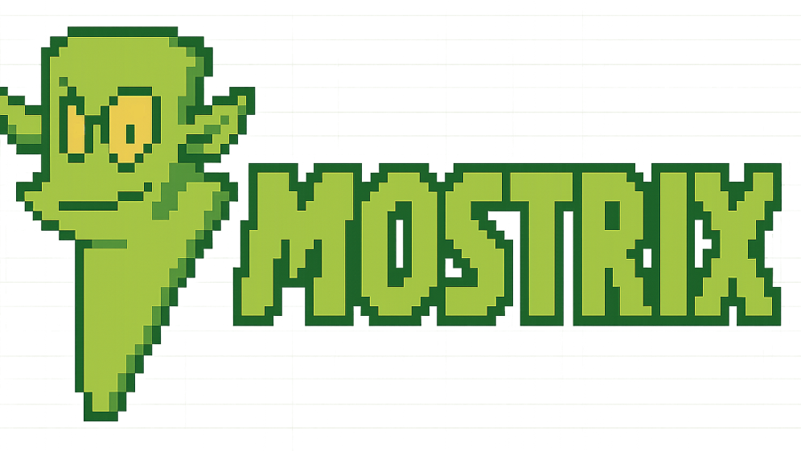
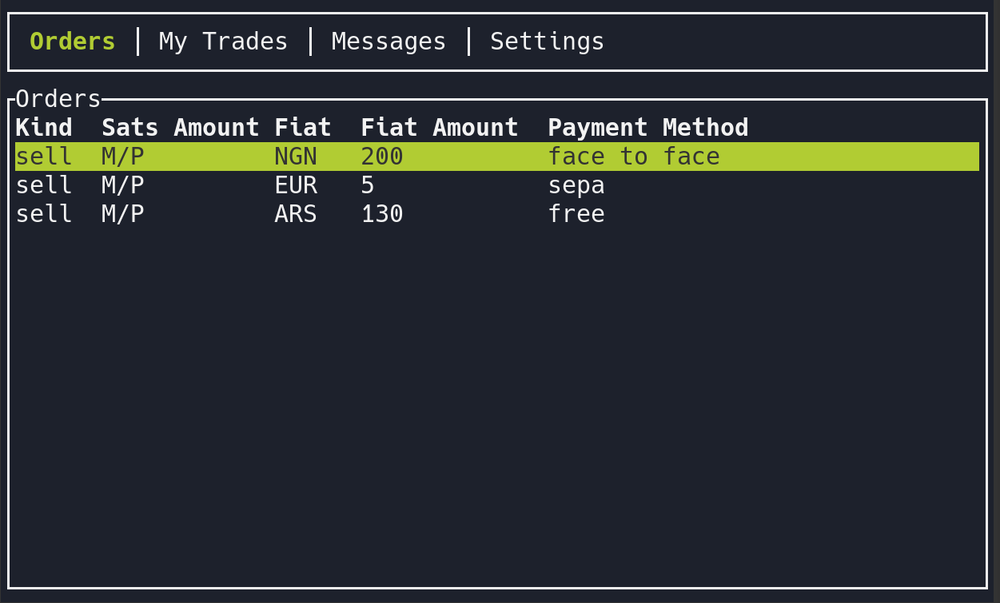

# Mostrix 🧌



**This is work in progress**

Terminal client for p2p using Mostro protocol.



## Requirements:

0. You need Rust version 1.64 or higher to compile.

## Install dependencies:

To compile on Ubuntu/Pop!\_OS, please install [cargo](https://www.rust-lang.org/tools/install), then run the following commands:

```bash
$ sudo apt update
$ sudo apt install -y cmake build-essential pkg-config
```

## Install

```bash
$ git clone https://github.com/MostroP2P/mostrix.git
$ cd mostrix
```

### Settings

Make sure that you have the following settings in your `~/.mostrix/settings.toml` file, you can find an example of the settings file in `settings.tpl.toml`, so you can copy it and modify it to your needs.

```toml
mostro_pubkey = "0000000000000000000000000000000000000000000000000000000000000000"
relays = ["wss://relay.mostro.network"]
```

### Run

```bash
$ cargo run
```

## TODO list
- [x] Displays order list
- [x] Implement logger
- [x] Create 12 words seed for user runing first time
- [x] Use sqlite (sqlx)
- [ ] Create settings.toml
- [ ] Create Settings tab
- [ ] [Implement keys management](https://mostro.network/protocol/key_management.html)
- [ ] List own orders
- [ ] Take Sell orders
- [ ] Take Buy orders
- [ ] Create Buy Orders
- [ ] Create buy orders with LN address
- [ ] Create Sell Orders
- [ ] [Peers-to-peer chat](https://mostro.network/protocol/chat.html)
- [ ] Maker cancel pending order
- [ ] Fiat sent
- [ ] Release
- [ ] Cooperative cancellation
- [ ] Buyer: add new invoice if payment fails
- [ ] Rate users
- [ ] Dispute flow (users)
- [ ] Dispute management (for admins)
