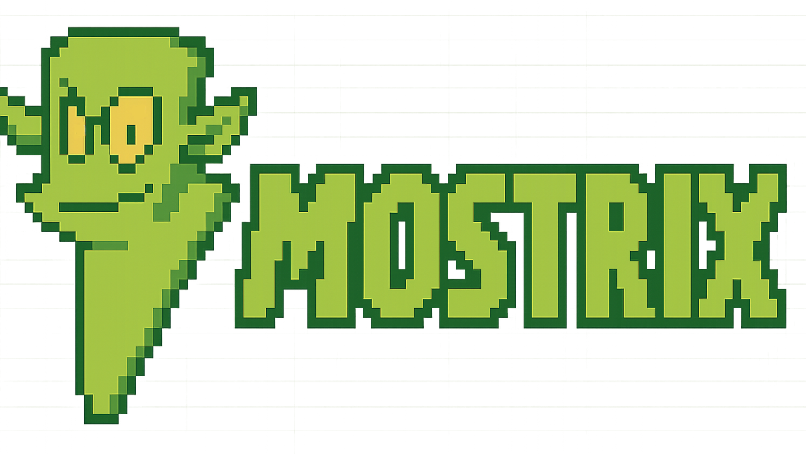
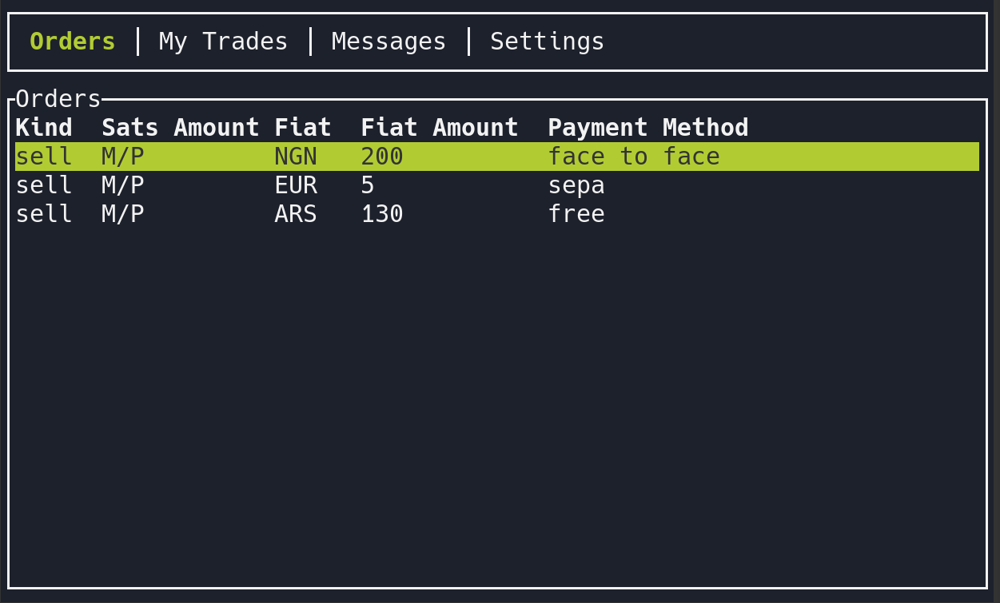

# MostriX 🧌



**This is work in progress**

Terminal client for p2p using Mostro protocol.



## Requirements:

0. You need Rust version 1.90 or higher to compile.

## Install dependencies:

To compile on Ubuntu/Pop!\_OS, please install [cargo](https://www.rust-lang.org/tools/install), then run the following commands:

```bash
$ sudo apt update
$ sudo apt install -y cmake build-essential pkg-config
```

## Install

```bash
$ git clone https://github.com/MostroP2P/mostrix.git
$ cd mostrix
```

### Settings (`settings.toml`)

Mostrix is configured via a TOML file called `settings.toml`.

- On **first run**, Mostrix:
  - Creates a directory `~/.mostrix/` (or the equivalent in your home directory).
  - Bootstraps `~/.mostrix/settings.toml` from embedded defaults, then derives `nsec_privkey` from the database identity key (index 0) so DB and settings stay consistent.
  - Shows the **Backup New Keys** popup so you can save the generated 12-word mnemonic.
- On **subsequent runs**, Mostrix only reads and writes **`~/.mostrix/settings.toml`**.

After the first run, edit `~/.mostrix/settings.toml` directly.

For portable installs, you can also place a `settings.toml` next to the executable, but it must not contain placeholder values (Mostrix refuses to start if placeholders are still present).

#### Example `settings.toml`

```toml
# Mostro pubkey, hex format - official Mostro instance
mostro_pubkey = "82fa8cb978b43c79b2156585bac2c011176a21d2aead6d9f7c575c005be88390"

# Nostr user private key (nsec format, KEEP THIS SECRET)
# Auto-generated on first run if not provided
nsec_privkey = "nsec1..."

# Admin private key - leave empty for normal user mode
admin_privkey = ""

# Nostr relays to connect to
relays = [
  "wss://relay.mostro.network",
]

# Log verbosity level: "trace", "debug", "info", "warn", "error"
# Not managed from tui at the moment
log_level = "info" 

# Fiat currency filter (optional, ISO codes)
# Empty list = show all currencies from Mostro instance
currencies_filter = []

# User mode: "user" or "admin" (controls available actions and UI)
user_mode = "user"

# Proof-of-work difficulty for events (0 = disabled, higher = more work)
# Not managed from tui at the moment
pow = 0
```

> **Note**: On first run, Mostrix generates a complete `settings.toml` with a fresh keypair. The example above shows the default values used.

#### Field explanations

- **`mostro_pubkey`**  
  - Public key of the Mostro instance you want to interact with.  
  - Accepts hex format. Use the key of the Mostro deployment you trust.

- **`nsec_privkey`**  
  - Your **Nostr private key** in `nsec…` format.
  - In normal user mode, Mostrix derives this automatically on first run from the DB identity mnemonic and keeps it in sync with the SQLite database.
  - When you use **Settings → Generate New Keys**, Mostrix rotates this value and shows the backup mnemonic popup.
  - **Treat this like a password** – do not share or commit it to Git.

- **`admin_privkey`**  
  - Private key used when running Mostrix in **admin mode**.  
  - Needed for admin-only flows (e.g., dispute resolution for admins).  
  - Leave it empty if you are a normal user.
  - When you use **Settings → Generate New Keys** in Admin mode, Mostrix rotates this value and shows the backup mnemonic popup.

- **`relays`**  
  - List of Nostr relay URLs (WebSocket endpoints) that Mostrix will connect to.  
  - You can add/remove relays depending on network connectivity and trust.

- **`log_level`**  
  - Controls how verbose logging is; values map to Rust log levels.  
  - Recommended values: `"info"` for normal use, `"debug"` or `"trace"` for troubleshooting.
  - Has no effect on what fiat currencies are available.

- **`currencies_filter`**  
  - Optional list of fiat currency **filter** (by ISO code) used by Mostrix when listing orders.  
  - If the list is **empty**, all currencies published by the Mostro instance are shown.  
  - If non-empty (e.g. `["USD"]` or `["USD", "EUR"]`), only orders whose fiat code is in this list are displayed.

- **`user_mode`**  
  - `"user"` (default): normal user interface and actions.  
  - `"admin"`: enables admin-specific capabilities; typically used with `admin_privkey`.

- **`pow`**  
  - Required proof-of-work difficulty for Nostr events created by Mostrix.  
  - `0` disables additional PoW; higher values increase CPU cost per event but can help with relay anti-spam policies.

#### Fiat currencies and Mostro instance info

- **Available fiat currencies** are **not configured in `settings.toml`**.  
- Instead, Mostrix reads them from the Mostro instance status event (`kind` 38385, tag `fiat_currencies_accepted`) as described in the Mostro protocol docs ([Mostro Instance Status](https://mostro.network/protocol/other_events.html#mostro-instance-status-1)).  
- The new **“Mostro Info”** tab (available in both User and Admin modes) shows:
  - Mostro daemon version, commit hash, limits, fee and PoW configuration.
  - Lightning node details (alias, pubkey, version, networks, URIs).
  - The list of **accepted fiat currencies** as published by the Mostro instance.
- The status bar’s **Currencies** line is also derived from this event; if the instance omits `fiat_currencies_accepted`, Mostrix treats it as “all currencies accepted” and displays `All (from Mostro instance)`.
- Press **Enter** while focused on the **Mostro Info** tab to refresh the instance info from the configured relays using the current Mostro pubkey in `settings.toml`.

#### Upgrading from v0.x

**Breaking change:** The `currencies` field in `settings.toml` has been renamed to `currencies_filter` for clarity.

- **Required:** Manually rename `currencies =` to `currencies_filter =` in your `~/.mostrix/settings.toml` before running.
- On first run with an old config that still uses `currencies`, Mostrix will exit with a clear error message and instructions.
- This is a breaking change — manual migration is mandatory.

Example migration:

```diff
- currencies = ["USD", "EUR"]
+ currencies_filter = ["USD", "EUR"]
```

**Note:** Mostrix will not start if the old `currencies` field is present. You must rename it to `currencies_filter` in your `settings.toml`.*** End Patch`"]}>>();

### Admin features

When `user_mode = "admin"` and `admin_privkey` is set in `settings.toml`, Mostrix shows admin tabs and allows dispute resolution.

- **Mode switch**: In the Settings tab, press **M** to toggle between User and Admin mode (persisted to `settings.toml`).
- **Disputes Pending**: Lists disputes with status `Initiated`. Select one and press **Enter** to take the dispute (ownership moves to you; other admins cannot take it). Order fiat code is fetched from the relay when taking a dispute, so admins do not need the order in their local database.
- **Disputes in Progress**: Workspace for disputes you have taken (`InProgress`). Per-dispute sidebar, header with full dispute info (parties, amounts, currency, ratings), and an integrated **shared-keys chat** with buyer and seller:
  - For each `(dispute, party)` pair, a shared key is derived between the admin key and the party’s trade pubkey and stored as hex in the local DB.
  - Admin and party chat via NIP‑59 gift-wrap events addressed to the shared key’s public key, providing restart‑safe, per‑dispute conversations.
  - Use **Tab** to switch chat view, **Shift+I** to enable/disable chat input, **PageUp** / **PageDown** to scroll, **End** to jump to latest. Press **Ctrl+S** to save the selected attachment to `~/.mostrix/downloads/`. Press **Shift+F** to open the finalization popup.
- **Finalization**: From the popup you can **Pay Buyer** (AdminSettle: release sats to buyer) or **Refund Seller** (AdminCancel: refund to seller), or **Exit** without action. Finalized disputes (Settled, SellerRefunded, Released) cannot be modified.
- **Settings (admin)**: **Add Dispute Solver** (add another solver by `npub`), **Change Admin Key** (update `admin_privkey`).

For detailed flows and UI, see [docs/ADMIN_DISPUTES.md](docs/ADMIN_DISPUTES.md), [docs/FINALIZE_DISPUTES.md](docs/FINALIZE_DISPUTES.md), and [docs/TUI_INTERFACE.md](docs/TUI_INTERFACE.md).

### Run

```bash
$ cargo run
```

## TODO list
- [x] Displays order list
- [x] Implement logger
- [x] Create 12 words seed for user runing first time
- [x] Use sqlite (sqlx)
- [x] Create settings.toml
- [x] Auto-generate settings.toml with sensible defaults on first run ([#40](https://github.com/MostroP2P/mostrix/issues/40))
- [x] Create Settings tab
- [x] [Implement keys management](https://mostro.network/protocol/key_management.html)
- [ ] List own orders
- [x] Take Sell orders
- [x] Take Buy orders
- [x] Create Buy Orders
- [x] Create buy orders with LN address
- [x] Create Sell Orders
- [ ] [Peers-to-peer chat](https://mostro.network/protocol/chat.html)
- [ ] Maker cancel pending order
- [x] Fiat sent
- [x] Release
- [ ] Cooperative cancellation
- [x] Buyer: add new invoice if payment fails
- [ ] Rate users
- [ ] Dispute flow (users)
- [x] Dispute management (for admins): take dispute, chat with parties, finalize (Pay Buyer / Refund Seller), add solver

**Note:** Many parts of the codebase still need thorough testing. Even features marked as complete may require additional testing, bug fixes, and refinement before production use.
