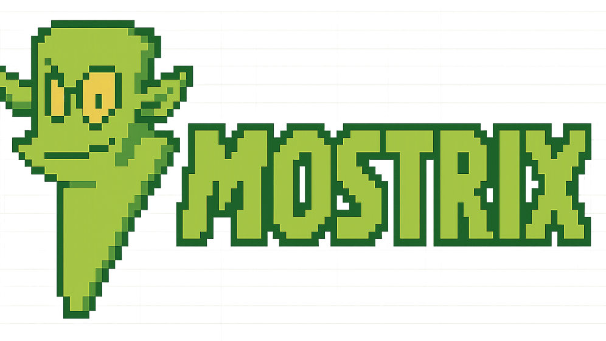
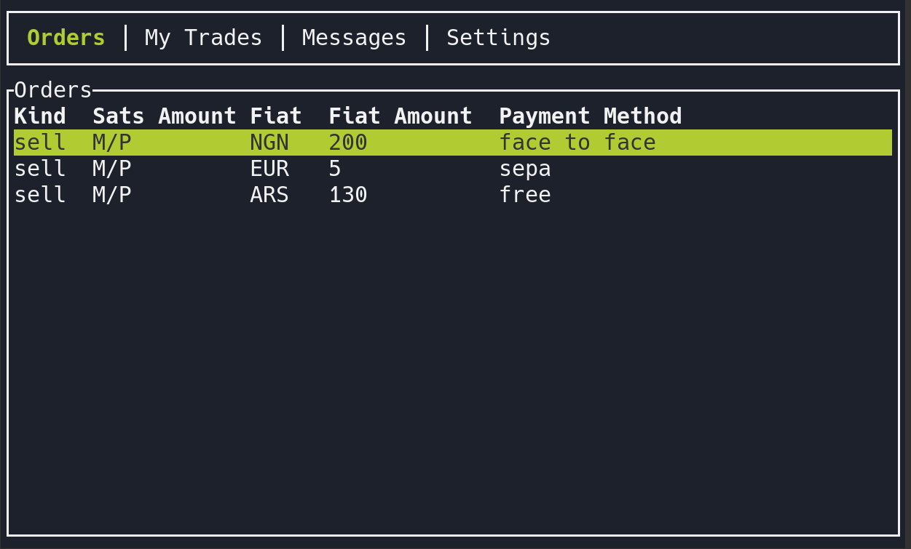

# MostriX 🧌

[](LICENSE)
[](https://www.rust-lang.org)
[](https://mostro.network/mostrix/coverage/)
[](https://github.com/MostroP2P/mostrix/releases)

[](https://deepwiki.com/MostroP2P/mostrix)



Terminal client for peer-to-peer Bitcoin exchange over the [Mostro](https://mostro.network/) protocol (Nostr + Lightning).

Current release: **[v0.3.6](https://github.com/MostroP2P/mostrix/releases/tag/v0.3.6)**. The project is still evolving; treat it as production-capable for testing and daily use, but expect ongoing UX and protocol polish.



## Features

- **Order book & trading** — browse pending buy/sell orders, create orders (including range / LN address), take trades, fiat-sent / release, cooperative cancel, and user-initiated disputes.
- **My Trades** — active-trade workspace with kind-14 peer chat, attachments (Blossom), Shared-key disclose, and a contextual **keycap command bar** (`i` / Esc INSERT·COMMAND, **Ctrl+K** Actions).
- **Full privacy** — opt-in on create/take; follow-up DMs honor `full_privacy` (My Trades shows Privacy vs Reputation).
- **Own reputation** — status bar shows your rating; refreshed at startup and after trades.
- **Chat copy** — range-select and copy messages in My Trades, Disputes, Observer, and solver DMs; optional **OSC 52** fallback for SSH (`clipboard_osc52`).
- **Messages tab** — trade-step timeline, invoices / bonds, rate counterparty, cooperative cancel prompts.
- **Admin / solvers** — take disputes, kind-14 party chat (BUYER / SELLER / SERBERO), finalize (pay buyer / refund seller / bond slash), Observer (Shared key), Serbero handoff takeover (**Ctrl+T**), optional **mostro-watchdog** Telegram alerts.
- **Settings** — Mostro instance picker, relays, Blossom servers, currency filters, Lightning address, background alerts, Restore Session, key rotation / seed import.

## Requirements

- Rust **1.97.0** or newer (pinned in [`rust-toolchain.toml`](rust-toolchain.toml)).

## Install dependencies

On Ubuntu/Pop!\_OS, install [cargo](https://www.rust-lang.org/tools/install), then:

```bash
$ sudo apt update
$ sudo apt install -y cmake build-essential pkg-config
```

## Install

From source:

```bash
$ git clone https://github.com/MostroP2P/mostrix.git
$ cd mostrix
$ cargo run --release
```

Pre-built binaries (when published): [Releases](https://github.com/MostroP2P/mostrix/releases). Verify signatures as described in [CHANGELOG.md](CHANGELOG.md) (Verifying the Release).

## Documentation

The **documentation index** is **[docs/README.md](docs/README.md)** — architecture, boot sequence, DM router, protocol, SQLite schema, TUI flows, admin disputes, and coding standards. Use it as the entry point for contributors and AI-assisted development.

**Quick links:** [Startup & config](docs/STARTUP_AND_CONFIG.md) · [TUI interface](docs/TUI_INTERFACE.md) · [DM listener / Messages sync](docs/DM_LISTENER_FLOW.md) · [Database](docs/DATABASE.md) · [Message flow & protocol](docs/MESSAGE_FLOW_AND_PROTOCOL.md) · [Key management](docs/KEY_MANAGEMENT.md) · [Admin disputes](docs/ADMIN_DISPUTES.md) · [Coding standards](docs/CODING_STANDARDS.md)

Mostrix speaks **protocol v2** (signed kind 14 / NIP-44) for Mostro protocol DMs and shows the advertised `protocol_version` on the **Mostro Info** tab. Protocol v1 GiftWrap instances are unsupported. P2P order chat and admin dispute chat use kind 14 (`K_sign` / `K_conv`) only. Details: [docs/README.md — Protocol v2](docs/README.md#protocol-v2-nip-44--protocol-dms-complete).

### Settings (`settings.toml`)

Mostrix is configured via a TOML file called `settings.toml`.

- File precedence: if a colocated **`settings.toml`** exists next to the executable, Mostrix reads **and updates** that file; otherwise it uses **`~/.mostrix/settings.toml`**.
- On **first run** (when neither file exists), Mostrix:
  - Creates `~/.mostrix/`.
  - Bootstraps `settings.toml` from embedded defaults, then derives `nsec_privkey` from the database identity key (index 0) so DB and settings stay consistent.
  - Shows the **Backup New Keys** popup so you can save the generated 12-word mnemonic.

For portable installs, a colocated `settings.toml` must not contain placeholder values (Mostrix refuses to start if placeholders are still present).

The repository root [`settings.toml`](settings.toml) is the template embedded at compile time. Prefer editing options from the **Settings** tab when possible.

#### Example `settings.toml`

```toml
# Mostro instance pubkey (hex or npub). Settings UI normalizes to hex on save.
mostro_pubkey = "82fa8cb978b43c79b2156585bac2c011176a21d2aead6d9f7c575c005be88390"

# Trader identity (nsec). Auto-derived on first run; keep secret.
nsec_privkey = "nsec1..."

# Admin / solver key (nsec). Used only when user_mode = "admin". Leave empty for traders.
admin_privkey = ""

relays = [
  "wss://relay.mostro.network",
  "wss://relay.shadowbip.com",
  "wss://mostro-p2p.tech",
]

# "trace" | "debug" | "info" | "warn" | "error" (not managed from the TUI yet)
log_level = "info"

# Empty = show all currencies from the Mostro instance
currencies_filter = []

# "user" (trader) or "admin" (dispute solver / operator)
user_mode = "user"

# Buyer Lightning address (LNURL-pay); leave empty if unused
ln_address = ""

# Blossom HTTPS bases for chat attachment uploads (tried in order).
# Empty list = built-in defaults (same idea as Mostro Mobile). Manage from Settings.
# blossom_servers = ["https://cdn.hzrd149.com", "https://nostr.download"]

# Wake chat recipients' phones after a chat message. Empty string disables.
push_server_url = "https://mostro-push-server.fly.dev"

# Out-of-focus alerts: terminal bell, title badge, sound. Also Settings → Background Alerts.
notifications_enabled = true

# Chat-copy OSC 52 fallback after native clipboard failure (SSH). Restart after change.
clipboard_osc52 = false

# Admin: assistants (e.g. Serbero) allowed to DM your admin key, as npub or hex.
# trusted_dm_senders = ["npub1..."]

# Admin: mostro-watchdog pubkey for Telegram dispute alerts. Settings → Link Watchdog.
watchdog_pubkey = ""
```

> **Note:** On first run, Mostrix generates a complete `settings.toml` with a fresh keypair. The example above shows typical defaults and optional fields.

#### Field explanations

- **`mostro_pubkey`**  
  - Public key of the Mostro instance (hex or `npub…`). The Settings picker / save path normalizes to hex.  
  - Use **Settings → Select Mostro Instance** (trusted catalog + custom paste) or edit the file.

- **`nsec_privkey`**  
  - Your **trader identity** (`nsec…`) used in **user mode** to create/take orders and chat.  
  - Derived on first run from the DB identity mnemonic and kept in sync. Prefer **Generate New Keys** / **Import Seed Words** over hand-editing.  
  - Not used for admin / dispute-solver actions (`admin_privkey`). **Treat like a password.**

- **`admin_privkey`**  
  - Private key (`nsec…`) used only when `user_mode = "admin"`. Signs take / settle / cancel dispute and per-dispute chat.  
  - **Dispute solver**: the `nsec` the operator registered (permission **Read** = mediate/chat; **Read-Write** = also settle/cancel and take over from a read-only solver — see [Taking over from Serbero](docs/ADMIN_DISPUTES.md#taking-over-a-dispute-from-serbero-ctrlt)). Solver keys cannot add other solvers.  
  - **Mostro operator**: the daemon `nsec` (pubkey = `mostro_pubkey`). Required for **Add Dispute Solver**.  
  - Do **not** reuse `nsec_privkey`. Set via **Settings → Change Admin Key**. Leave empty for regular traders.

| | `nsec_privkey` | `admin_privkey` |
|---|---|---|
| **Regular trader** | Auto-managed identity | Empty |
| **Dispute solver** | Auto-managed identity (trading) | Registered solver `nsec` (Read or Read-Write) |
| **Mostro operator** | Auto-managed identity (trading) | Mostro daemon `nsec` |

- **`relays`** — Nostr WebSocket URLs. Add / remove / restore defaults from Settings.

- **`log_level`** — Rust log verbosity (`info` for normal use; `debug` / `trace` for troubleshooting).

- **`currencies_filter`** — Optional ISO fiat codes to visually filter the order book. Empty = all currencies from the instance.

- **`user_mode`** — `"user"` (default) or `"admin"`. Switch from Settings (**Switch Mode**); persisted to disk.

- **`ln_address`** — Optional buyer Lightning address (`user@domain.com`). Settings verifies LNURL `payRequest` before save. Used when submitting invoices.

- **`blossom_servers`** — HTTPS bases for **outbound** encrypted attachment upload (My Trades **Ctrl+O**). Empty = built-in defaults. Receive/save uses the URL inside each message.

- **`push_server_url`** — mostro-push-server base URL to wake mobile chat recipients. Empty disables (also reduces revealing trade pubkeys to that service).

- **`notifications_enabled`** — Bell, window-title unread badge, and sound for new trade/chat messages while the terminal is unfocused. Toggle **Background Alerts** in Settings.

- **`clipboard_osc52`** — Opt-in OSC 52 chat-copy fallback when the native clipboard fails (useful over SSH). Config-only; restart after changing. See [TUI — OSC 52](docs/TUI_INTERFACE.md#optional-terminal-clipboard-fallback-osc-52).

- **`trusted_dm_senders`** — Admin only: npub/hex list of assistants (e.g. Serbero) whose DMs to your admin key are shown per dispute. Empty = ignore such senders.

- **`watchdog_pubkey`** — Admin only: mostro-watchdog key linked via **Settings → Link Watchdog** so you get Telegram alerts when a party writes in a dispute you took. Empty disables. Only public chat keys are shared with the watchdog — never a private key.

#### Fiat currencies and Mostro instance info

- **Available fiat currencies** are **not** listed in `settings.toml`. Mostrix reads them from the Mostro instance status event (`kind` 38385, tag `fiat_currencies_accepted`) — see [Mostro Instance Status](https://mostro.network/protocol/other_events.html#mostro-instance-status-1).
- The **Mostro Info** tab (User and Admin) shows daemon version, commit, limits, fees, PoW, Lightning node details, and accepted fiat currencies.
- The status bar **Currencies** line comes from the same event; if the instance omits `fiat_currencies_accepted`, Mostrix treats it as all currencies (`All (from Mostro instance)`).
- Press **Enter** on the **Mostro Info** tab to refresh from relays using the current `mostro_pubkey`.

#### Upgrading from older v0.x configs

**Breaking change (historical):** `currencies` was renamed to `currencies_filter`.

```diff
- currencies = ["USD", "EUR"]
+ currencies_filter = ["USD", "EUR"]
```

If the old field is still present, Mostrix exits with instructions. Remove `currencies` and keep only `currencies_filter`.

### User highlights

- **Orders** — filtered book; **Enter** takes an order or cancels your own pending listing; **Shift+F** / **Shift+X** for local filters.
- **Create New Order** — sectioned form, live preview, currency / payment-method pickers, optional full privacy.
- **My Trades** — peer chat, **Ctrl+S** save / **Ctrl+O** send attachments (**Ctrl+Shift+O** retry), **Ctrl+C** copy range, trade actions via COMMAND shortcuts or **Ctrl+K** (fiat sent, release, rate, dispute, cancel, refresh, Shared key).
- **Messages** — step timeline, invoice/bond popups, rate and cooperative-cancel flows.
- **Settings** — instance, relays, Blossom, LN address, currency filters, alerts, Restore Session, seed import / generate.

Keyboard help: **Ctrl+H** (context) or **Shift+H** on Settings for every option. Full map: [docs/TUI_INTERFACE.md](docs/TUI_INTERFACE.md).

### Admin features

When `user_mode = "admin"` and `admin_privkey` is set, Mostrix shows admin tabs.

- **Mode switch**: Settings → **Switch Mode (User ↔ Admin)** (**Enter**). **Shift+H** explains every Settings option.
- **Disputes Pending**: `Initiated` disputes. **Enter** takes the selected dispute. Serbero handoffs show a banner / tab badge — **Ctrl+T** to take over.
- **Disputes in Progress**: Taken disputes workspace — sidebar by dispute id, header, kind-14 chat with **BUYER** / **SELLER** / **SERBERO** (**Tab** cycles parties).  
  - **Keycap bar**: **i** INSERT (type) / **Esc** COMMAND (shortcuts); **Ctrl+K** Actions (Resolve / Recover / Filter / Remove — letter selects, Enter confirms). SERBERO is read-only (no Write/Send).  
  - **Ctrl+S** saves the selected attachment; **Shift+F** (or **Ctrl+K → F**) opens finalization. **Ctrl+C** copies a message range.
- **Finalization**: Pay buyer / Refund seller / Bond slash when the instance enables bonds. Details: [docs/FINALIZE_DISPUTES.md](docs/FINALIZE_DISPUTES.md).
- **Observer**: Paste a disclosed **Shared key** (`K_conv`, never the signing key), **Enter** to load, **Ctrl+L** clear, **Ctrl+K** Actions, **Ctrl+S** save attachments.
- **Settings (admin)**: **Add Dispute Solver**, **Change Admin Key**, **Link Watchdog**, relays / Blossom / filters / alerts (no Generate New Keys in admin mode).

Details: [docs/ADMIN_DISPUTES.md](docs/ADMIN_DISPUTES.md), [docs/FINALIZE_DISPUTES.md](docs/FINALIZE_DISPUTES.md), [docs/TUI_INTERFACE.md](docs/TUI_INTERFACE.md).

### Run

```bash
$ cargo run
# or
$ cargo run --release
```

Recommended checks before contributing:

```bash
$ cargo fmt --all
$ cargo clippy --all-targets --all-features -- -D warnings
$ cargo test --all-features
```

### Code coverage

Measured with [`cargo-llvm-cov`](https://github.com/taiki-e/cargo-llvm-cov). Published HTML: **<https://mostro.network/mostrix/coverage/>** (also reachable via the `gh-pages` redirect from `mostrop2p.github.io`). Regenerated weekly by the `Coverage` workflow and on demand from Actions. The README badge reads `coverage/badge.json` from that site.

Locally:

```bash
cargo install cargo-llvm-cov
cargo llvm-cov --all-features --summary-only
cargo llvm-cov --all-features --html   # target/llvm-cov/html/index.html
```

Enable **GitHub Pages** with Source = **Deploy from a branch** → `gh-pages` / `/ (root)` so coverage publishes.

## Status

| Area | Status |
|------|--------|
| Order book, create / take buy & sell, LN address create | Done |
| My Trades peer chat (kind 14), attachments | Done |
| Fiat sent / release / cooperative cancel / rate / user dispute | Done |
| Maker cancel pending listing | Done (Orders **Enter** on own pending) |
| Full privacy + own reputation on status bar | Done |
| Chat copy (+ optional OSC 52) | Done |
| Keycap bars + Ctrl+K Actions (My Trades / Disputes / Observer) | Done |
| Admin take / chat / finalize / Observer / Watchdog | Done |
| Session restore (hydrate without restart) | Done |
| Protocol v1 GiftWrap Mostro instances | Unsupported (v2 only) |

**Note:** Features marked done still benefit from more testing and polish. Report issues on GitHub.

## License

This project is licensed under the [GNU General Public License v3.0](LICENSE).
