# Admin Dispute Resolution

This guide explains the admin mode functionality for dispute resolution in Mostrix. Admin mode allows authorized users to resolve disputes between buyers and sellers on the Mostro network.

## Admin Mode Overview

Admin mode can be activated in two ways:

- **On startup (default mode)**: set `user_mode = "admin"` and configure a valid `admin_privkey` in `settings.toml`.
- **At runtime (TUI switch)**: start in user mode and press **`M`** in the **Settings** tab to toggle between User and Admin modes. The selected mode is persisted back to `settings.toml` (`user_mode` field).

Only the admin private key can be used to sign dispute resolution actions.

**Source**: `src/settings.rs:12`

```12:12:src/settings.rs
    pub admin_privkey: String,
```

## Admin Tabs

The admin interface provides dedicated tabs for dispute management:

### 1. Disputes Tab

Lists all active disputes on the Mostro network. Admins can:

- **View dispute details**: Order ID, parties involved, status
- **Take a dispute**: Select a dispute and take ownership to resolve it
- **Navigate**: Use arrow keys to browse the dispute list

### 2. Settings Tab

**Status**: ✅ **Fully Implemented and Working**

The Settings tab provides comprehensive configuration options for both User and Admin modes. The available options differ based on the current role.

#### User Mode Options

1. **Change Mostro Pubkey**: Update the Mostro instance pubkey used by the client (hex format, 64 characters).
2. **Add Nostr Relay**: Add a new Nostr relay to the relay list (must start with `wss://`). Relays are added to the running client immediately.
3. **Add Currency Filter**: Add a fiat currency code (e.g., USD, EUR) to filter orders displayed. When one or more currencies are configured, only orders matching those fiat codes are shown. Filters are applied in real-time.
4. **Clear Currency Filters**: Remove all currency filters to show orders for all currencies. This clears the `currencies` array in `settings.toml`.

#### Admin Mode Options

1. **Change Mostro Pubkey**: Update the Mostro instance pubkey used by the client (hex format, 64 characters).
2. **Add Nostr Relay**: Add a new Nostr relay to the relay list (must start with `wss://`). Relays are added to the running client immediately.
3. **Add Currency Filter**: Add a fiat currency code (e.g., USD, EUR) to filter orders displayed. Filters are applied in real-time.
4. **Clear Currency Filters**: Remove all currency filters to show orders for all currencies.
5. **Add Dispute Solver**: Add a new dispute solver to the network (see [Adding a Solver](#adding-a-solver) section).
6. **Change Admin Key**: Update the admin private key used for signing dispute actions.

#### Features

- **Mode Display**: Shows current mode (User/Admin) at the top
- **Mode Switching**: Press `M` key to switch between User and Admin modes
- **Confirmation Popups**: All settings changes require confirmation before saving
- **Input Validation**: All inputs are validated before processing:
  - Mostro pubkey: Must be 64-character hex string
  - Relay URLs: Must start with `wss://`
  - Currency codes: Non-empty, max 10 characters
  - Admin/Solver pubkeys: Must be valid `npub` format
- **Keyboard Input**: All inputs support both paste and keyboard entry
- **Settings Persistence**: All changes are saved to `settings.toml` file
- **Error Handling**: Invalid inputs display error popups with clear messages
- **Dynamic Updates**: 
  - Relays are added to the running Nostr client immediately
  - Currency filters are applied in real-time to order fetching
  - Status bar displays current settings (Mostro pubkey, relays, currencies)

**Source**: `src/ui/settings_tab.rs`, `src/ui/key_handler/settings.rs`, `src/ui/key_handler/validation.rs`

## Dispute States

Disputes progress through different states during their lifecycle. Understanding these states helps admins know what actions are available and what the current status of a dispute is.

The dispute `Status` enum defines the possible states:

```rust
pub enum Status {
    /// Dispute initiated and waiting to be taken by a solver
    #[default]
    Initiated,
    /// Taken by a solver
    InProgress,
    /// Canceled by admin/solver and refunded to seller
    SellerRefunded,
    /// Settled seller's invoice by admin/solver and started to pay sats to buyer
    Settled,
    /// Released by the seller
    Released,
}
```

### State Descriptions

#### 1. `Initiated` (Default)

- **Meaning**: The dispute has been created and is waiting for an admin/solver to take ownership.
- **Admin Actions Available**:
  - Take the dispute (moves to `InProgress`)
  - View dispute details
- **Next State**: `InProgress` (when taken by admin)

#### 2. `InProgress`

- **Meaning**: An admin/solver has taken ownership of the dispute and is actively working on resolution.
- **Admin Actions Available**:
  - Communicate with buyer and seller
  - Request additional information
  - Resolve in favor of buyer (moves to `Settled`)
  - Resolve in favor of seller (moves to `SellerRefunded`)
- **Next States**: `Settled`, `SellerRefunded`, or `Released`

#### 3. `SellerRefunded`

- **Meaning**: The dispute was resolved in favor of the seller. The seller has been refunded, and the buyer's payment was returned.
- **Admin Actions Available**:
  - View dispute history (dispute is closed)
- **Final State**: No further actions possible

#### 4. `Settled`

- **Meaning**: The admin/solver has settled the seller's invoice and started the process of paying sats to the buyer. This indicates resolution in favor of the buyer.
- **Admin Actions Available**:
  - Monitor payment completion
  - View dispute history
- **Next State**: `Released` (when seller releases)

#### 5. `Released`

- **Meaning**: The seller has released the funds, completing the dispute resolution process.
- **Admin Actions Available**:
  - View dispute history (dispute is closed)
- **Final State**: No further actions possible

### State Transition Flow


### State Color Coding

In the UI, dispute states are color-coded for quick visual identification:

- **Yellow**: `Initiated` (pending/waiting)
- **Green**: `InProgress`, `Settled`, `Released` (active/resolved)
- **Red**: `SellerRefunded` (refunded/canceled)

**Source**: `src/ui/mod.rs:482` (`apply_status_color`)

## Dispute Resolution Flow

### Taking a Dispute

When an admin takes a dispute from the disputes list:

```mermaid
sequenceDiagram
    participant Admin
    participant TUI
    participant Client
    participant DB
    participant AdminKey
    participant NostrRelays
    participant Mostro

    Admin->>TUI: Navigate to Disputes tab
    TUI->>Client: Display dispute list
    Admin->>TUI: Select dispute & press Enter
    TUI->>Client: take_dispute(dispute_id)
    Client->>DB: Get admin_privkey
    DB-->>Client: admin_privkey
    Client->>AdminKey: Parse & sign with admin key
    Client->>Client: Construct TakeDispute message
    Client->>NostrRelays: Publish NIP-59 Gift Wrap
    NostrRelays->>Mostro: Forward TakeDispute action
    Mostro->>Mostro: Validate admin key & assign dispute
    Mostro->>Mostro: Update dispute status: Initiated → InProgress
    Mostro->>NostrRelays: Confirmation
    NostrRelays-->>Client: Response
    Client->>Client: Update dispute status to InProgress
    Client-->>TUI: Dispute taken successfully
    TUI-->>Admin: Show confirmation
```



**Key Points**:

- Only the `admin_privkey` can sign dispute resolution actions
- The dispute is assigned to the admin who takes it
- Other admins cannot take a dispute that's already been taken
- The admin becomes responsible for resolving the dispute
- Upon taking a dispute, the admin receives a `SolverDisputeInfo` struct with all dispute details

### Dispute Information Structure

When an admin takes a dispute, they receive a `SolverDisputeInfo` struct containing all relevant information about the dispute:

```rust
pub struct SolverDisputeInfo {
    pub id: Uuid,
    pub kind: String,
    pub status: String,
    pub hash: Option<String>,
    pub preimage: Option<String>,
    pub order_previous_status: String,
    pub initiator_pubkey: String,
    pub buyer_pubkey: Option<String>,
    pub seller_pubkey: Option<String>,
    pub initiator_full_privacy: bool,
    pub counterpart_full_privacy: bool,
    pub initiator_info: Option<UserInfo>,
    pub counterpart_info: Option<UserInfo>,
    pub premium: i64,
    pub payment_method: String,
    pub amount: i64,
    pub fiat_amount: i64,
    pub fee: i64,
    pub routing_fee: i64,
    pub buyer_invoice: Option<String>,
    pub invoice_held_at: i64,
    pub taken_at: i64,
    pub created_at: i64,
}
```

#### Field Descriptions

**Identity & Status**:

- **`id`**: Unique identifier (UUID) for the dispute
- **`kind`**: Order kind (e.g., "Buy" or "Sell")
- **`status`**: Current dispute status (see [Dispute States](#dispute-states) section)
- **`order_previous_status`**: The order's status before the dispute was initiated

**Lightning Network Details**:

- **`hash`**: Lightning invoice hash (if applicable)
- **`preimage`**: Lightning invoice preimage (if available)
- **`buyer_invoice`**: Lightning invoice provided by the buyer (if applicable)
- **`invoice_held_at`**: Timestamp when the invoice was held/created

**Parties Involved**:

- **`initiator_pubkey`**: Public key of the user who initiated the dispute
- **`buyer_pubkey`**: Public key of the buyer (if available)
- **`seller_pubkey`**: Public key of the seller (if available)
- **`initiator_full_privacy`**: Whether the dispute initiator has full privacy enabled
- **`counterpart_full_privacy`**: Whether the counterparty has full privacy enabled
- **`initiator_info`**: Optional user information for the dispute initiator (name, reputation, etc.)
- **`counterpart_info`**: Optional user information for the counterparty (name, reputation, etc.)

**Financial Details**:

- **`amount`**: Amount in satoshis
- **`fiat_amount`**: Amount in fiat currency
- **`premium`**: Premium amount (in satoshis)
- **`fee`**: Fee amount (in satoshis)
- **`routing_fee`**: Lightning routing fee (in satoshis)
- **`payment_method`**: Payment method used

**Timestamps**:

- **`created_at`**: Timestamp when the dispute was created
- **`taken_at`**: Timestamp when the admin took the dispute

#### Using Dispute Information

This comprehensive information allows admins to:

1. **Understand the context**: Review order details, parties involved, and dispute circumstances
2. **Assess privacy settings**: Know if parties have full privacy enabled (affects available information)
3. **Review financial details**: Understand amounts, fees, and payment methods
4. **Check Lightning status**: Verify invoice details and payment state
5. **Make informed decisions**: Use all available information to resolve the dispute fairly

**Privacy Considerations**:

- If `initiator_full_privacy` or `counterpart_full_privacy` is `true`, some user information may be limited
- `initiator_info` and `counterpart_info` may be `None` if privacy is enabled
- Admins should respect privacy settings while gathering necessary information for resolution

### Adding a Solver

**Status**: ✅ **Implemented and Working**

When an admin adds another dispute solver from the Settings tab:


**Implementation Function**:

```12:53:src/util/order_utils/execute_admin_add_solver.rs
pub async fn execute_admin_add_solver(
    solver_pubkey: &str,
    client: &Client,
    mostro_pubkey: PublicKey,
) -> Result<()> {
    // Get admin keys from settings
    let settings = SETTINGS
        .get()
        .ok_or(anyhow::anyhow!("Settings not initialized"))?;

    if settings.admin_privkey.is_empty() {
        return Err(anyhow::anyhow!("Admin private key not configured"));
    }

    let admin_keys = Keys::parse(&settings.admin_privkey)?;

    // Create AddSolver message
    let add_solver_message = Message::new_dispute(
        Some(Uuid::new_v4()),
        None,
        None,
        Action::AdminAddSolver,
        Some(Payload::TextMessage(solver_pubkey.to_string())),
    )
    .as_json()
    .map_err(|_| anyhow::anyhow!("Failed to serialize message"))?;

    // Send the DM using admin keys (signed gift wrap)
    // Note: Following the example pattern, we don't wait for a response
    send_dm(
        client,
        Some(&admin_keys),
        &admin_keys,
        &mostro_pubkey,
        add_solver_message,
        None,
        false,
    )
    .await?;

    Ok(())
}
```

**Validation Function**:

```3:13:src/ui/key_handler/validation.rs
pub fn validate_npub(npub_str: &str) -> Result<(), String> {
    if npub_str.trim().is_empty() {
        return Err("Public key cannot be empty".to_string());
    }

    PublicKey::from_bech32(npub_str.trim()).map_err(|_| "Invalid key format".to_string())?;

    Ok(())
}
```

**Key Points**:

- ✅ Requires admin privileges (signed with `admin_privkey`)
- ✅ Input validation: Validates npub format using `PublicKey::from_bech32`
- ✅ Error handling: Shows error popup for invalid pubkey format
- ✅ Confirmation popup: Custom message "Are you sure you want to add this pubkey as dispute solver?"
- ✅ UI state management: Stays on Settings tab after operation
- ✅ Adds a new public key to the list of authorized dispute solvers
- ✅ The new solver can then take and resolve disputes
- ✅ Helps distribute dispute resolution workload
- ✅ Uses NIP-59 Gift Wrap for secure message delivery

### Chatting with Parties

Admins communicate with buyers and sellers through separate chat interfaces to prevent confusion and ensure clear communication.

#### Chat with Buyer Flow


#### Chat with Seller Flow


**Visual Safety Features**:

- **Different colors**: Buyer and Seller chat tabs use distinct color schemes
- **Clear labeling**: Tab names explicitly indicate which party you're communicating with
- **Context preservation**: Each tab maintains its own message history and context

## Dispute Resolution Actions

Once an admin has taken a dispute (state: `InProgress`), they are expected to perform resolution actions such as resolving in favor of buyer or seller, requesting additional information, or transferring/escalating the dispute. The exact UI flows for these actions are still under active development in Mostrix and may change; refer to the Mostro protocol documentation for the canonical dispute actions and state transitions.

## Security Considerations

### Admin Key Management

- **`admin_privkey`**: Must be kept secure and never shared
- **Key derivation**: Admin keys are not derived from the user's mnemonic (separate key)
- **Access control**: Only the configured admin key can sign dispute actions

### Dispute Assignment

- **Single admin per dispute**: Once taken, a dispute is assigned to one admin
- **Prevents conflicts**: Other admins cannot take an already-assigned dispute
- **Clear ownership**: The assigned admin is responsible for resolution

### Communication Security

- **Encrypted messages**: All communication uses NIP-44 or NIP-59 encryption
- **Signed actions**: All dispute actions are signed with the admin key
- **Audit trail**: Dispute actions are recorded on the Nostr network

## New Features: Currency Filters & Relay Management

### Currency Filter Management

**Status**: ✅ **Fully Implemented**

Currency filters allow admins (and users) to focus on specific fiat currencies when viewing orders. This is particularly useful for admins monitoring disputes in specific markets.

#### Features

- **Add Currency Filter**: Add fiat currency codes (e.g., USD, EUR, ARS) to filter orders
  - Currency codes are validated (non-empty, max 10 characters)
  - Filters are applied in real-time to order fetching
  - Multiple currencies can be added to show orders for any of them
- **Clear Currency Filters**: Remove all currency filters with a single action
  - Clears the `currencies` array in `settings.toml`
  - Can also be cleared by manually editing `settings.toml` and setting `currencies = []`
- **Dynamic Filtering**: Currency filters are applied immediately without restart
- **Status Bar Display**: Active currency filters are displayed in the status bar

#### Implementation

**Source**: `src/ui/key_handler/settings.rs:55-78`

```rust
/// Save currency to settings file
pub fn save_currency_to_settings(currency_string: &str) {
    save_settings_with(
        |s| {
            let currency_upper = currency_string.trim().to_uppercase();
            if !s.currencies.contains(&currency_upper) {
                s.currencies.push(currency_upper);
            }
        },
        "Failed to save currency to settings",
        "Currency filter added to settings file",
    );
}

/// Clear all currency filters (sets currencies to empty vector)
pub fn clear_currency_filters() {
    save_settings_with(
        |s| {
            s.currencies.clear();
        },
        "Failed to clear currency filters",
        "All currency filters cleared",
    );
}
```

### Relay Management Improvements

**Status**: ✅ **Fully Implemented**

Enhanced relay management allows admins to dynamically add relays without restarting the application.

#### Features

- **Dynamic Relay Addition**: New relays are added to the running Nostr client immediately
  - No restart required
  - Relays are connected asynchronously in the background
- **Settings Persistence**: Relays are saved to `settings.toml` and persist across restarts
- **Duplicate Prevention**: The system prevents adding the same relay twice
- **Status Bar Display**: Active relays are displayed in the status bar

#### Implementation

**Source**: `src/ui/key_handler/enter_handlers.rs` (relay addition logic)

When a relay is added:
1. Input is validated (must start with `wss://`)
2. Confirmation popup is shown
3. Relay is added to `settings.toml`
4. Relay is added to the running Nostr client via `tokio::spawn`
5. Success/error feedback is provided

### Validation Enhancements

**Status**: ✅ **Fully Implemented**

Comprehensive input validation ensures data integrity and provides clear error messages.

#### Validation Rules

1. **Mostro Pubkey Validation** (`validate_mostro_pubkey`)
   - Format: 64-character hex string
   - Changed from `npub` format to hex format for consistency
   - Example: `627788f4ea6c308b98e5928a632e8220108fcbb7fbcc1270e67582d98eac84ae`

2. **Relay Validation** (`validate_relay`)
   - Must start with `wss://` or `ws://`
   - Prevents invalid relay URLs

3. **Currency Validation** (`validate_currency`)
   - Non-empty string
   - Maximum 10 characters
   - Automatically converted to uppercase

4. **Nostr Public Key Validation** (`validate_npub`)
   - Must be valid `npub` format (bech32 encoded)
   - Used for admin keys and dispute solver pubkeys

**Source**: `src/ui/key_handler/validation.rs`

### Status Bar Improvements

**Status**: ✅ **Fully Implemented**

The status bar now provides comprehensive information about current settings and configuration.

#### Multi-line Display

The status bar displays 3 separate lines:

1. **Mostro Pubkey**: Shows the current Mostro instance pubkey (truncated if long)
2. **Relays List**: Shows all active relays (comma-separated, truncated if many)
3. **Currencies List**: Shows active currency filters (comma-separated, or "All" if none)

#### Dynamic Updates

- Status bar reloads settings from disk on each draw cycle
- Ensures the displayed information is always current
- Updates immediately when settings are changed

**Source**: `src/ui/status.rs`, `src/ui/mod.rs` (status bar rendering)

## Implementation Status

### ✅ Completed Features (Current PR)

The following features have been fully implemented and are working:

#### Settings Tab Improvements

1. **Settings Tab for Both Modes** (`src/ui/settings_tab.rs`)
   - ✅ User and Admin mode support with role-specific options
   - ✅ Mode display showing current role
   - ✅ Mode switching via `M` key with footer instructions
   - ✅ Dynamic option list based on user role

2. **Common Settings Functions** (Available to both User and Admin)
   - ✅ **Change Mostro Pubkey** (`src/ui/key_handler/settings.rs:29-36`)
     - Input popup with keyboard support
     - Hex format validation (64 characters)
     - Confirmation popup before saving
     - Persists to `settings.toml`
   - ✅ **Add Nostr Relay** (`src/ui/key_handler/settings.rs:38-49`)
     - Input popup with keyboard support
     - Validation (must start with `wss://`)
     - Confirmation popup before saving
     - Adds to relay list in `settings.toml`
     - Prevents duplicate relays
     - Dynamically adds relay to running Nostr client
   - ✅ **Add Currency Filter** (`src/ui/key_handler/settings.rs:55-67`)
     - Input popup with keyboard support
     - Currency code validation (non-empty, max 10 chars)
     - Automatically converts to uppercase
     - Prevents duplicate currencies
     - Applied in real-time to order filtering
     - Persists to `settings.toml`
   - ✅ **Clear Currency Filters** (`src/ui/key_handler/settings.rs:69-78`)
     - Confirmation popup before clearing
     - Clears all currency filters
     - Updates `settings.toml` immediately
     - Applied in real-time to order filtering

3. **Admin-Only Settings Functions**
   - ✅ **Add Dispute Solver** (`src/util/order_utils/execute_admin_add_solver.rs`)
     - Input validation for npub format
     - Error popup for invalid input
     - Confirmation popup with custom message
     - Sends `AdminAddSolver` action to Mostro
     - Stays on Settings tab after completion
   - ✅ **Change Admin Key** (`src/ui/key_handler/settings.rs:20-27`)
     - Input popup with keyboard support
     - Confirmation popup before saving
     - Persists to `settings.toml`

#### Code Quality Improvements

1. **Modular Key Handler** (`src/ui/key_handler/`)
   - ✅ Refactored monolithic `key_handler.rs` into modular structure
   - ✅ `mod.rs`: Main dispatcher
   - ✅ `input_helpers.rs`: Generic text input handling
   - ✅ `navigation.rs`: Navigation and tab switching
   - ✅ `enter_handlers.rs`: Enter key handling with validation
   - ✅ `esc_handlers.rs`: Escape key handling
   - ✅ `form_input.rs`: Character input and backspace
   - ✅ `confirmation.rs`: Confirmation popup logic
   - ✅ `settings.rs`: Settings persistence functions
   - ✅ `validation.rs`: Input validation utilities

2. **UI Components**
   - ✅ Generic key input popup (`src/ui/key_input_popup.rs`)
   - ✅ Enhanced confirmation popup (`src/ui/admin_key_confirm.rs`)
     - Supports custom messages
     - Conditionally hides key display
     - Proper text formatting

3. **Validation System** (`src/ui/key_handler/validation.rs`)
   - ✅ `validate_mostro_pubkey`: Hex format validation (64 characters)
   - ✅ `validate_relay`: URL format validation (`wss://` or `ws://`)
   - ✅ `validate_currency`: Currency code validation (non-empty, max 10 chars)
   - ✅ `validate_npub`: Nostr public key validation (bech32 format)
   - ✅ All validation functions return `Result<(), String>` with clear error messages

4. **Status Bar Enhancements** (`src/ui/status.rs`)
   - ✅ Multi-line display (Mostro pubkey, relays, currencies)
   - ✅ Dynamic settings reloading from disk
   - ✅ Real-time updates when settings change
   - ✅ Truncation for long lists

#### Commits Made

The following commits were made in this PR:

1. **`0aee5fa`** - `refactor: split key_handler into modular structure and improve settings UX`
   - Refactored key handler into modular structure
   - Added settings functions for Mostro pubkey and relay
   - Improved code organization and reusability

2. **`afd7ed9`** - `feat: add admin key confirmation popup with settings persistence`
   - Added admin key confirmation popup
   - Implemented settings persistence

3. **`c42fab8`** - `fix:` (latest commit)
   - Fixed footer instruction display for Admin mode
   - Ensured proper layout for Settings tab

### 🔄 Planned Implementation

- Enhanced **Chat** tab for admins (separate buyer/seller views with color coding).
- Additional dispute resolution actions and workflows in the UI.

**Source**: `src/ui/mod.rs:113`

```113:120:src/ui/mod.rs
pub enum AdminTab {
    Disputes,
    Chat,
    Settings,
}
```

*Note: The `Chat` tab is currently rendered as “coming soon” in the UI. Buyer/seller‑specific chat tabs described above are design goals and not yet implemented.*

## Testing

Mostrix includes a comprehensive test suite to ensure reliability and correctness of critical components.

### Test Organization

Tests are organized into two categories:

1. **Unit Tests** (inline in source files): Test pure functions and isolated logic
   - Parsing functions (`src/util/order_utils/helper.rs`)
   - Validation functions (`src/ui/key_handler/validation.rs`)
   - Helper functions (`src/util/types.rs`)

2. **Integration Tests** (`tests/` directory): Test database operations and end-to-end flows
   - Database operations (`tests/db_tests.rs`)
   - Shared test utilities (`tests/common/mod.rs`)

### Running Tests

```bash
# Run all tests
cargo test

# Run only unit tests (faster)
cargo test --lib

# Run only integration tests
cargo test --test db_tests

# Run with output
cargo test -- --nocapture
```

### Test Coverage

The test suite covers:

- **Parsing Logic**: Order and dispute parsing from Nostr tags
- **Validation**: Public key validation, range amount validation
- **Database Operations**: User creation, key derivation, order persistence
- **Key Derivation**: Critical security component - ensures deterministic key generation
- **Error Handling**: Error message generation and validation

### Key Derivation Tests

Key derivation is a critical security component and is thoroughly tested:

- Same mnemonic + index produces same keys (deterministic)
- Different indices produce different keys
- Identity keys are correctly derived from mnemonic

**Source**: `src/models.rs` (inline tests), `tests/db_tests.rs`

### Future Test Expansion

The test infrastructure is designed for easy expansion. Future additions could include:

- Mock-based tests for async operations (Nostr client interactions)
- UI state transition tests (using `ratatui_testlib`)
- Snapshot testing for complex data structures
- End-to-end workflow tests

## Related Documentation

- [TUI_INTERFACE.md](TUI_INTERFACE.md) - General TUI architecture and navigation
- [KEY_MANAGEMENT.md](KEY_MANAGEMENT.md) - Key derivation and management
- [MESSAGE_FLOW_AND_PROTOCOL.md](MESSAGE_FLOW_AND_PROTOCOL.md) - Message protocols and flows
- [CODING_STANDARDS.md](CODING_STANDARDS.md) - Code quality guidelines including testing practices
- [FEATURE_ANALYSIS.md](FEATURE_ANALYSIS.md) - Comprehensive analysis of currency filters and relay management features