# Admin Dispute Resolution

This guide explains the admin mode functionality for dispute resolution in Mostrix. Admin mode allows authorized users to resolve disputes between buyers and sellers on the Mostro network.

## Admin Mode Overview

Admin mode is activated when the `user_mode` setting is set to `"admin"` and a valid `admin_privkey` is configured in `settings.toml`. Only the admin private key can be used to sign dispute resolution actions.

**Source**: `src/settings.rs:12`

```12:12:src/settings.rs
    pub admin_privkey: String,
```

## Admin Tabs

The admin interface provides dedicated tabs for dispute management:

### 1. Disputes Tab

Lists all active disputes on the Mostro network. Admins can:

- **View dispute details**: Order ID, parties involved, status
- **Take a dispute**: Select a dispute and take ownership to resolve it
- **Navigate**: Use arrow keys to browse the dispute list

### 2. Add Solver (Settings Tab)

**Status**: ✅ **Implemented and Working**

Allows admins to add another dispute solver to the network directly from the Settings tab. This enables:

- **Network expansion**: Add additional trusted admins to help resolve disputes
- **Solver management**: Maintain a list of authorized dispute resolvers
- **Decentralization**: Distribute dispute resolution across multiple admins

**Implementation Details**:

- Located in the Settings tab (option 3 for Admin mode)
- Input validation: Validates nostr public key format before sending
- Confirmation popup: Shows "Are you sure you want to add this pubkey as dispute solver?"
- Error handling: Displays error popup for invalid pubkey format
- UI state: Stays on Settings tab after successful addition

**Source**: `src/ui/settings_tab.rs:57`, `src/util/order_utils/execute_admin_add_solver.rs`

### 3. Disputes with Buyer Tab

Dedicated chat interface for communicating with the **buyer** in an active dispute.

**Visual Safety Feature**: This tab is **differently colored** (e.g., blue/green) to prevent admins from accidentally sending messages to the wrong party.

**Functionality**:

- View message history with the buyer
- Send messages to the buyer
- Request additional information or evidence
- Coordinate resolution steps

### 4. Disputes with Seller Tab

Dedicated chat interface for communicating with the **seller** in an active dispute.

**Visual Safety Feature**: This tab is **differently colored** (e.g., red/orange) to clearly distinguish it from the buyer chat tab.

**Functionality**:

- View message history with the seller
- Send messages to the seller
- Request additional information or evidence
- Coordinate resolution steps

### 5. Settings Tab

**Status**: ✅ **Fully Implemented and Working**

The Settings tab provides comprehensive configuration options for both User and Admin modes. The available options differ based on the current role.

#### User Mode Options

1. **Change Mostro Pubkey**: Update the Mostro instance pubkey used by the client
2. **Add Nostr Relay**: Add a new Nostr relay to the relay list

#### Admin Mode Options

1. **Change Mostro Pubkey**: Update the Mostro instance pubkey used by the client
2. **Add Nostr Relay**: Add a new Nostr relay to the relay list
3. **Add Dispute Solver**: Add a new dispute solver to the network (see [Adding a Solver](#adding-a-solver) section)
4. **Change Admin Key**: Update the admin private key used for signing dispute actions

#### Features

- **Mode Display**: Shows current mode (User/Admin) at the top
- **Mode Switching**: Press `M` key to switch between User and Admin modes
- **Confirmation Popups**: All settings changes require confirmation before saving
- **Input Validation**: Pubkey inputs are validated for correct format
- **Keyboard Input**: All inputs support both paste and keyboard entry
- **Settings Persistence**: All changes are saved to `settings.toml` file
- **Error Handling**: Invalid inputs display error popups with clear messages

**Source**: `src/ui/settings_tab.rs`, `src/ui/key_handler/settings.rs`

## Dispute States

Disputes progress through different states during their lifecycle. Understanding these states helps admins know what actions are available and what the current status of a dispute is.

The dispute `Status` enum defines the possible states:

```rust
pub enum Status {
    /// Dispute initiated and waiting to be taken by a solver
    #[default]
    Initiated,
    /// Taken by a solver
    InProgress,
    /// Canceled by admin/solver and refunded to seller
    SellerRefunded,
    /// Settled seller's invoice by admin/solver and started to pay sats to buyer
    Settled,
    /// Released by the seller
    Released,
}
```

### State Descriptions

#### 1. `Initiated` (Default)

- **Meaning**: The dispute has been created and is waiting for an admin/solver to take ownership.
- **Admin Actions Available**:
  - Take the dispute (moves to `InProgress`)
  - View dispute details
- **Next State**: `InProgress` (when taken by admin)

#### 2. `InProgress`

- **Meaning**: An admin/solver has taken ownership of the dispute and is actively working on resolution.
- **Admin Actions Available**:
  - Communicate with buyer and seller
  - Request additional information
  - Resolve in favor of buyer (moves to `Settled`)
  - Resolve in favor of seller (moves to `SellerRefunded`)
- **Next States**: `Settled`, `SellerRefunded`, or `Released`

#### 3. `SellerRefunded`

- **Meaning**: The dispute was resolved in favor of the seller. The seller has been refunded, and the buyer's payment was returned.
- **Admin Actions Available**:
  - View dispute history (dispute is closed)
- **Final State**: No further actions possible

#### 4. `Settled`

- **Meaning**: The admin/solver has settled the seller's invoice and started the process of paying sats to the buyer. This indicates resolution in favor of the buyer.
- **Admin Actions Available**:
  - Monitor payment completion
  - View dispute history
- **Next State**: `Released` (when seller releases)

#### 5. `Released`

- **Meaning**: The seller has released the funds, completing the dispute resolution process.
- **Admin Actions Available**:
  - View dispute history (dispute is closed)
- **Final State**: No further actions possible

### State Transition Flow


### State Color Coding

In the UI, dispute states are color-coded for quick visual identification:

- **Yellow**: `Initiated` (pending/waiting)
- **Green**: `InProgress`, `Settled`, `Released` (active/resolved)
- **Red**: `SellerRefunded` (refunded/canceled)

**Source**: `src/ui/mod.rs:482` (`apply_status_color`)

## Dispute Resolution Flow

### Taking a Dispute

When an admin takes a dispute from the disputes list:

```mermaid
sequenceDiagram
    participant Admin
    participant TUI
    participant Client
    participant DB
    participant AdminKey
    participant NostrRelays
    participant Mostro

    Admin->>TUI: Navigate to Disputes tab
    TUI->>Client: Display dispute list
    Admin->>TUI: Select dispute & press Enter
    TUI->>Client: take_dispute(dispute_id)
    Client->>DB: Get admin_privkey
    DB-->>Client: admin_privkey
    Client->>AdminKey: Parse & sign with admin key
    Client->>Client: Construct TakeDispute message
    Client->>NostrRelays: Publish NIP-59 Gift Wrap
    NostrRelays->>Mostro: Forward TakeDispute action
    Mostro->>Mostro: Validate admin key & assign dispute
    Mostro->>Mostro: Update dispute status: Initiated → InProgress
    Mostro->>NostrRelays: Confirmation
    NostrRelays-->>Client: Response
    Client->>Client: Update dispute status to InProgress
    Client-->>TUI: Dispute taken successfully
    TUI-->>Admin: Show confirmation
```



**Key Points**:

- Only the `admin_privkey` can sign dispute resolution actions
- The dispute is assigned to the admin who takes it
- Other admins cannot take a dispute that's already been taken
- The admin becomes responsible for resolving the dispute
- Upon taking a dispute, the admin receives a `SolverDisputeInfo` struct with all dispute details

### Dispute Information Structure

When an admin takes a dispute, they receive a `SolverDisputeInfo` struct containing all relevant information about the dispute:

```rust
pub struct SolverDisputeInfo {
    pub id: Uuid,
    pub kind: String,
    pub status: String,
    pub hash: Option<String>,
    pub preimage: Option<String>,
    pub order_previous_status: String,
    pub initiator_pubkey: String,
    pub buyer_pubkey: Option<String>,
    pub seller_pubkey: Option<String>,
    pub initiator_full_privacy: bool,
    pub counterpart_full_privacy: bool,
    pub initiator_info: Option<UserInfo>,
    pub counterpart_info: Option<UserInfo>,
    pub premium: i64,
    pub payment_method: String,
    pub amount: i64,
    pub fiat_amount: i64,
    pub fee: i64,
    pub routing_fee: i64,
    pub buyer_invoice: Option<String>,
    pub invoice_held_at: i64,
    pub taken_at: i64,
    pub created_at: i64,
}
```

#### Field Descriptions

**Identity & Status**:

- **`id`**: Unique identifier (UUID) for the dispute
- **`kind`**: Order kind (e.g., "Buy" or "Sell")
- **`status`**: Current dispute status (see [Dispute States](#dispute-states) section)
- **`order_previous_status`**: The order's status before the dispute was initiated

**Lightning Network Details**:

- **`hash`**: Lightning invoice hash (if applicable)
- **`preimage`**: Lightning invoice preimage (if available)
- **`buyer_invoice`**: Lightning invoice provided by the buyer (if applicable)
- **`invoice_held_at`**: Timestamp when the invoice was held/created

**Parties Involved**:

- **`initiator_pubkey`**: Public key of the user who initiated the dispute
- **`buyer_pubkey`**: Public key of the buyer (if available)
- **`seller_pubkey`**: Public key of the seller (if available)
- **`initiator_full_privacy`**: Whether the dispute initiator has full privacy enabled
- **`counterpart_full_privacy`**: Whether the counterparty has full privacy enabled
- **`initiator_info`**: Optional user information for the dispute initiator (name, reputation, etc.)
- **`counterpart_info`**: Optional user information for the counterparty (name, reputation, etc.)

**Financial Details**:

- **`amount`**: Amount in satoshis
- **`fiat_amount`**: Amount in fiat currency
- **`premium`**: Premium amount (in satoshis)
- **`fee`**: Fee amount (in satoshis)
- **`routing_fee`**: Lightning routing fee (in satoshis)
- **`payment_method`**: Payment method used

**Timestamps**:

- **`created_at`**: Timestamp when the dispute was created
- **`taken_at`**: Timestamp when the admin took the dispute

#### Using Dispute Information

This comprehensive information allows admins to:

1. **Understand the context**: Review order details, parties involved, and dispute circumstances
2. **Assess privacy settings**: Know if parties have full privacy enabled (affects available information)
3. **Review financial details**: Understand amounts, fees, and payment methods
4. **Check Lightning status**: Verify invoice details and payment state
5. **Make informed decisions**: Use all available information to resolve the dispute fairly

**Privacy Considerations**:

- If `initiator_full_privacy` or `counterpart_full_privacy` is `true`, some user information may be limited
- `initiator_info` and `counterpart_info` may be `None` if privacy is enabled
- Admins should respect privacy settings while gathering necessary information for resolution

### Adding a Solver

**Status**: ✅ **Implemented and Working**

When an admin adds another dispute solver from the Settings tab:


**Implementation Function**:

```12:53:src/util/order_utils/execute_admin_add_solver.rs
pub async fn execute_admin_add_solver(
    solver_pubkey: &str,
    client: &Client,
    mostro_pubkey: PublicKey,
) -> Result<()> {
    // Get admin keys from settings
    let settings = SETTINGS
        .get()
        .ok_or(anyhow::anyhow!("Settings not initialized"))?;

    if settings.admin_privkey.is_empty() {
        return Err(anyhow::anyhow!("Admin private key not configured"));
    }

    let admin_keys = Keys::parse(&settings.admin_privkey)?;

    // Create AddSolver message
    let add_solver_message = Message::new_dispute(
        Some(Uuid::new_v4()),
        None,
        None,
        Action::AdminAddSolver,
        Some(Payload::TextMessage(solver_pubkey.to_string())),
    )
    .as_json()
    .map_err(|_| anyhow::anyhow!("Failed to serialize message"))?;

    // Send the DM using admin keys (signed gift wrap)
    // Note: Following the example pattern, we don't wait for a response
    send_dm(
        client,
        Some(&admin_keys),
        &admin_keys,
        &mostro_pubkey,
        add_solver_message,
        None,
        false,
    )
    .await?;

    Ok(())
}
```

**Validation Function**:

```3:13:src/ui/key_handler/validation.rs
pub fn validate_npub(npub_str: &str) -> Result<(), String> {
    if npub_str.trim().is_empty() {
        return Err("Public key cannot be empty".to_string());
    }

    PublicKey::from_bech32(npub_str.trim()).map_err(|_| "Invalid pubkey format".to_string())?;

    Ok(())
}
```

**Key Points**:

- ✅ Requires admin privileges (signed with `admin_privkey`)
- ✅ Input validation: Validates npub format using `PublicKey::from_bech32`
- ✅ Error handling: Shows error popup for invalid pubkey format
- ✅ Confirmation popup: Custom message "Are you sure you want to add this pubkey as dispute solver?"
- ✅ UI state management: Stays on Settings tab after operation
- ✅ Adds a new public key to the list of authorized dispute solvers
- ✅ The new solver can then take and resolve disputes
- ✅ Helps distribute dispute resolution workload
- ✅ Uses NIP-59 Gift Wrap for secure message delivery

### Chatting with Parties

Admins communicate with buyers and sellers through separate chat interfaces to prevent confusion and ensure clear communication.

#### Chat with Buyer Flow


#### Chat with Seller Flow


**Visual Safety Features**:

- **Different colors**: Buyer and Seller chat tabs use distinct color schemes
- **Clear labeling**: Tab names explicitly indicate which party you're communicating with
- **Context preservation**: Each tab maintains its own message history and context

## Dispute Resolution Actions

Once an admin has taken a dispute (state: `InProgress`), they can perform various resolution actions:

### 1. Resolve in Favor of Buyer

- **Action**: Settle seller's invoice and initiate payment to buyer
- **State Transition**: `InProgress` → `Settled`
- **Result**:
  - Seller's invoice is settled
  - Payment process to buyer begins
  - Dispute moves to `Settled` state
- **Final State**: When seller releases, state becomes `Released` (dispute closed)

### 2. Resolve in Favor of Seller

- **Action**: Cancel dispute and refund seller
- **State Transition**: `InProgress` → `SellerRefunded`
- **Result**:
  - Seller receives refund
  - Buyer's payment is returned
  - Dispute is closed
- **Final State**: `SellerRefunded` (dispute closed)

### 3. Request Additional Information

- Send messages to either party requesting evidence
- Coordinate between buyer and seller
- Gather necessary documentation

### 4. Escalate or Transfer

- Transfer dispute to another admin/solver if needed
- Escalate complex cases

## Security Considerations

### Admin Key Management

- **`admin_privkey`**: Must be kept secure and never shared
- **Key derivation**: Admin keys are not derived from the user's mnemonic (separate key)
- **Access control**: Only the configured admin key can sign dispute actions

### Dispute Assignment

- **Single admin per dispute**: Once taken, a dispute is assigned to one admin
- **Prevents conflicts**: Other admins cannot take an already-assigned dispute
- **Clear ownership**: The assigned admin is responsible for resolution

### Communication Security

- **Encrypted messages**: All communication uses NIP-44 or NIP-59 encryption
- **Signed actions**: All dispute actions are signed with the admin key
- **Audit trail**: Dispute actions are recorded on the Nostr network

## Implementation Status

### ✅ Completed Features (Current PR)

The following features have been fully implemented and are working:

#### Settings Tab Improvements

1. **Settings Tab for Both Modes** (`src/ui/settings_tab.rs`)
   - ✅ User and Admin mode support with role-specific options
   - ✅ Mode display showing current role
   - ✅ Mode switching via `M` key with footer instructions
   - ✅ Dynamic option list based on user role

2. **Common Settings Functions** (Available to both User and Admin)
   - ✅ **Change Mostro Pubkey** (`src/ui/key_handler/settings.rs:29-36`)
     - Input popup with keyboard support
     - Confirmation popup before saving
     - Persists to `settings.toml`
   - ✅ **Add Nostr Relay** (`src/ui/key_handler/settings.rs:38-49`)
     - Input popup with keyboard support
     - Confirmation popup before saving
     - Adds to relay list in `settings.toml`
     - Prevents duplicate relays

3. **Admin-Only Settings Functions**
   - ✅ **Add Dispute Solver** (`src/util/order_utils/execute_admin_add_solver.rs`)
     - Input validation for npub format
     - Error popup for invalid input
     - Confirmation popup with custom message
     - Sends `AdminAddSolver` action to Mostro
     - Stays on Settings tab after completion
   - ✅ **Change Admin Key** (`src/ui/key_handler/settings.rs:20-27`)
     - Input popup with keyboard support
     - Confirmation popup before saving
     - Persists to `settings.toml`

#### Code Quality Improvements

1. **Modular Key Handler** (`src/ui/key_handler/`)
   - ✅ Refactored monolithic `key_handler.rs` into modular structure
   - ✅ `mod.rs`: Main dispatcher
   - ✅ `input_helpers.rs`: Generic text input handling
   - ✅ `navigation.rs`: Navigation and tab switching
   - ✅ `enter_handlers.rs`: Enter key handling with validation
   - ✅ `esc_handlers.rs`: Escape key handling
   - ✅ `form_input.rs`: Character input and backspace
   - ✅ `confirmation.rs`: Confirmation popup logic
   - ✅ `settings.rs`: Settings persistence functions
   - ✅ `validation.rs`: Input validation utilities

2. **UI Components**
   - ✅ Generic key input popup (`src/ui/key_input_popup.rs`)
   - ✅ Enhanced confirmation popup (`src/ui/admin_key_confirm.rs`)
     - Supports custom messages
     - Conditionally hides key display
     - Proper text formatting

#### Commits Made

The following commits were made in this PR:

1. **`0aee5fa`** - `refactor: split key_handler into modular structure and improve settings UX`
   - Refactored key handler into modular structure
   - Added settings functions for Mostro pubkey and relay
   - Improved code organization and reusability

2. **`afd7ed9`** - `feat: add admin key confirmation popup with settings persistence`
   - Added admin key confirmation popup
   - Implemented settings persistence

3. **`c42fab8`** - `fix:` (latest commit)
   - Fixed footer instruction display for Admin mode
   - Ensured proper layout for Settings tab

### 🔄 Planned Implementation

- Dispute list fetching and display
- Take dispute functionality
- Separate buyer/seller chat interfaces with color coding
- Dispute resolution actions (resolve in favor of buyer/seller)

**Source**: `src/ui/mod.rs:107`

```107:111:src/ui/mod.rs
pub enum AdminTab {
    Disputes,
    Chat,
    Settings,
}
```

*Note: The `AdminTab` enum will be updated to include `DisputesWithBuyer` and `DisputesWithSeller` tabs as implementation progresses. The "Add Solver" functionality is now accessible through the Settings tab.*

## Related Documentation

- [TUI_INTERFACE.md](TUI_INTERFACE.md) - General TUI architecture and navigation
- [KEY_MANAGEMENT.md](KEY_MANAGEMENT.md) - Key derivation and management
- [MESSAGE_FLOW_AND_PROTOCOL.md](MESSAGE_FLOW_AND_PROTOCOL.md) - Message protocols and flows
