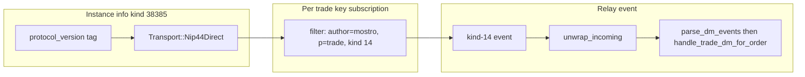

# DM listener / router flow (`listen_for_order_messages`)

This document explains the runtime flow inside `listen_for_order_messages` (in `src/util/dm_utils/mod.rs`), focusing on:

- how the in-memory **message list** (`Vec<OrderMessage>`) is created/updated
- how “preferences”/routing concepts work: **TrackOrder**, **Waiter**, **Database**, **Action**, **Status**, notifications, and terminal cleanup

> **Protocol v2:** Mostrix speaks signed kind 14 (NIP-44) for protocol DMs. Filters use [`filter_protocol_dm_from_mostro`](../src/util/filters.rs). Outbound [`send_dm`](../src/util/dm_utils/mod.rs) uses [`wrap_message_with`](../src/util/mod.rs) (`Transport::Nip44Direct`); inbound parse, waiter match, and listener decrypt use [`unwrap_incoming`](../src/util/mod.rs). Event gate: `event.kind == Kind::PrivateDirectMessage`. See [Protocol v2](README.md#protocol-v2-nip-44--protocol-dms-complete).

## Protocol DMs (NIP-44 kind 14)

Protocol DMs (orders, take, pay, release — **not** P2P order chat or admin dispute chat) use one listener and one wire format:

| | **v2** (NIP-44) |
|---|---|
| **Subscribe filter** | `.author(mostro).pubkey(trade_key).kind(14)` (self-admin omits `#p`) |
| **Inbound event kind** | PrivateDirectMessage (14) |
| **Outbound** | Signed kind 14 + identity proof via `wrap_message_with` |
| **Decrypt** | `unwrap_incoming` |
| **PoW** | Instance `pow` on signed kind 14; first-contact actions (`NewOrder`, `TakeBuy`, `TakeSell`) use `max(pow, pow_first_contact)` — see [POW_AND_OUTBOUND_EVENTS.md](POW_AND_OUTBOUND_EVENTS.md) |

[`transport_from_instance`](../src/util/mostro_info.rs) always returns `Nip44Direct` and is cached on [`AppState.transport`](../src/ui/app_state.rs). Kind-38385 `protocol_version` is still parsed for the Mostro Info tab; a v1 advertisement is unsupported. Startup **awaits** instance info before spawning the listener; reconnect and Mostro Info refresh reload via [`dm_transport_for_mostro`](../src/ui/key_handler/async_tasks.rs).



## Big picture

Mostrix has a **single background task** that:

- maintains relay subscriptions for **active orders** (long-lived)
- supports temporary **request/response waits** (short-lived) used by operations like “create order”, “take order”, “send msg”
- consumes incoming relay protocol DM events and routes each event into:
  - (A) the **waiter path**: satisfy in-flight `wait_for_dm` calls
  - (B) the **tracked-order path**: update the UI/order-state pipeline

### Core state held by the listener

- **`subscribed_pubkeys: HashSet<PublicKey>`**  
  Pubkeys we believe we currently have an active protocol-DM subscription for (whether that subscription originated from TrackOrder or a Waiter).

- **`subscription_to_order: HashMap<SubscriptionId, (Uuid, i64)>`**  
  The “fast path” routing table: if an event arrives with a known `subscription_id`, we immediately know its `(order_id, trade_index)`.

- **`pubkey_to_subscription: HashMap<PublicKey, SubscriptionId>`**  
  Lets TrackOrder “rebind” a pubkey that was subscribed earlier by a waiter without subscribing twice.

- **`pending_waiters`** (process-wide registry in `src/util/dm_utils/waiters.rs`)  
  Each waiter is a oneshot sender plus the `trade_keys` to test whether the incoming protocol DM can be decrypted for that operation. Waiters are **not** stored in the listener task, so abort/reconnect/supervised respawn does not cancel in-flight `wait_for_dm` calls. The rebuilt listener re-subscribes waiter pubkeys and catch-up fetches events since each waiter's register timestamp.

- **`active_order_trade_indices: Arc<Mutex<HashMap<Uuid, i64>>>`** *(shared with the rest of the app)*  
  Tracks which orders are currently “active” and which `trade_index` (hence which trade key) belongs to each `order_id`.

- **`messages: Arc<Mutex<Vec<OrderMessage>>>`** *(shared with UI)*  
  The in-memory list backing the “Messages”/flow UI. Important: this vector is **not a full history**; it stores **one “latest relevant” row per order**.

## Startup bootstrap (subscriptions + relay replay)

### 1) Load active orders from the database

Before the listener task starts, `hydrate_startup_active_order_dm_state` (`src/util/dm_utils/mod.rs`) reads non-terminal orders from SQLite (`Order::get_startup_active_orders`) and builds:

- **`active_order_trade_indices`**: `order_id → trade_index` (seeds the shared `Arc<Mutex<…>>` used by the UI and listener)
- **`order_last_seen_dm_ts`**: optional per-order Unix cursor (max seen protocol DM rumor time), used to choose the initial subscription filter

The in-memory **Messages** list (`Vec<OrderMessage>`) is **not** persisted. Only the DB row (trade keys, index, cursor) survives restart.

### 2) Per-order protocol DM `subscribe` (routing tables)

`listen_for_order_messages(client, mostro_pubkey, transport, …)` clones the active-order map and, for each `(order_id, trade_index)`:

1. derives `trade_keys` from the persisted `User` seed + trade index
2. subscribes via `dm_helpers::ensure_order_dm_subscription` (filter = `filter_protocol_dm_from_mostro(…)`) with a mode from `DmSubscriptionMode`:
   - **`StartupCatchUp`** (no `last_seen_dm_ts` yet): latest retained event (`limit(1)`) — tight catch-up
   - **`StartupSince(ts)`** (cursor present): `since(ts)` for incremental subscription
   - **`LiveOnly`** (used after `TrackOrder` during live flows, e.g. take-order): **`.limit(0)`** live stream — **not** `.since(now)`, so Same-second Mostro replies are not dropped when `take_order` sends an early `TrackOrder` before `wait_for_dm` (the pubkey is already subscribed once; a second waiter subscription is skipped)
3. records routing metadata (`subscribed_pubkeys`, `subscription_to_order`, `pubkey_to_subscription`)

### 3) One-shot `fetch_events` replay (Messages tab after restart)

Relay subscriptions alone often **do not** deliver enough stored history into the notification stream to refill the UI. Immediately after the bootstrap `subscribe` loop, the listener runs **`fetch_and_replay_startup_trade_dms`**:

- Takes a **`DmListenerStartupReplay`** snapshot (`client`, `mostro_pubkey`, `transport`, `pool`, `user`, messages, notification maps, subscription maps).
- For each startup order with a known subscription id, **queries relays** with `client.fetch_events` using [`filter_protocol_dm_from_mostro`](../src/util/filters.rs) + `since` + limit 100 (12-hour lookback — `STARTUP_TRADE_DM_LOOKBACK_SECS` / `STARTUP_TRADE_DM_FETCH_LIMIT`).
- Within that fetched window, decrypts each event with [`unwrap_incoming`](../src/util/mod.rs) and parses with **`parse_dm_events_single`**, then picks the **single** parsed triple **`(Message, rumor created_at, sender)`** whose **rumor timestamp is greatest** (tie-break: Nostr event id). Envelope order can disagree with rumor time; replaying the full batch in sort order could hydrate an **older** trade step, so only this **newest-rumor** line is replayed.
- Dispatches **`dispatch_trade_dm_batch(vec![freshest], …, notify: false)`** — i.e. one message per order. The **`notify`** flag is passed through to **`handle_trade_dm_for_order`** so startup replay does not bump the unread badge or re-trigger invoice popups (`notify: false` here; live relay paths use **`notify: true`**).

**Practical “where to look”**: `fetch_and_replay_startup_trade_dms`, struct **`DmListenerStartupReplay`**, **`dispatch_trade_dm_batch`** (batch of one at startup), and **`notify`** on **`handle_trade_dm_for_order`** / **`dispatch_trade_dm_batch`** in `src/util/dm_utils/mod.rs`.

### 4) Post-restore trade DM replay (session restore, no restart)

Cold startup replay runs inside `listen_for_order_messages` bootstrap (section 3). **Session restore** (Settings → Restore Session) must refill the Messages tab **without** restarting the listener task. That path is separate:

1. `apply_order_result` handles `OperationResult::SessionRestored` — clears chat projection, re-syncs DB-backed UI rows, then spawns **`spawn_post_restore_hydrate`** (`src/ui/helpers/startup.rs`).
2. **`prepare_post_restore_trade_dm_replay`** reloads `hydrate_startup_active_order_dm_state`, re-seeds `active_order_trade_indices` and `startup_popup_floor_ts` on `AppState`.
3. **`replay_active_trade_dms`** (awaitable; also used from the orchestrator) fetches per active order with **`trade_dm_replay_fetch_filter`**:
   - **No `last_seen_dm_ts`** (post-wipe / fresh restore row): **limit-only** — no `since` — so relay retention bounds catch-up (not the 12h cold lookback).
   - **Cursor present**: `since` from cursor ∩ lookback, plus fetch limit.
4. Dispatch uses **`UntrackedFallback`** when the live DM router has no `TrackOrder` subscription for the trade pubkey yet (common immediately after restore).
5. Updates `AppState.messages` with **`notify: false`** (no duplicate popups). Completion is folded into **`RestoreHydrateReport.trade_dm`** on **`PostRestoreHydrateCompleted`**.

Peer order chat (My Trades panel) is a **separate pipe** — shared-key kind-14 fetch in `rebuild_peer_order_chats_after_restore`, not the protocol-DM router. See [STARTUP_AND_CONFIG.md](STARTUP_AND_CONFIG.md) — "Session restore hydrate".

## Command “preferences”: TrackOrder vs Waiter

The listener consumes a command channel (`dm_subscription_rx`) with two variants:

### 1) `TrackOrder { order_id, trade_index }`

Use case: “this order is now active; keep listening for updates”.

What happens:

- **Active order map is updated immediately** (`active_order_trade_indices.insert(order_id, trade_index)`)
  - It also removes any “stale” `order_id` entries pointing at the same `trade_index` (to avoid phantom order IDs when the final Mostro-provided ID differs from an optimistic one).
- Derive `trade_keys` from `trade_index`, get `pubkey = trade_keys.public_key()`.
- Ensure a protocol-DM subscription exists for that trade pubkey (via `filter_protocol_dm_from_mostro`). If already subscribed (possibly via a waiter), TrackOrder will reuse it.
- Update routing tables so future relay events with that `subscription_id` are routed directly to `(order_id, trade_index)`.

**Conceptually:** TrackOrder is long-lived; it binds the pubkey to a concrete order and makes the tracked-order path reliable and O(1).

### 2) `RegisterWaiter { trade_keys }`

Use case: “I’m about to send a request DM; wait for the first decryptable response for these trade keys”.

What happens:

- `wait_for_dm` inserts the oneshot into the **process-wide** waiter registry (bounded by `MAX_PENDING_WAITERS`) **before** sending the protocol DM. A full registry fails the command without sending, so Mostro is not left with an unacked action.
- The listener command is a subscribe hint only. If this trade pubkey is not yet subscribed, the listener subscribes with `filter_protocol_dm_from_mostro(…).limit(0)` and records the `SubscriptionId` in `pubkey_to_subscription`.
- The waiter subscription uses a **live-only** filter (`.limit(0)`), which avoids
  replay backlog and prevents missing immediate responses due to same-second `since(now)` cutoff.
- If the listener is aborted (reconnect / key reload / panic respawn), the oneshot stays in the registry. Bootstrap re-subscribes with `WaiterCatchUp(since)` and **spawns** a bounded concurrent `fetch_events` catch-up so live notification routing is not blocked. That catch-up only take-and-sends waiter **ids snapshotted at spawn**, so a delayed result cannot consume a later same-key waiter. Events older than `since` are ignored so startup catch-up does not steal a stale trade DM as the in-flight response. Waiters with an expected `request_id` consume only a decryptable Mostro reply that echoes that id.

**Conceptually:** a Waiter is short-lived. It does not know `order_id`; it only knows “this key should decrypt the response”. Timeout (`WAIT_FOR_DM_TIMEOUT_MSG`) means no matching event arrived. Oneshot cancel (`WAIT_FOR_DM_CANCELED_MSG`) is not a Mostro rejection (`CantDo`).

## Incoming protocol DM event routing (the heart of the flow)

When a relay event arrives (`RelayPoolNotification::Event`) and `event.kind == transport.event_kind()`:

### Step A — satisfy pending waiters first

For each waiter:

- skip events whose `event.pubkey` is not the configured Mostro instance (relay author filters are not a trust boundary)
- test whether [`unwrap_incoming`](../src/util/mod.rs) succeeds for `waiter.trade_keys` and the event
- if it does **and** the decoded `request_id` correlates with the waiter (or the waiter has none), take-and-send the raw `event` into that waiter’s oneshot
- catch-up results skip waiters whose id was not in the set snapshotted when that fetch was spawned
- otherwise, keep the waiter pending for the next event

To avoid duplicate decrypt checks, the listener keeps a **per-event decryptability cache**:

- key: `(event_id, trade_pubkey)`
- value: `bool` (decryptable or not)

This cache is reused again in the tracked-order path below.

### Step B — tracked-order path (map event → order_id/trade_index)

The listener tries, in order:

1) **Fast path: route by subscription id**  
If `subscription_to_order` contains `subscription_id`, we have `(order_id, trade_index)`.

2) **Fallback path: resolve by testing active orders**  
If subscription id is unknown (e.g. a waiter created the subscription and TrackOrder hasn’t rebound it yet), the listener scans `active_order_trade_indices` and tries decrypting the event against each derived trade key until one matches.

When an `(order_id, trade_index, trade_keys)` is found, the listener proceeds to parse and dispatch.

## How the “list of messages” is created

### 1) Decrypt & parse into protocol `Message`

For the tracked order (or fallback-resolved order), the listener:

- builds a one-event `Events` set
- calls `parse_dm_events(events, &trade_keys, None)`

`parse_dm_events` returns a sorted list:

- **dedup**: drops duplicate Nostr event IDs
- **decrypt**: [`unwrap_incoming`](../src/util/mod.rs) (signed kind 14) and parses JSON into `mostro_core::Message`
- **sort**: ascending by rumor created-at timestamp (oldest → newest)

### 2) Dispatch each parsed trade DM into the UI/DB pipeline

For each `(Message, timestamp, sender)` in the parsed batch:

- call `handle_trade_dm_for_order(...)`
- then apply “terminal trade” cleanup rules (see below)

### 3) `handle_trade_dm_for_order` constructs (and replaces) `OrderMessage`

This function is where `OrderMessage` is created/updated and pushed into `messages`.

Key behaviors:

- **Early return for non-trade hydration actions**  
  **`Action::CantDo`** returns immediately. It is an error response from Mostro (`Payload::CantDo`); it is handled on the **waiter** path (`order_utils/helper.rs` → user-facing `OperationResult`) and must **not** upsert SQLite or replace the per-order Messages row.

- **Trade-DM `Action::NewOrder` (special cases only)**  
  Create-order `NewOrder` uses the **waiter** path (`send_new_order`), not this listener. On a tracked trade subscription, `try_handle_new_order_trade_dm` handles only:
  - pre-Active **taker** republish → delete stale take row and remove from Messages;
  - pre-Active **maker** republish → revert DB to `pending`, remove from Messages, refresh My Trades maker-book cache;
  - **range child** listing (`Payload::Order` + `pending`, no local row) → `save_order` + track.
  When that helper returns `false`, the message continues through generic trade-DM hydration. Replayed `NewOrder` must not replace an established non-`NewOrder` Messages row (`new_order_would_regress_messages_row`).

- **DB refresh/upsert for certain actions**  
  For `add-invoice`, `pay-invoice`, and **`pay-bond-invoice`** (Mostro Phase 1.5+ taker bond / Phase 5+ maker bond) where the payload embeds an order, the listener persists/upserts the order row (including request id when available). `pay-bond-invoice` is allow-listed for null `request_id` DMs (`helper.rs`) — Mostro may emit these after a take **or** as the first create-order reply when maker bonding is enabled.

- **Status persistence**  
  Updates the order status in SQLite via `update_order_status` using:
  - status derived from `Payload::Order` / `PaymentRequest(Some(order), ...)` + `map_action_to_status`, or
  - action-only inference (`inferred_status_from_trade_action`) when payload is absent — including **`CooperativeCancelAccepted` → `CooperativelyCanceled`** when Mostro sends an action-only DM.

- **Derive “effective” UI fields with fallbacks**  
  The `OrderMessage` fields like `sat_amount`, `buyer_invoice`, `order_kind`, `is_mine`, `order_status` are computed from a priority order:
  - payload (if present)
  - database row (if present)
  - previous message already stored for that order (if present)

- **Dedup / “is new message” logic**  
  Relay delivery can be out-of-order. The listener decides a message is “new” if:
  - there was no existing message for that order, or
  - the `Action` changed, or
  - the `Action` is the same but the new timestamp is strictly newer

- **“One row per order” storage**  
  The `messages: Vec<OrderMessage>` is treated as “latest per order”:
  - it removes any existing entry with the same `order_id`
  - pushes the newly created `OrderMessage`
  - sorts the whole vector by `timestamp` descending (newest first)

So the “message list” is really a **per-order summary row list**, not a chat transcript.

### 4) Notifications + pending badge count

If the update is both:

- **actionable** (e.g. `pay-invoice` / `pay-bond-invoice` only when an actual invoice exists in the `PaymentRequest` payload — same gate in `src/util/dm_utils/mod.rs`), and
- **new** (per the logic above),

then the listener:

- increments `pending_notifications`
- sends a UI notification via `message_notification_tx`

## Action vs Status vs Database (how to think about them)

- **`Action`** (`mostro_core::Action`)  
  The *event type* of a protocol step (e.g. `PayInvoice`, **`PayBondInvoice`**, `AddInvoice`, `FiatSent`, `Release`, `Canceled`, …). This is always present in the decoded `MessageKind`. `PayBondInvoice` (wire discriminator `pay-bond-invoice`) was introduced in `mostro-core` 0.11.0 and replaces the Phase 1 hack of reusing `PayInvoice` for anti-abuse bonds.

- **`Status`** (`mostro_core::order::Status`)  
  The order’s *state machine position* (e.g. `waiting-payment`, **`waiting-taker-bond`** (Phase 1.5+), **`waiting-maker-bond`** (Phase 5+), `active`, `fiat-sent`, `success`, …). This may come from:
  - an embedded order payload (`Payload::Order` or `PaymentRequest(Some(order), ...)` — **prefer payload `status`** for maker bond, e.g. `waiting-maker-bond`)
  - the local DB (previously persisted)
  - action-only inference when payload is absent (`PayBondInvoice` → `WaitingTakerBond` in `inferred_status_from_trade_action`; maker bond should carry explicit status in the `PaymentRequest` order)

**Pre-active statuses** (`is_pre_active_status` in `dm_utils/mod.rs`): include `pending`, `waiting-taker-bond`, **`waiting-maker-bond`**, and early payment/invoice phases — used for taker-cancel republish, maker listing recovery, and expiry/reconcile guards.

- **Database (`sqlite`)**  
  Used to persist “critical truth” for recovery and UI:
  - order rows (including `trade_keys`, kind, mine/not-mine, last known status)
  - status updates (`update_order_status`)
  - “upsert from DM” updates for invoice-related actions

**Rule of thumb in the listener:**  
Use payload `Status` when present, otherwise consult DB or infer from `Action`, then publish an `OrderMessage` that carries “effective” fields forward so the UI stays stable even across partial payloads.

## Terminal cleanup (when we stop tracking an order)

Some messages indicate the trade is over. Terminal detection considers:

- explicit terminal actions even when payload is null (e.g. `canceled`, **`CooperativeCancelAccepted`**)
- terminal order statuses when present in the payload (`success`, `canceled`, `expired`, …)

When a terminal message is detected:

- for **tracked subscriptions** (known `subscription_id`):
  - remove the order from `active_order_trade_indices`
  - remove the pubkey from `subscribed_pubkeys`
  - remove the mapping entry from `subscription_to_order`
  - unsubscribe from the relay subscription

- for **fallback/untracked** (unknown `subscription_id`):
  - remove the order from `active_order_trade_indices`
  - remove the pubkey from `subscribed_pubkeys`
  - do **not** unsubscribe (we may not own that subscription id)

### Early cancel nuance (pre-Active taker cancel)

`Action::Canceled` can arrive with `payload: null`. Mostrix treats this **contextually**:

- **cancel while still effectively Pending (pre-Active)**: the order is republished back to the book as Pending. Mostrix:
  - stops tracking/unsubscribes
  - removes the per-order row from `messages`
  - **taker**: deletes the local `orders` DB row (stale take-attempt row)
  - **maker**: reverts the local DB status back to `pending` (order still alive in the book)
- **all other cancels** (maker cancel pre-Active, or cancels after the trade progressed): Mostrix:
  - persists a terminal cancel status (`canceled` / payload terminal status when present)
  - stops tracking/unsubscribes
  - removes the per-order row from `messages`

## Mermaid: end-to-end listener flow

```mermaid
flowchart TD
  A[listen_for_order_messages start] --> B[Load User from DB]
  B --> C[Bootstrap subs for active_order_trade_indices]
  C --> C1[Re-subscribe in-flight wait_for_dm waiters + catch-up fetch]
  C1 --> C2[fetch_events replay into messages notify=false]
  C2 --> D{loop: select}

  D -->|tick| GC[Prune closed waiters]
  D -->|cmd| CMD{DmRouterCmd}
  CMD -->|TrackOrder| TO[Update active_order_trade_indices; ensure subscription; bind subscription_id -> order]
  CMD -->|RegisterWaiter| W[Ensure waiter pubkey subscription; oneshot already in process-wide registry]

  D -->|relay event| E[protocol DM event arrives]
  E --> WA[Try match pending waiters (decrypt check)]
  WA --> RB{subscription_id mapped?}
  RB -->|yes| FAST[Derive trade_keys; parse_dm_events; dispatch batch]
  RB -->|no| FB[resolve_order_for_event: scan active orders; find decryptable key]
  FB -->|matched| FAST
  FB -->|no match| DROP[Ignore event]

  FAST --> HT[handle_trade_dm_for_order per message]
  HT --> M[Replace per-order entry in messages; maybe notify]
  M --> TERM{terminal message?}
  TERM -->|yes| CL[cleanup indices + subscription]
  TERM -->|no| D
  CL --> D
```

## Practical “where to look” pointers

- **Router entry point**: `listen_for_order_messages` in `src/util/dm_utils/mod.rs`
- **Message parsing**: `parse_dm_events`
- **Per-order message construction & dedup**: `handle_trade_dm_for_order`
- **Terminal detection**: `trade_message_is_terminal`
- **Fallback routing**: `resolve_order_for_event`

## Manual verification (protocol v2)

Use this checklist when validating protocol DMs against a live v2 node:

1. **v2 node** (`protocol_version: "2"`) — create order, take, pay invoice, release over kind-14 subscribe + `unwrap_incoming`.
2. **v1 node** (`protocol_version: "1"`) — Mostrix does **not** speak GiftWrap; Mostro Info shows an unsupported warning. Do not expect trade DMs to work.
3. **Mid-trade restart** — quit and relaunch Mostrix; startup `fetch_events` replay hydrates Messages tab state via the kind-14 filter.
4. **Session restore (no restart)** — Settings → Restore Session after seed import; Messages tab and My Trades peer chat hydrate via `spawn_post_restore_hydrate` without relaunching the DM listener. See [RESTORE_SESSION_ACCEPTANCE.md](RESTORE_SESSION_ACCEPTANCE.md).
5. **P2P order chat** — kind 14 only (`chat_utils.rs`). Unrelated to protocol DM cutover. Full #102 matrix: [CHAT_KIND14_ACCEPTANCE.md](CHAT_KIND14_ACCEPTANCE.md).

