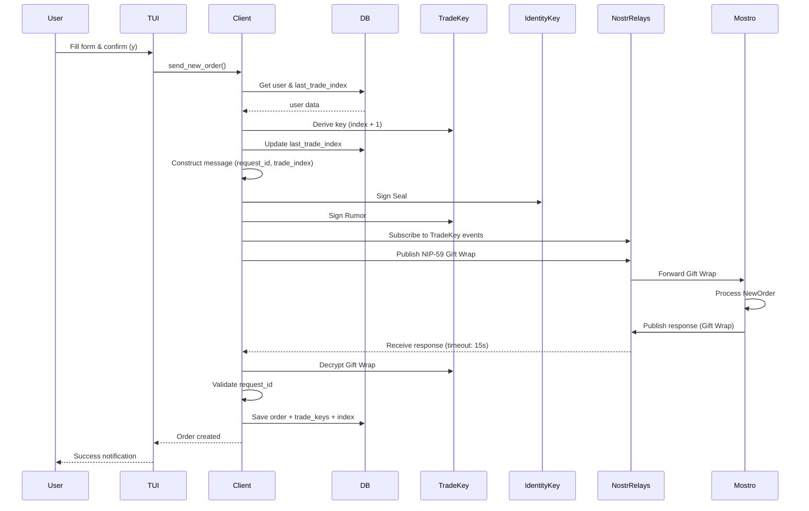
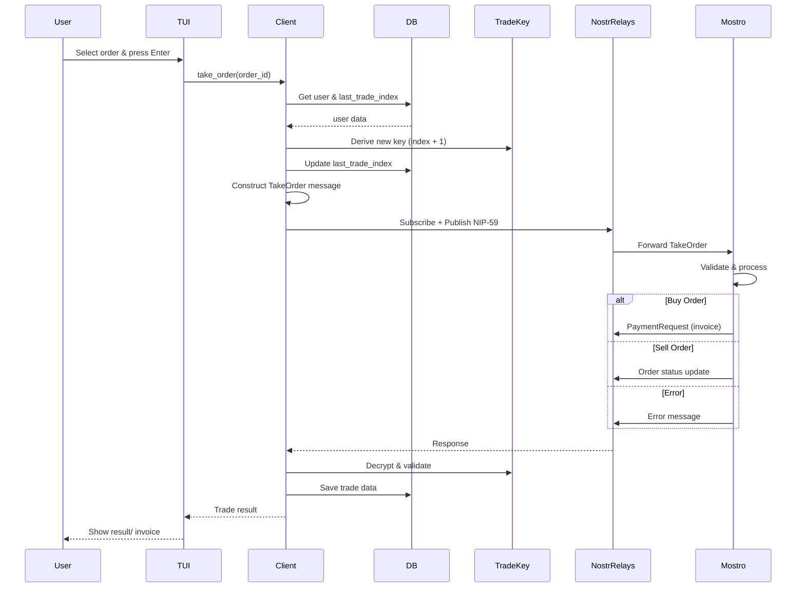
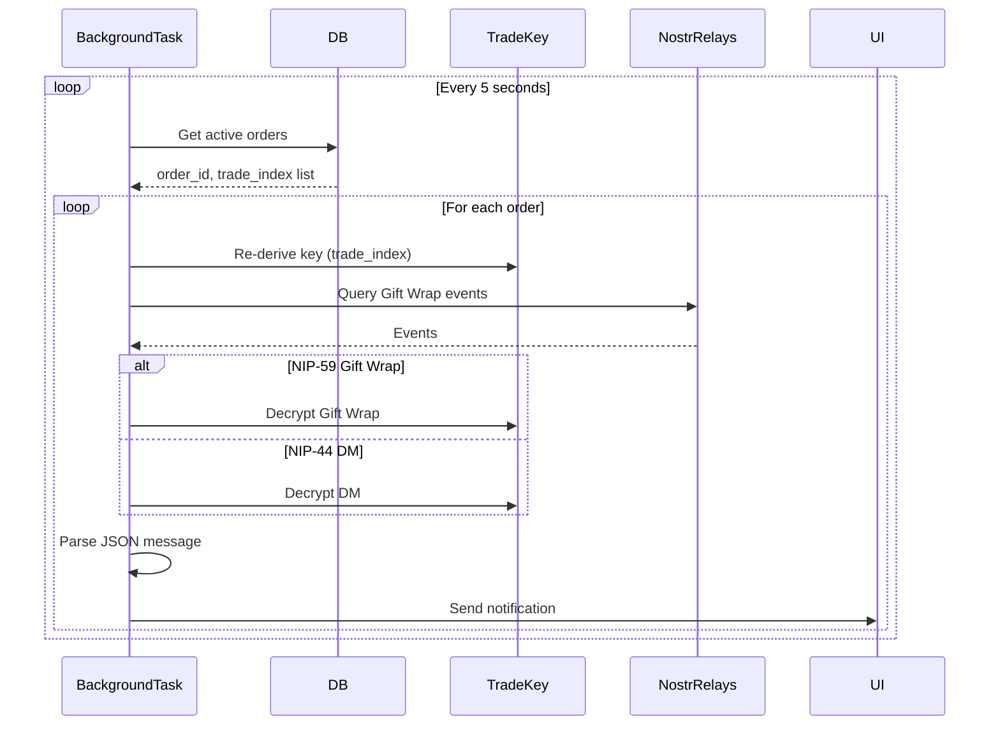
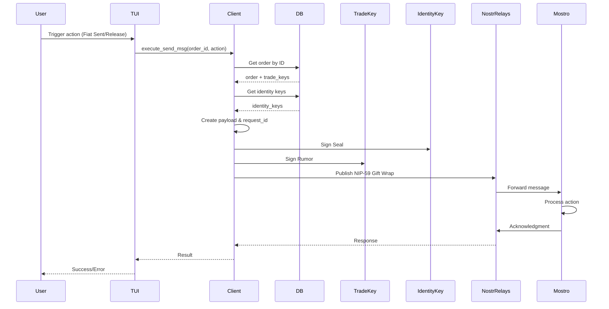
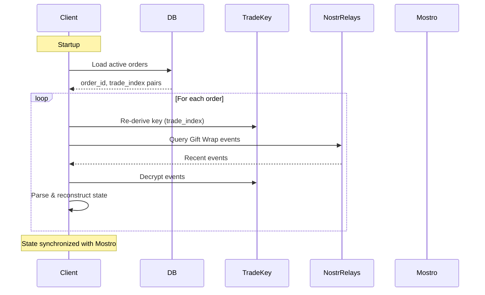

# Message Flow & Protocol Interactions

This guide explains how Mostrix communicates with the Mostro daemon and handles the flow of orders and messages through the Nostr network.

## Communication Protocols

Mostrix uses two Nostr protocols for secure communication:

1. **NIP-59 (Gift Wrap)**: Primary method for communicating with the Mostro daemon. Provides encryption and authentication.
2. **NIP-44 (Encrypted Direct Messages)**: Alternative method for peer-to-peer communication (used in some scenarios).

## Order Creation Flow

When a user creates a new order through the TUI, the following sequence occurs:



### 1. User Input → Form Validation
**Source**: `src/ui/key_handler.rs:743`
```743:746:src/ui/key_handler.rs
        UiMode::UserMode(UserMode::ConfirmingOrder(form)) => {
            // User confirmed, send the order
            let form_clone = form.clone();
            app.mode = UiMode::UserMode(UserMode::WaitingForMostro(form_clone.clone()));
```

The user fills out the order form and confirms with the `y` key. The UI switches to `WaitingForMostro` mode.

### 2. Trade Key Derivation
**Source**: `src/util/order_utils/send_new_order.rs:84`
```84:87:src/util/order_utils/send_new_order.rs
    let user = User::get(pool).await?;
    let next_idx = user.last_trade_index.unwrap_or(1) + 1;
    let trade_keys = user.derive_trade_keys(next_idx)?;
    let _ = User::update_last_trade_index(pool, next_idx).await;
```

A fresh trade key is derived using the next available index. This ensures privacy by using a unique key for each order.

### 3. Message Construction
**Source**: `src/util/order_utils/send_new_order.rs:108`
```108:117:src/util/order_utils/send_new_order.rs
    // Create message
    let request_id = uuid::Uuid::new_v4().as_u128() as u64;
    let order_content = Payload::Order(small_order);
    let message = Message::new_order(
        None,
        Some(request_id),
        Some(next_idx),
        Action::NewOrder,
        Some(order_content),
    );
```

A `Message` is constructed with:
- A unique `request_id` for tracking the response
- The `trade_index` to identify which key Mostro should use
- The `Action::NewOrder` action type
- The order payload containing all order details

### 4. Sending the Direct Message
**Source**: `src/util/order_utils/send_new_order.rs:131`
```131:139:src/util/order_utils/send_new_order.rs
    let identity_keys = User::get_identity_keys(pool).await?;
    let new_order_message = send_dm(
        client,
        Some(&identity_keys),
        &trade_keys,
        &mostro_pubkey,
        message_json,
        None,
        false,
    );
```

The message is sent via `send_dm`, which:
- Uses the **Identity Key** to sign the Seal (for reputation tracking)
- Uses the **Trade Key** to sign the Rumor (demonstrating ownership)
- Wraps everything in a NIP-59 Gift Wrap event

### 5. Waiting for Response
**Source**: `src/util/order_utils/send_new_order.rs:141`
```141:143:src/util/order_utils/send_new_order.rs
    // Wait for Mostro response (subscribes first, then sends message to avoid missing messages)
    let recv_event =
        wait_for_dm(client, &trade_keys, FETCH_EVENTS_TIMEOUT, new_order_message).await?;
```

The `wait_for_dm` function:
1. **Subscribes first** to the trade key's Gift Wrap events (to avoid missing the response)
2. **Sends the message** after subscription is active
3. **Waits up to 15 seconds** (`FETCH_EVENTS_TIMEOUT`) for a response

### 6. Parsing and Handling Response
**Source**: `src/util/order_utils/send_new_order.rs:145`
```145:176:src/util/order_utils/send_new_order.rs
    // Parse DM events
    let messages = parse_dm_events(recv_event, &trade_keys, None).await;

    if let Some((response_message, _, _)) = messages.first() {
        let inner_message = handle_mostro_response(response_message, request_id)?;

        match inner_message.request_id {
            Some(id) => {
                if request_id == id {
                    // Request ID matches, process the response
                    match inner_message.action {
                        Action::NewOrder => {
                            if let Some(Payload::Order(order)) = &inner_message.payload {
                                log::info!(
                                    "✅ Order created successfully! Order ID: {:?}",
                                    order.id
                                );

                                // Save order to database
                                if let Err(e) = save_order(
                                    order.clone(),
                                    &trade_keys,
                                    request_id,
                                    next_idx,
                                    pool,
                                )
                                .await
                                {
                                    log::error!("Failed to save order to database: {}", e);
                                }

                                Ok(create_order_result_success(order, next_idx))
```

The response is:
1. **Decrypted** using the trade key
2. **Validated** by matching the `request_id`
3. **Processed** based on the action type
4. **Saved to the database** with the associated trade keys and index

## Taking Orders Flow

When a user takes an existing order from the order book:



### 1. User Selection
The user navigates to an order in the Orders tab and presses `Enter`.

### 2. Trade Key Derivation
**Source**: `src/util/order_utils/take_order.rs:66`
```66:68:src/util/order_utils/take_order.rs
    let next_idx = user.last_trade_index.unwrap_or(1) + 1;
    let trade_keys = user.derive_trade_keys(next_idx)?;
    let _ = User::update_last_trade_index(pool, next_idx).await;
```

A new trade key is derived for this specific trade interaction.

### 3. Message Construction
**Source**: `src/util/order_utils/take_order.rs:77`
```77:83:src/util/order_utils/take_order.rs
    // Create message
    let take_order_message = Message::new_order(
        Some(order_id),
        Some(request_id),
        Some(next_idx),
        action.clone(),
        payload,
    );
```

The message includes:
- The `order_id` of the order being taken
- A `request_id` for tracking
- The `trade_index` for this new trade
- The appropriate action (`TakeBuy` or `TakeSell`)

### 4. Response Handling
Similar to order creation, the client waits for Mostro's response, which may include:
- A `PaymentRequest` (for buy orders, requiring a Lightning invoice)
- Order status updates
- Error messages if the order is no longer available

## Background Message Listening

Mostrix runs a background task that continuously monitors for new messages related to active trades.



### Message Listener Task
**Source**: `src/util/dm_utils/mod.rs:216`
```216:223:src/util/dm_utils/mod.rs
pub async fn listen_for_order_messages(
    client: Client,
    pool: sqlx::sqlite::SqlitePool,
    active_order_trade_indices: Arc<Mutex<HashMap<uuid::Uuid, i64>>>,
    messages: Arc<Mutex<Vec<crate::ui::OrderMessage>>>,
    message_notification_tx: tokio::sync::mpsc::UnboundedSender<crate::ui::MessageNotification>,
    pending_notifications: Arc<Mutex<usize>>,
) {
```

This task:
1. **Runs every 5 seconds** (`refresh_interval`)
2. **Iterates through active orders** (stored in `active_order_trade_indices`)
3. **Re-derives trade keys** for each active order
4. **Fetches recent Gift Wrap events** directed to those trade public keys
5. **Parses and decrypts messages** using `parse_dm_events`
6. **Sends notifications** to the UI via the `message_notification_tx` channel

### Message Parsing
**Source**: `src/util/dm_utils/mod.rs:137`
```137:159:src/util/dm_utils/mod.rs
        let (created_at, message, sender) = match dm.kind {
            nostr_sdk::Kind::GiftWrap => {
                let unwrapped_gift = match nip59::extract_rumor(pubkey, dm).await {
                    Ok(u) => u,
                    Err(e) => {
                        log::warn!("Could not decrypt gift wrap (event {}): {}", dm.id, e);
                        continue;
                    }
                };
                let (message, _): (Message, Option<String>) =
                    match serde_json::from_str(&unwrapped_gift.rumor.content) {
                        Ok(msg) => msg,
                        Err(e) => {
                            log::warn!("Could not parse message content (event {}): {}", dm.id, e);
                            continue;
                        }
                    };

                (
                    unwrapped_gift.rumor.created_at,
                    message,
                    unwrapped_gift.sender,
                )
            }
```

The parser handles:
- **NIP-59 Gift Wrap**: Extracts the rumor, decrypts using the trade key, and parses the JSON message
- **NIP-44 Private Direct Messages**: Decrypts using the conversation key derived from the trade key and receiver's public key

## Sending Trade Messages

When a user needs to send a message during an active trade (e.g., "Fiat Sent", "Release"):



### Message Sending Flow
**Source**: `src/util/order_utils/execute_send_msg.rs:44`
```44:95:src/util/order_utils/execute_send_msg.rs
pub async fn execute_send_msg(
    order_id: &Uuid,
    action: Action,
    pool: &sqlx::SqlitePool,
    client: &Client,
    mostro_pubkey: PublicKey,
) -> Result<()> {
    // Get order from database
    let order = Order::get_by_id(pool, &order_id.to_string()).await?;

    // Get trade keys of specific order
    let trade_keys = order
        .trade_keys
        .clone()
        .ok_or(anyhow::anyhow!("Missing trade keys"))?;

    let order_trade_keys = Keys::parse(&trade_keys)?;

    // Get identity keys
    let identity_keys = User::get_identity_keys(pool).await?;

    // Determine payload based on action
    // For FiatSent on range orders, we might need NextTrade payload
    let payload: Option<Payload> = create_msg_payload(&action, &order, pool).await?;

    // Create request id
    let request_id = Uuid::new_v4().as_u128() as u64;

    // Create message
    let message = Message::new_order(
        Some(*order_id),
        Some(request_id),
        None,
        action.clone(),
        payload,
    );

    // Serialize the message
    let message_json = message
        .as_json()
        .map_err(|e| anyhow::anyhow!("Failed to serialize message: {e}"))?;

    // Send the DM
    let sent_message = send_dm(
        client,
        Some(&identity_keys),
        &order_trade_keys,
        &mostro_pubkey,
        message_json,
        None,
        false,
    );
```

Key points:
- The **trade keys are retrieved from the database** (they were stored when the order was created/taken)
- The **identity keys are used** for the Seal signature
- A **request_id** is generated for tracking the response
- The message is **sent and the client waits for Mostro's acknowledgment**
- For **range orders**, see [RANGE_ORDERS.md](RANGE_ORDERS.md) for details on the `NextTrade` payload mechanism

## Error Handling Patterns

### Timeout Handling
If Mostro doesn't respond within `FETCH_EVENTS_TIMEOUT` (15 seconds), the operation fails with a timeout error.

### Request ID Mismatch
**Source**: `src/util/order_utils/send_new_order.rs:199`
```199:201:src/util/order_utils/send_new_order.rs
                } else {
                    Err(anyhow::anyhow!("Mismatched request_id"))
                }
```

If the response's `request_id` doesn't match the sent request, the operation is rejected.

### Decryption Failures
**Source**: `src/util/dm_utils/mod.rs:139`
```139:144:src/util/dm_utils/mod.rs
                let unwrapped_gift = match nip59::extract_rumor(pubkey, dm).await {
                    Ok(u) => u,
                    Err(e) => {
                        log::warn!("Could not decrypt gift wrap (event {}): {}", dm.id, e);
                        continue;
                    }
                };
```

If a message cannot be decrypted (wrong key, corrupted data, etc.), it is logged and skipped rather than crashing the listener.

## Admin Chat Fetch (Single-Flight)

When the user is in **Admin** mode, the main event loop runs a periodic admin chat sync so the "Disputes in Progress" tab stays up to date with NIP‑59 gift-wrap messages from buyers and sellers.

- **Trigger**: Every 5 seconds (`admin_chat_interval` in `src/main.rs`), only when `app.user_role == UserRole::Admin` and `admin_chat_keys` is set.
- **Entry point**: `spawn_admin_chat_fetch` in `src/util/order_utils/fetch_scheduler.rs` is called with the Nostr client, admin keys, current disputes, `admin_chat_last_seen`, and the channel to send results.
- **Single-flight guard**: A shared `AtomicBool` (`CHAT_MESSAGES_SEMAPHORE`) is used so that only one admin chat fetch runs concurrently. On entry, `compare_exchange(false, true)` is used; if it fails (flag already `true`), the call returns without spawning. The flag is cleared when the fetch completes (success or error), then the result is sent on the channel.
- **Fetch work**: The spawned task calls `fetch_admin_chat_updates` (which internally uses `fetch_gift_wraps_to_admin`), then sends the `Result<Vec<AdminChatUpdate>, _>` to the main loop.
- **Application**: The main loop receives results on `admin_chat_updates_rx` and applies them via `apply_admin_chat_updates`: appends new messages to `admin_dispute_chats`, updates `admin_chat_last_seen`, and persists cursors to the database. Incoming content that is JSON with `type` `image_encrypted` or `file_encrypted` (Mostro Mobile Encrypted File Messaging format) is parsed as attachment messages: Blossom URL, base64 nonce (12 bytes), filename, optional base64 decryption key (32 bytes). Those appear in the chat with an icon and optional decryption key; transcript files store a placeholder. The admin can press **Ctrl+S** with an attachment selected to download the blob from the Blossom URL (HTTPS), optionally decrypt with ChaCha20-Poly1305 (nonce + ciphertext + tag), and save to `~/.mostrix/downloads/<dispute_id>_<filename>`. See `src/util/blossom.rs` and the "Receiving and saving file attachments" section in [ADMIN_DISPUTES.md](ADMIN_DISPUTES.md).

This avoids overlapping relay queries and duplicate work when the 5-second tick fires before a previous fetch has finished.

### Database Errors
Database operations (saving orders, updating trade indices) log errors but don't necessarily fail the entire operation, allowing the user to continue using the client.

## Stateless Recovery

Mostrix's message handling is designed to be stateless:



This approach means:
- No local message database is required
- The client can recover from crashes or restarts
- The state is always synchronized with what Mostro knows
