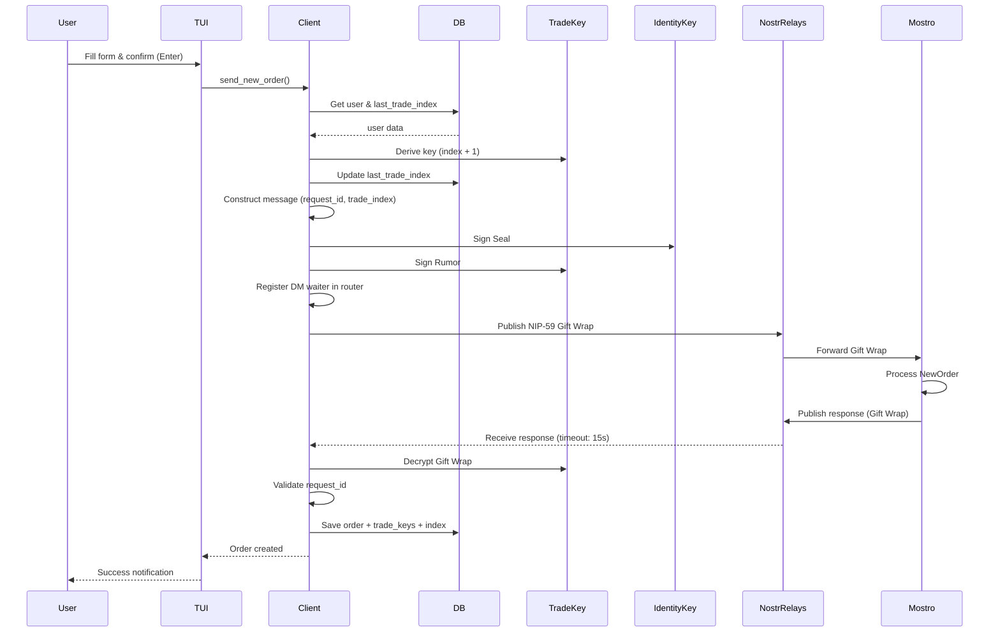
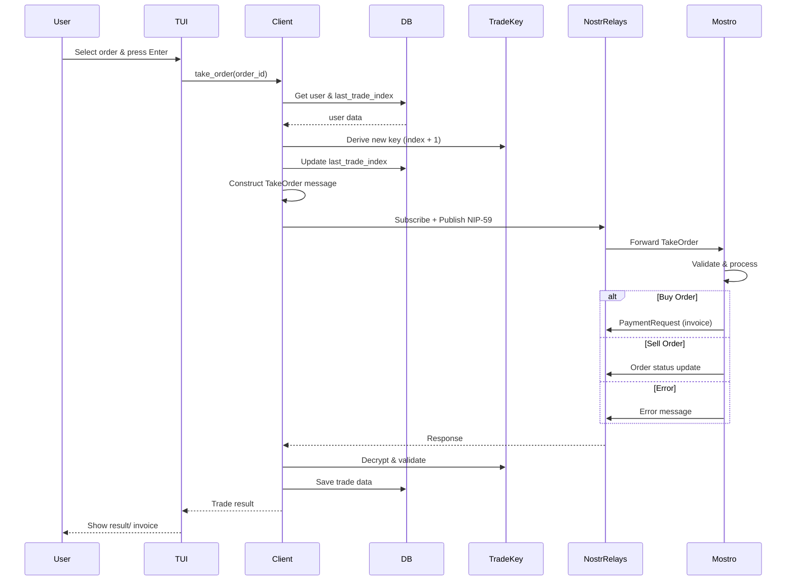
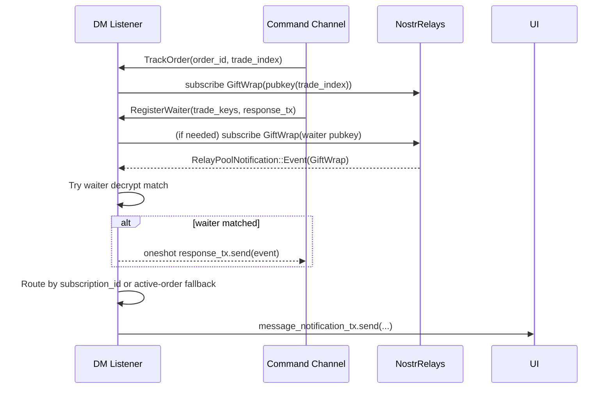
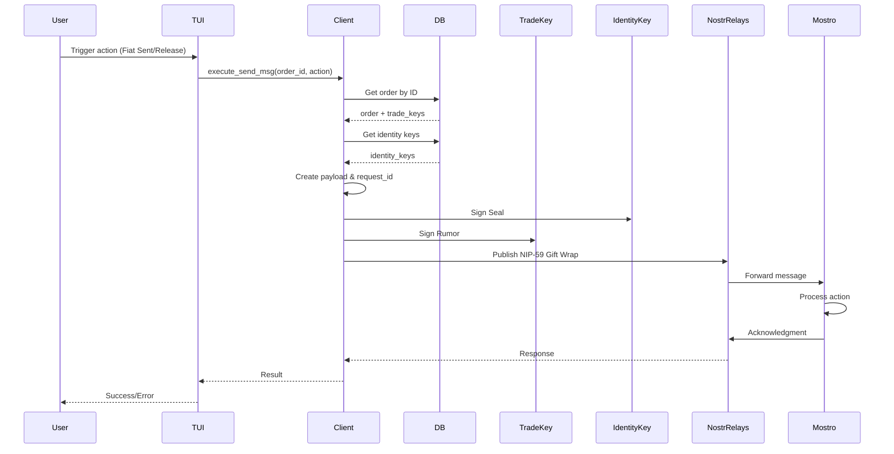
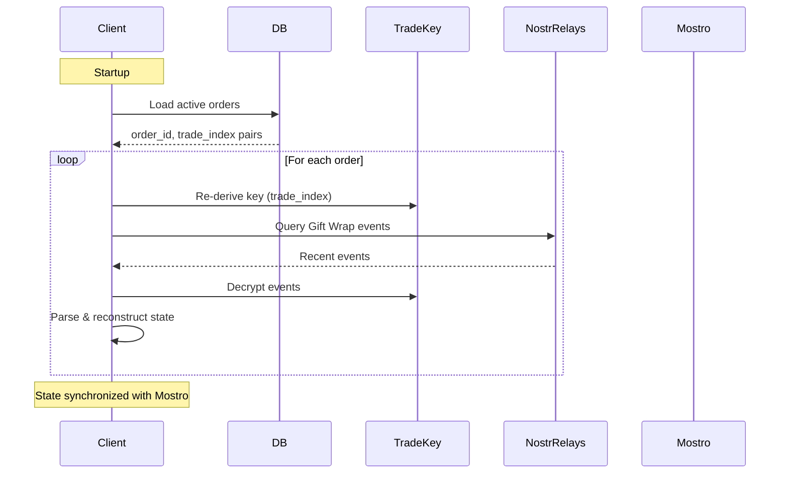

# Message Flow & Protocol Interactions

This guide explains how Mostrix communicates with the Mostro daemon and handles the flow of orders and messages through the Nostr network.

See also **[DM_LISTENER_FLOW.md](DM_LISTENER_FLOW.md)** for the background `listen_for_order_messages` task: relay subscriptions, waiter vs tracked-order routing, and the in-memory Messages list.

**Restart / Messages tab:** the UI message list is rebuilt from relays at startup (`fetch_events` replay per active trade key), not from a local message table. The database stores order rows, `trade_index`, and an optional **`last_seen_dm_ts`** cursor for subscription/sync; see **DATABASE.md** and **DM_LISTENER_FLOW.md** (“Startup bootstrap”).

## Communication Protocols

Mostrix uses two Nostr protocols for secure communication:

1. **NIP-59 (Gift Wrap)**: Primary method for communicating with the Mostro daemon. Provides encryption and authentication.
2. **NIP-44 (Encrypted Direct Messages)**: Alternative method for peer-to-peer communication (used in some scenarios).

### Proof-of-work (NIP-13)

Required difficulty comes from the Mostro **instance status** event (kind **38385**, tag `pow`), not from `settings.toml`. Mostrix derives mining bits with `nostr_pow_from_instance`, threads cached `AppState.mostro_info` into `send_dm` and related publishers, and applies PoW to the **published** event—including the **outer** Gift Wrap (kind 1059), via a local helper that extends the rust-nostr `gift_wrap` path. See **[POW_AND_OUTBOUND_EVENTS.md](POW_AND_OUTBOUND_EVENTS.md)** for implementation details and file pointers.

## Order Creation Flow

When a user creates a new order through the TUI, the following sequence occurs:


```mermaid
sequenceDiagram
    participant User
    participant TUI
    participant Client
    participant DB
    participant TradeKey
    participant IdentityKey
    participant NostrRelays
    participant Mostro

    User->>TUI: Fill form & confirm (Enter)
    TUI->>Client: send_new_order()
    Client->>DB: Get user & last_trade_index
    DB-->>Client: user data
    Client->>TradeKey: Derive key (index + 1)
    Client->>DB: Update last_trade_index
    Client->>Client: Construct message (request_id, trade_index)
    Client->>IdentityKey: Sign Seal
    Client->>TradeKey: Sign Rumor
    Client->>Client: Register DM waiter in router
    Client->>NostrRelays: Publish NIP-59 Gift Wrap
    NostrRelays->>Mostro: Forward Gift Wrap
    Mostro->>Mostro: Process NewOrder
    Mostro->>NostrRelays: Publish response (Gift Wrap)
    NostrRelays-->>Client: Receive response (timeout: 15s)
    Client->>TradeKey: Decrypt Gift Wrap
    Client->>Client: Validate request_id
    Client->>DB: Save order + trade_keys + index
    Client-->>TUI: Order created
    TUI-->>User: Success notification
```

### 1. User Input → Form Validation
**Source**: `src/ui/key_handler.rs:743`
```743:746:src/ui/key_handler.rs
        UiMode::UserMode(UserMode::ConfirmingOrder(form)) => {
            // User confirmed, send the order
            let form_clone = form.clone();
            app.mode = UiMode::UserMode(UserMode::WaitingForMostro(form_clone.clone()));
```

The user fills out the order form and confirms with **Enter** on the \"Create New Order\" form. The UI switches to `WaitingForMostro` mode.

### 2. Trade Key Derivation
**Source**: `src/util/order_utils/send_new_order.rs:84`
```84:87:src/util/order_utils/send_new_order.rs
    let user = User::get(pool).await?;
    let next_idx = user.last_trade_index.unwrap_or(1) + 1;
    let trade_keys = user.derive_trade_keys(next_idx)?;
    let _ = User::update_last_trade_index(pool, next_idx).await;
```

A fresh trade key is derived using the next available index. This ensures privacy by using a unique key for each order.

### 3. Message Construction
**Source**: `src/util/order_utils/send_new_order.rs:108`
```108:117:src/util/order_utils/send_new_order.rs
    // Create message
    let request_id = uuid::Uuid::new_v4().as_u128() as u64;
    let order_content = Payload::Order(small_order);
    let message = Message::new_order(
        None,
        Some(request_id),
        Some(next_idx),
        Action::NewOrder,
        Some(order_content),
    );
```

A `Message` is constructed with:
- A unique `request_id` for tracking the response
- The `trade_index` to identify which key Mostro should use
- The `Action::NewOrder` action type
- The order payload containing all order details

### 4. Sending the Direct Message
**Source**: `src/util/order_utils/send_new_order.rs:131`
```131:139:src/util/order_utils/send_new_order.rs
    let identity_keys = User::get_identity_keys(pool).await?;
    let new_order_message = send_dm(
        client,
        Some(&identity_keys),
        &trade_keys,
        &mostro_pubkey,
        message_json,
        None,
        false,
    );
```

The message is sent via `send_dm`, which:
- Uses the **Identity Key** to sign the Seal (for reputation tracking)
- Uses the **Trade Key** to sign the Rumor (demonstrating ownership)
- Wraps everything in a NIP-59 Gift Wrap event

### 5. Waiting for Response
**Source**: `src/util/order_utils/send_new_order.rs:141`
```141:143:src/util/order_utils/send_new_order.rs
    // Wait for Mostro response (subscribes first, then sends message to avoid missing messages)
    let recv_event =
        wait_for_dm(client, &trade_keys, FETCH_EVENTS_TIMEOUT, new_order_message).await?;
```

The `wait_for_dm` function now uses the shared DM router:
1. **Registers a waiter** (`RegisterWaiter`) for the specific `trade_keys`
2. **Sends the message** after waiter registration
3. **Waits up to 15 seconds** (`FETCH_EVENTS_TIMEOUT`) on a oneshot response channel
4. The background DM listener decrypt-checks incoming GiftWrap events against pending waiters and delivers the first match to `wait_for_dm`

Waiter subscription detail:
- `RegisterWaiter` uses a live-only GiftWrap filter with `.limit(0)` (not `since(now)`), which
  avoids same-second timestamp edge cases that can miss immediate Mostro responses.

### 6. Parsing and Handling Response
**Source**: `src/util/order_utils/send_new_order.rs:145`
```145:176:src/util/order_utils/send_new_order.rs
    // Parse DM events
    let messages = parse_dm_events(recv_event, &trade_keys, None).await;

    if let Some((response_message, _, _)) = messages.first() {
        let inner_message = handle_mostro_response(response_message, request_id)?;

        match inner_message.request_id {
            Some(id) => {
                if request_id == id {
                    // Request ID matches, process the response
                    match inner_message.action {
                        Action::NewOrder => {
                            if let Some(Payload::Order(order)) = &inner_message.payload {
                                log::info!(
                                    "✅ Order created successfully! Order ID: {:?}",
                                    order.id
                                );

                                // Save order to database
                                if let Err(e) = save_order(
                                    order.clone(),
                                    &trade_keys,
                                    request_id,
                                    next_idx,
                                    pool,
                                )
                                .await
                                {
                                    log::error!("Failed to save order to database: {}", e);
                                }

                                Ok(create_order_result_success(order, next_idx))
```

The response is:
1. **Decrypted** using the trade key
2. **Validated** by matching the `request_id`
3. **Processed** based on the action type
4. **Saved to the database** with the associated trade keys and index

## Taking Orders Flow

When a user takes an existing order from the order book:


```mermaid
sequenceDiagram
    participant User
    participant TUI
    participant Client
    participant DB
    participant TradeKey
    participant NostrRelays
    participant Mostro

    User->>TUI: Select order & press Enter
    TUI->>Client: take_order(order_id)
    Client->>DB: Get user & last_trade_index
    DB-->>Client: user data
    Client->>TradeKey: Derive new key (index + 1)
    Client->>DB: Update last_trade_index
    Client->>Client: Construct TakeOrder message
    Client->>NostrRelays: Subscribe + Publish NIP-59
    NostrRelays->>Mostro: Forward TakeOrder
    Mostro->>Mostro: Validate & process
    alt Buy Order
        Mostro->>NostrRelays: PaymentRequest (invoice)
    else Sell Order
        Mostro->>NostrRelays: Order status update
    else Error
        Mostro->>NostrRelays: Error message
    end
    NostrRelays-->>Client: Response
    Client->>TradeKey: Decrypt & validate
    Client->>DB: Save trade data
    Client-->>TUI: Trade result
    TUI-->>User: Show result/ invoice
```

### 1. User Selection
The user navigates to an order in the Orders tab and presses `Enter`.

### 2. Trade Key Derivation
**Source**: `src/util/order_utils/take_order.rs:66`
```66:68:src/util/order_utils/take_order.rs
    let next_idx = user.last_trade_index.unwrap_or(1) + 1;
    let trade_keys = user.derive_trade_keys(next_idx)?;
    let _ = User::update_last_trade_index(pool, next_idx).await;
```

A new trade key is derived for this specific trade interaction.

### 3. Message Construction
**Source**: `src/util/order_utils/take_order.rs:77`
```77:83:src/util/order_utils/take_order.rs
    // Create message
    let take_order_message = Message::new_order(
        Some(order_id),
        Some(request_id),
        Some(next_idx),
        action.clone(),
        payload,
    );
```

The message includes:
- The `order_id` of the order being taken
- A `request_id` for tracking
- The `trade_index` for this new trade
- The appropriate action (`TakeBuy` or `TakeSell`)

### 4. Response Handling
Similar to order creation, the client waits for Mostro's response, which may include:
- A `PaymentRequest` (for buy orders, requiring a Lightning invoice)
- Order status updates
- Error messages if the order is no longer available

## Background Message Listening

Mostrix runs a background task that continuously monitors relay notifications and routes trade DMs in real time.

For a detailed, code-level walkthrough of the DM router/listener (including how the in-memory `Vec<OrderMessage>` is built, how `TrackOrder` vs waiters work, and how `Action`/`Status`/DB updates relate), see [DM_LISTENER_FLOW.md](DM_LISTENER_FLOW.md).


```mermaid
sequenceDiagram
    participant Router as DM Listener
    participant Cmd as Command Channel
    participant Relays as NostrRelays
    participant UI

    Cmd->>Router: TrackOrder(order_id, trade_index)
    Router->>Relays: subscribe GiftWrap(pubkey(trade_index))
    Cmd->>Router: RegisterWaiter(trade_keys, response_tx)
    Router->>Relays: (if needed) subscribe GiftWrap(waiter pubkey)
    Relays-->>Router: RelayPoolNotification::Event(GiftWrap)
    Router->>Router: Try waiter decrypt match
    alt waiter matched
        Router-->>Cmd: oneshot response_tx.send(event)
    end
    Router->>Router: Route by subscription_id or active-order fallback
    Router->>UI: message_notification_tx.send(...)
```

### Message Listener Task
**Source**: `src/util/dm_utils/mod.rs:216`
```216:223:src/util/dm_utils/mod.rs
pub async fn listen_for_order_messages(
    client: Client,
    pool: sqlx::sqlite::SqlitePool,
    active_order_trade_indices: Arc<Mutex<HashMap<uuid::Uuid, i64>>>,
    messages: Arc<Mutex<Vec<crate::ui::OrderMessage>>>,
    message_notification_tx: tokio::sync::mpsc::UnboundedSender<crate::ui::MessageNotification>,
    pending_notifications: Arc<Mutex<usize>>,
) {
```

This task:
1. Maintains a command-driven subscription router (`TrackOrder` + `RegisterWaiter`)
2. Consumes `client.notifications()` and handles GiftWrap events as they arrive
3. Routes events by known `subscription_id` to `(order_id, trade_index)`
4. Falls back to decrypting against active tracked trade keys when `subscription_id` is unknown
5. Parses/decrypts with `parse_dm_events`, updates order state, and emits UI notifications

### User order chat local cache (My Trades)

In addition to relay-driven trade DMs, Mostrix keeps a lightweight local transcript cache for user-to-user order chat:

- **Path**: `~/.mostrix/orders_chat/<order_id>.txt`
- **Startup restore**: `load_user_order_chats_at_startup` restores cached chat into `AppState.order_chats` and seeds `order_chat_last_seen` before relay backfill.
- **Incremental merge**: `apply_user_order_chat_updates` deduplicates by `(timestamp, content)`, persists new entries, and advances per-order cursors.
- **Compatibility parsing**: legacy sender labels from older files (`Admin`, `Admin to Buyer`, `Admin to Seller`, `Buyer`, `Seller`) are mapped to `You/Peer` when loading.

**Source**: `src/ui/helpers/startup.rs`, `src/ui/helpers/chat_storage.rs`, `src/util/chat_utils.rs`

### Message Parsing
**Source**: `src/util/dm_utils/mod.rs:137`
```137:159:src/util/dm_utils/mod.rs
        let (created_at, message, sender) = match dm.kind {
            nostr_sdk::Kind::GiftWrap => {
                let unwrapped_gift = match nip59::extract_rumor(pubkey, dm).await {
                    Ok(u) => u,
                    Err(e) => {
                        log::warn!("Could not decrypt gift wrap (event {}): {}", dm.id, e);
                        continue;
                    }
                };
                let (message, _): (Message, Option<String>) =
                    match serde_json::from_str(&unwrapped_gift.rumor.content) {
                        Ok(msg) => msg,
                        Err(e) => {
                            log::warn!("Could not parse message content (event {}): {}", dm.id, e);
                            continue;
                        }
                    };

                (
                    unwrapped_gift.rumor.created_at,
                    message,
                    unwrapped_gift.sender,
                )
            }
```

The parser handles:
- **NIP-59 Gift Wrap**: Extracts the rumor, decrypts using the trade key, and parses the JSON message
- **NIP-44 Private Direct Messages**: Decrypts using the conversation key derived from the trade key and receiver's public key

## Sending Trade Messages

When a user needs to send a message during an active trade (e.g., "Fiat Sent", "Release"):


```mermaid
sequenceDiagram
    participant User
    participant TUI
    participant Client
    participant DB
    participant TradeKey
    participant IdentityKey
    participant NostrRelays
    participant Mostro

    User->>TUI: Trigger action (Fiat Sent/Release)
    TUI->>Client: execute_send_msg(order_id, action)
    Client->>DB: Get order by ID
    DB-->>Client: order + trade_keys
    Client->>DB: Get identity keys
    DB-->>Client: identity_keys
    Client->>Client: Create payload & request_id
    Client->>IdentityKey: Sign Seal
    Client->>TradeKey: Sign Rumor
    Client->>NostrRelays: Publish NIP-59 Gift Wrap
    NostrRelays->>Mostro: Forward message
    Mostro->>Mostro: Process action
    Mostro->>NostrRelays: Acknowledgment
    NostrRelays-->>Client: Response
    Client-->>TUI: Result
    TUI-->>User: Success/Error
```

### Message Sending Flow
**Source**: `src/util/order_utils/execute_send_msg.rs:44`
```44:95:src/util/order_utils/execute_send_msg.rs
pub async fn execute_send_msg(
    order_id: &Uuid,
    action: Action,
    pool: &sqlx::SqlitePool,
    client: &Client,
    mostro_pubkey: PublicKey,
) -> Result<()> {
    // Get order from database
    let order = Order::get_by_id(pool, &order_id.to_string()).await?;

    // Get trade keys of specific order
    let trade_keys = order
        .trade_keys
        .clone()
        .ok_or(anyhow::anyhow!("Missing trade keys"))?;

    let order_trade_keys = Keys::parse(&trade_keys)?;

    // Get identity keys
    let identity_keys = User::get_identity_keys(pool).await?;

    // Determine payload based on action
    // For FiatSent on range orders, we might need NextTrade payload
    let payload: Option<Payload> = create_msg_payload(&action, &order, pool).await?;

    // Create request id
    let request_id = Uuid::new_v4().as_u128() as u64;

    // Create message
    let message = Message::new_order(
        Some(*order_id),
        Some(request_id),
        None,
        action.clone(),
        payload,
    );

    // Serialize the message
    let message_json = message
        .as_json()
        .map_err(|e| anyhow::anyhow!("Failed to serialize message: {e}"))?;

    // Send the DM
    let sent_message = send_dm(
        client,
        Some(&identity_keys),
        &order_trade_keys,
        &mostro_pubkey,
        message_json,
        None,
        false,
    );
```

Key points:
- The **trade keys are retrieved from the database** (they were stored when the order was created/taken)
- The **identity keys are used** for the Seal signature
- A **request_id** is generated for tracking the response
- The message is **sent and the client waits for Mostro's acknowledgment**
- For **range orders**, see [RANGE_ORDERS.md](RANGE_ORDERS.md) for details on the `NextTrade` payload mechanism
- For **`Action::Cancel`**, a successful response may be **`Canceled`** or **`CooperativeCancelAccepted`** (`execute_send_msg` in `src/util/order_utils/execute_send_msg.rs`).

### Cooperative cancel (peer request)

When the counterparty initiates cooperative cancel, Mostrix receives a trade DM whose **`action`** is **`CooperativeCancelInitiatedByPeer`**. The user can confirm from the Messages tab:

1. **Enter** opens **`UiMode::ViewingMessage`** with the same **YES/NO** chrome as other confirms (`helpers::render_yes_no_buttons` in `src/ui/tabs/tab_content.rs`).
2. **YES + Enter** runs **`execute_send_msg`** with **`Action::Cancel`**, which waits for Mostro’s DM response.
3. On success, the client:
   - persists **`CooperativelyCanceled`** on the **`orders`** row (`update_order_status` from `src/ui/key_handler/message_handlers.rs`);
   - sends **`OperationResult::TradeClosed`** so the main loop removes the order from the in-memory Messages list and clears **`active_order_trade_indices`** (`handle_operation_result` in `src/util/dm_utils/order_ch_mng.rs` — the UI then shows a short success **Info** toast).

When the relay later delivers **`CooperativeCancelAccepted`**, the DM listener treats it as **terminal** (`trade_message_is_terminal`), may update status again if needed, and performs the usual subscription cleanup. See **DM_LISTENER_FLOW.md** (terminal cleanup, status inference).

### Rating the counterparty (`RateUser`)

After a successful trade, Mostro may prompt with a DM whose **`action`** is **`rate`** and **`payload`** is **`null`**, while the local DB row may still show **`success`**. The client must not infer the UI step from **`Status::Success` alone** for that message.

- **UI**: **`UiMode::RatingOrder`** (`src/ui/app_state.rs`) — star row **1–5** (`mostro_core::MIN_RATING` / `MAX_RATING`), **Left/Right** or **+/-** to adjust, **Enter** to submit, **Esc** to dismiss. Rendered in **`src/ui/tabs/tab_content.rs`** (`render_rating_order`), opened from Messages **Enter** when the selected message’s action is **`Rate`** (`src/ui/key_handler/enter_handlers.rs`).
- **Send path**: **`execute_rate_user`** in **`src/util/order_utils/execute_send_msg.rs`** builds **`Message::new_order`** with **`Action::RateUser`**, **`Payload::RatingUser(rating)`**, and the trade **`order_id`**; **identity + trade keys** and **`send_dm` / `wait_for_dm`** match other trade messages. The response is expected to be **`Action::RateReceived`**. No counterparty pubkey is sent — Mostro resolves the peer server-side.

## Messages tab: trade timeline stepper (buy and sell listings)

The Messages detail panel shows a **six-step** timeline for trades with known **`order_kind`**. The highlighted column comes from **`message_trade_timeline_step`** → **`FlowStep`** (`src/ui/orders.rs`): **`BuyFlowStep(StepLabelsBuy)`** or **`SellFlowStep(StepLabelsSell)`**, each with discriminants **1…6** for UI columns (sell swaps the first two phase columns vs buy). Resolution dispatches to **`buy_listing_flow_step`** or **`sell_listing_flow_step`**, combining **`OrderMessage::order_status`**, **`is_mine`** (maker/taker), and **`action`**, via **`listing_step_from_status(order_kind, status)`** (kind-specific status mapping) and kind-specific **`_flow_step_from_action`**. **`Action::Rate`** / **`RateReceived`** are handled before status so **`rate`** DMs without a full order payload still highlight the final step.

Step **wording** (strings per column) lives in **`src/ui/constants.rs`** (`StepLabel`, buy/sell step arrays); **`listing_timeline_labels`** selects the array by kind and role.

See **[buy order flow.md](buy%20order%20flow.md)** and **[sell order flow.md](sell%20order%20flow.md)** for product context and **[TUI_INTERFACE.md](TUI_INTERFACE.md)** for **`UiMode`** overlays.

## Error Handling Patterns

### Timeout Handling
If no waiter-matching GiftWrap arrives within `FETCH_EVENTS_TIMEOUT` (15 seconds), `wait_for_dm` fails with a timeout error.

### Request ID Mismatch
**Source**: `src/util/order_utils/send_new_order.rs:199`
```199:201:src/util/order_utils/send_new_order.rs
                } else {
                    Err(anyhow::anyhow!("Mismatched request_id"))
                }
```

If the response's `request_id` doesn't match the sent request, the operation is rejected.

### Decryption Failures
**Source**: `src/util/dm_utils/mod.rs:139`
```139:144:src/util/dm_utils/mod.rs
                let unwrapped_gift = match nip59::extract_rumor(pubkey, dm).await {
                    Ok(u) => u,
                    Err(e) => {
                        log::warn!("Could not decrypt gift wrap (event {}): {}", dm.id, e);
                        continue;
                    }
                };
```

If a message cannot be decrypted (wrong key, corrupted data, etc.), it is logged and skipped rather than crashing the listener.

## Admin Chat Fetch (Single-Flight, Shared-Key Based)

When the user is in **Admin** mode, the main event loop runs a periodic admin chat sync so the "Disputes in Progress" tab stays up to date with NIP‑59 gift-wrap messages exchanged over **per‑dispute shared keys**.

- **Trigger**: Every 5 seconds (`admin_chat_interval` in `src/main.rs`), only when `app.user_role == UserRole::Admin`.
- **Shared keys**: For each `AdminDispute` in `InProgress` state, the database may hold `buyer_shared_key_hex` / `seller_shared_key_hex`. At runtime these are converted back to `Keys` via `keys_from_shared_hex` in `src/util/chat_utils.rs`.
- **Entry point**: `spawn_admin_chat_fetch` in `src/util/order_utils/fetch_scheduler.rs` is called with the Nostr client, the current disputes, `admin_chat_last_seen`, and the channel to send results.
- **Single-flight guard**: A shared `AtomicBool` (`CHAT_MESSAGES_SEMAPHORE`) ensures that only one admin chat fetch runs concurrently. If a previous fetch is still running, subsequent ticks are skipped until the flag is cleared.
- **Fetch work**: The spawned task calls `fetch_admin_chat_updates`, which, for every dispute+party that has a stored shared key:
  - Rebuilds the shared `Keys` from hex.
  - Fetches `Kind::GiftWrap` events **addressed to the shared key’s public key** over a 7‑day rolling window.
  - Decrypts each event with the shared key (first trying standard NIP‑59 `from_gift_wrap`, then falling back to the simplified Mostro‑chat format).
  - Applies per‑(dispute, party) `last_seen_timestamp` filtering so only newer messages are returned.
- **Application**: The main loop receives results on `admin_chat_updates_rx` and applies them via `apply_admin_chat_updates`, which:
  - Appends new `DisputeChatMessage` items into `AppState.admin_dispute_chats`.
  - Updates in‑memory `admin_chat_last_seen` entries.
  - Persists cursors to the `admin_disputes` table (`buyer_chat_last_seen`, `seller_chat_last_seen`) via `update_chat_last_seen_by_dispute_id`.
- **Attachments**: Attachment messages (Mostro Mobile Encrypted File Messaging: `image_encrypted` / `file_encrypted`) are parsed into structured attachment entries. From the dispute chat, the admin presses **Ctrl+S** to open a **Save attachment** popup listing all attachments for the current dispute/party; they select one with ↑/↓ and press Enter to download from Blossom (`blossom://` → `https://`), optionally decrypt with ChaCha20‑Poly1305 (nonce + ciphertext + tag), and save to `~/.mostrix/downloads/<dispute_id>_<filename>`. See `src/util/blossom.rs` and the "Receiving and saving file attachments" section in [ADMIN_DISPUTES.md](ADMIN_DISPUTES.md).

This avoids overlapping relay queries and duplicate work when the 5‑second tick fires before a previous fetch has finished, while ensuring admin chat is driven entirely by the per‑dispute shared keys stored in the database.

### Database Errors
Database operations (saving orders, updating trade indices) log errors but don't necessarily fail the entire operation, allowing the user to continue using the client.

## Stateless Recovery

Mostrix's message handling is designed to be stateless:


```mermaid
sequenceDiagram
    participant Client
    participant DB
    participant TradeKey
    participant NostrRelays
    participant Mostro

    Note over Client: Startup
    Client->>DB: Load active orders
    DB-->>Client: order_id, trade_index pairs
    loop For each order
        Client->>TradeKey: Re-derive key (trade_index)
        Client->>NostrRelays: Query Gift Wrap events
        NostrRelays-->>Client: Recent events
        Client->>TradeKey: Decrypt events
        Client->>Client: Parse & reconstruct state
    end
    Note over Client: State synchronized with Mostro
```

This approach means:
- No local trade-message database is required
- The client can recover from crashes or restarts
- Message delivery for in-flight requests is race-resistant through router waiters
- The runtime state is synchronized from active order/trade-key tracking + relay notifications
