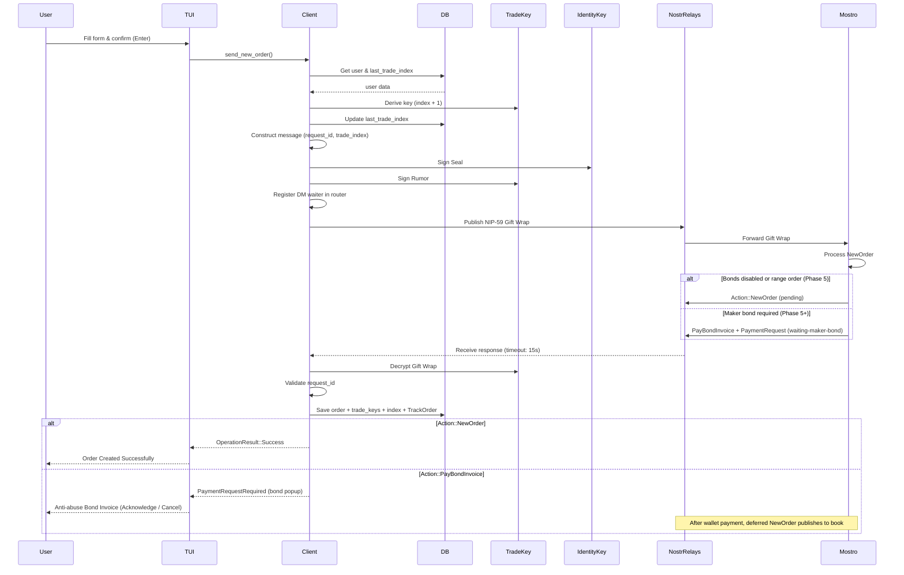
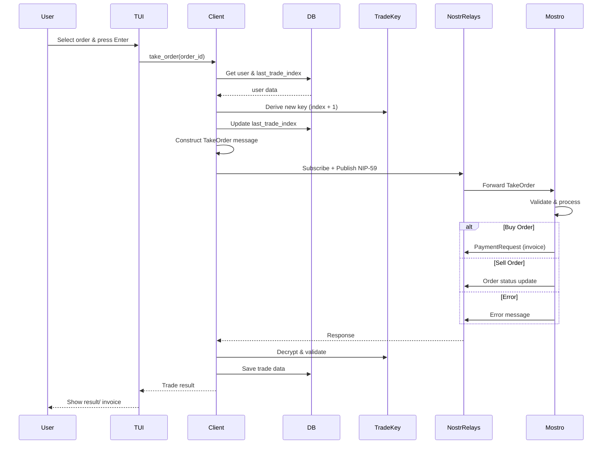
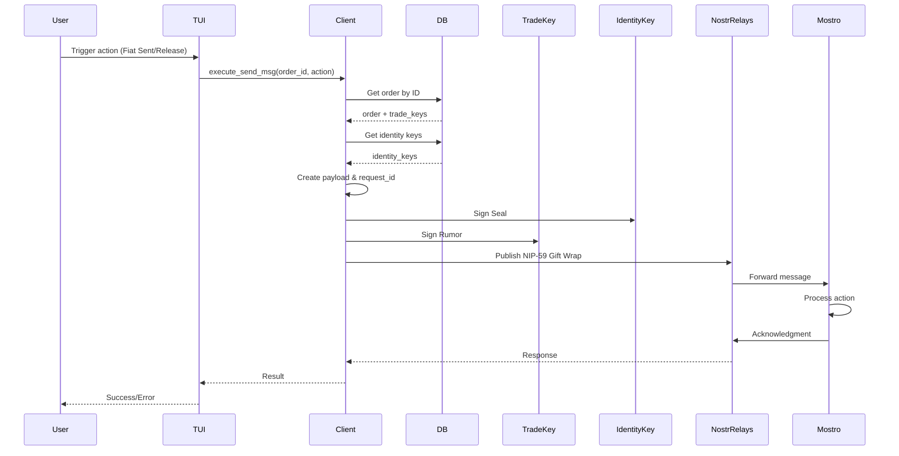
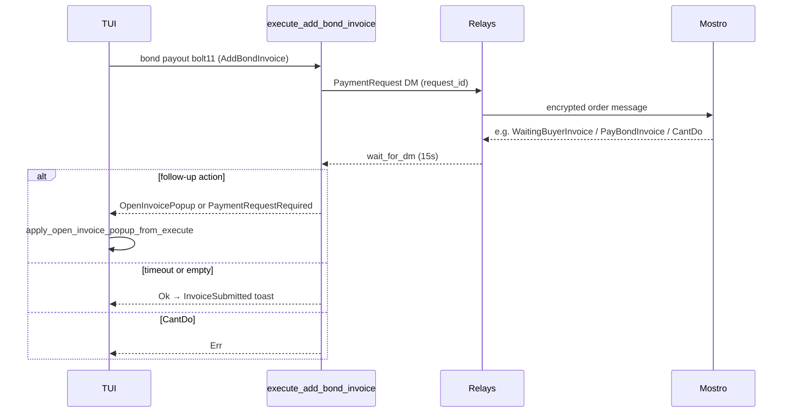
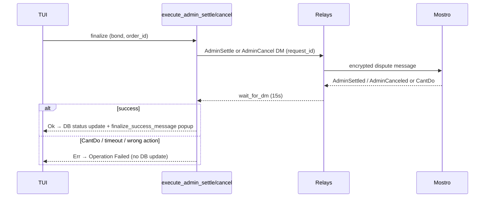
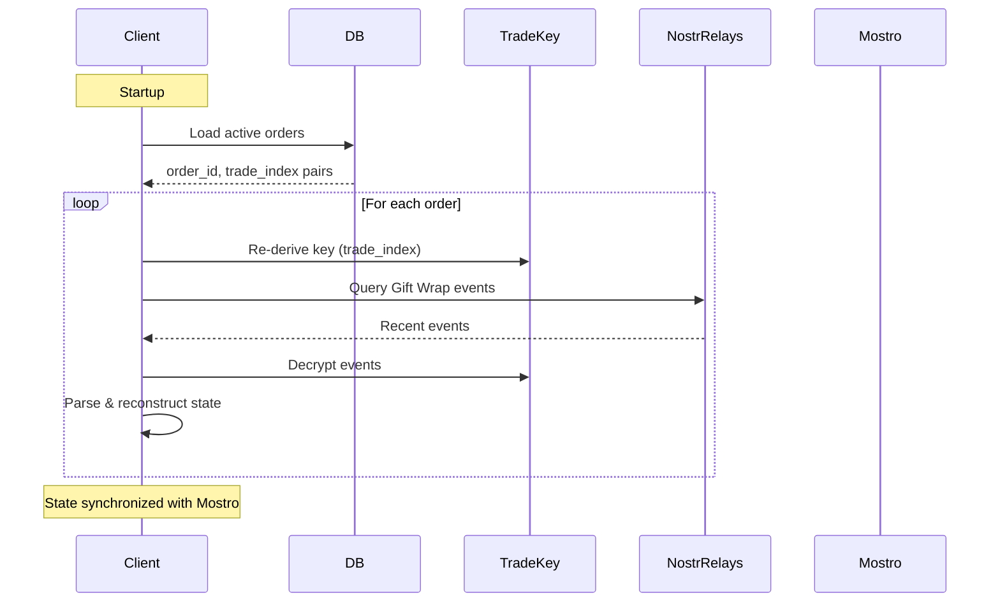

# Message Flow & Protocol Interactions

This guide explains how Mostrix communicates with the Mostro daemon and handles the flow of orders and messages through the Nostr network.

See also **[DM_LISTENER_FLOW.md](DM_LISTENER_FLOW.md)** for the background `listen_for_order_messages` task: relay subscriptions, waiter vs tracked-order routing, and the in-memory Messages list.

**Restart / Messages tab:** the UI message list is rebuilt from relays at startup (`fetch_events` replay per active trade key), not from a local message table. The database stores order rows, `trade_index`, and an optional **`last_seen_dm_ts`** cursor for subscription/sync; see **DATABASE.md** and **DM_LISTENER_FLOW.md** (“Startup bootstrap”).

## Communication Protocols

Mostrix uses Nostr transports for two distinct purposes:

| Traffic | Transport | Notes |
|---------|-----------|--------|
| **Mostro protocol DMs** (orders, take, pay, release, admin actions to daemon) | **Dual transport** via [`send_dm`](../src/util/dm_utils/mod.rs) → [`wrap_message_with`](../src/util/mod.rs): v1 GiftWrap (1059) or v2 signed kind 14 | Selected from instance `protocol_version` on kind 38385 (inbound + outbound) |
| **P2P order chat** (My Trades) and **admin dispute chat** | NIP-59 GiftWrap via `mostro_core::chat` | Unchanged by protocol v2; shared ECDH keys |

### Protocol v2 discovery, outbound send, and subscriptions (partial)

Mostro daemons advertise wire format on the **instance status** event (kind **38385**):

- Tag **`protocol_version`**: `"1"` → GiftWrap, `"2"` → NIP-44 direct messages.
- Mostrix parses this into [`MostroInstanceInfo.protocol_version`](../src/util/mostro_info.rs) and resolves [`Transport`](../src/util/mod.rs) with [`transport_from_instance`](../src/util/mostro_info.rs).
- [`AppState.transport`](../src/ui/app_state.rs) is kept in sync whenever instance info updates ([`set_mostro_info`](../src/ui/app_state.rs)).
- The **Mostro Info** tab displays protocol version and resolved wire transport.

**Outbound send (implemented):** [`send_dm`](../src/util/dm_utils/mod.rs) uses `transport_from_instance` + [`wrap_message_with`](../src/util/mod.rs); v2 adds default NIP-40 expiration (30 days) when `expiration` is `None`.

**Transport before listener:** startup awaits instance info; reload/reconnect uses [`dm_transport_for_mostro`](../src/ui/key_handler/async_tasks.rs).

**Relay filters (implemented):**

| Transport | Inbound filter (Mostro → client) |
|-----------|----------------------------------|
| v1 GiftWrap | `.pubkey(trade_key).kind(1059)` |
| v2 NIP-44 | `.author(mostro_pubkey).pubkey(trade_key).kind(14)` |

Used by `dm_helpers::ensure_order_dm_subscription`, startup `fetch_and_replay_startup_trade_dms`, and `RegisterWaiter` via [`filter_protocol_dm_from_mostro`](../src/util/filters.rs) with the resolved `transport`.

### Legacy overview

1. **NIP-59 Gift Wrap (1059)**: Protocol v1 wire format and all P2P chat.
2. **NIP-44 direct (signed kind 14)**: Protocol v2 for Mostro DMs — inbound and outbound via dual transport helpers.

### Proof-of-work (NIP-13)

Required difficulty comes from kind **38385** tags `pow` and optional `pow_first_contact`. Mostrix uses [`nostr_pow_for_protocol_dm`](../src/util/mostro_info.rs) in [`send_dm`](../src/util/dm_utils/mod.rs) (v2 first-contact actions: `max(pow, pow_first_contact)`). See **[POW_AND_OUTBOUND_EVENTS.md](POW_AND_OUTBOUND_EVENTS.md)**.

## Order Creation Flow

When a user creates a new order through the TUI, the following sequence occurs:


```mermaid
sequenceDiagram
    participant User
    participant TUI
    participant Client
    participant DB
    participant TradeKey
    participant IdentityKey
    participant NostrRelays
    participant Mostro

    User->>TUI: Fill form & confirm (Enter)
    TUI->>Client: send_new_order()
    Client->>DB: Get user & last_trade_index
    DB-->>Client: user data
    Client->>TradeKey: Derive key (index + 1)
    Client->>DB: Update last_trade_index
    Client->>Client: Construct message (request_id, trade_index)
    Client->>IdentityKey: Sign Seal
    Client->>TradeKey: Sign Rumor
    Client->>Client: Register DM waiter in router
    Client->>NostrRelays: Publish NIP-59 Gift Wrap
    NostrRelays->>Mostro: Forward Gift Wrap
    Mostro->>Mostro: Process NewOrder
    alt Bonds disabled or range order (Phase 5)
        Mostro->>NostrRelays: Action::NewOrder (pending)
    else Maker bond required (Phase 5+)
        Mostro->>NostrRelays: PayBondInvoice + PaymentRequest (waiting-maker-bond)
    end
    NostrRelays-->>Client: Receive response (timeout: 15s)
    Client->>TradeKey: Decrypt Gift Wrap
    Client->>Client: Validate request_id
    Client->>DB: Save order + trade_keys + index + TrackOrder
    alt Action::NewOrder
        Client-->>TUI: OperationResult::Success
        TUI-->>User: Order Created Successfully
    else Action::PayBondInvoice
        Client-->>TUI: PaymentRequestRequired (bond popup)
        TUI-->>User: Anti-abuse Bond Invoice (Acknowledge / Cancel)
        Note over Mostro,NostrRelays: After wallet payment, deferred NewOrder publishes to book
    end
```

### 1. User Input → Form Validation
**Source**: `src/ui/key_handler.rs:743`
```743:746:src/ui/key_handler.rs
        UiMode::UserMode(UserMode::ConfirmingOrder(form)) => {
            // User confirmed, send the order
            let form_clone = form.clone();
            app.mode = UiMode::UserMode(UserMode::WaitingForMostro(form_clone.clone()));
```

The user fills out the order form and confirms with **Enter** on the \"Create New Order\" form. The UI switches to `WaitingForMostro` mode.

### 2. Trade Key Derivation
**Source**: `src/util/order_utils/send_new_order.rs:84`
```84:87:src/util/order_utils/send_new_order.rs
    let user = User::get(pool).await?;
    let next_idx = user.last_trade_index.unwrap_or(1) + 1;
    let trade_keys = user.derive_trade_keys(next_idx)?;
    let _ = User::update_last_trade_index(pool, next_idx).await;
```

A fresh trade key is derived using the next available index. This ensures privacy by using a unique key for each order.

### 3. Message Construction
**Source**: `src/util/order_utils/send_new_order.rs:108`
```108:117:src/util/order_utils/send_new_order.rs
    // Create message
    let request_id = uuid::Uuid::new_v4().as_u128() as u64;
    let order_content = Payload::Order(small_order);
    let message = Message::new_order(
        None,
        Some(request_id),
        Some(next_idx),
        Action::NewOrder,
        Some(order_content),
    );
```

A `Message` is constructed with:
- A unique `request_id` for tracking the response
- The `trade_index` to identify which key Mostro should use
- The `Action::NewOrder` action type
- The order payload containing all order details

### 4. Sending the Direct Message
**Source**: `src/util/order_utils/send_new_order.rs:131`
```131:139:src/util/order_utils/send_new_order.rs
    let identity_keys = User::get_identity_keys(pool).await?;
    let new_order_message = send_dm(
        client,
        Some(&identity_keys),
        &trade_keys,
        &mostro_pubkey,
        message_json,
        None,
        mostro_instance,
    );
```

The message is sent via `send_dm`, which:
- Resolves wire transport from cached instance info ([`transport_from_instance`](../src/util/mostro_info.rs))
- Wraps with [`wrap_message_with`](../src/util/mod.rs): v1 NIP-59 Gift Wrap or v2 signed kind 14 (identity proof in ciphertext)
- Uses the **Identity Key** for reputation binding and the **Trade Key** to sign the published event and inner message tuple
- On v2, adds a default NIP-40 expiration (30 days) when the caller passes `None`

### 5. Waiting for Response
**Source**: `src/util/order_utils/send_new_order.rs:141`
```141:143:src/util/order_utils/send_new_order.rs
    // Wait for Mostro response (subscribes first, then sends message to avoid missing messages)
    let recv_event =
        wait_for_dm(client, &trade_keys, FETCH_EVENTS_TIMEOUT, new_order_message).await?;
```

The `wait_for_dm` function now uses the shared DM router:
1. **Registers a waiter** (`RegisterWaiter`) for the specific `trade_keys`
2. **Sends the message** after waiter registration
3. **Waits up to 15 seconds** (`FETCH_EVENTS_TIMEOUT`) on a oneshot response channel
4. The background DM listener decrypt-checks incoming protocol DM events (GiftWrap or kind 14 per transport) against pending waiters and delivers the first match to `wait_for_dm`

Waiter subscription detail:
- `RegisterWaiter` uses [`filter_protocol_dm_from_mostro`](../src/util/filters.rs) with `.limit(0)` (live-only)

### 6. Parsing and Handling Response
**Source**: [`src/util/order_utils/send_new_order.rs`](../src/util/order_utils/send_new_order.rs)

The response is:
1. **Decrypted** using the trade key (`parse_dm_events`)
2. **Validated** by `handle_mostro_response` (including `CantDo` and `request_id` match)
3. **Processed** by action:

| First reply | Payload | Mostrix result | UI |
|-------------|---------|----------------|-----|
| `Action::NewOrder` | `Payload::Order` | `OperationResult::Success` | "Order Created Successfully" modal |
| `Action::PayBondInvoice` | `PaymentRequest` (order often `waiting-maker-bond`) | `PaymentRequestRequired` | Bond popup via `order_ch_mng.rs` (no success modal) |

Both paths call `save_order(..., is_maker: true)`, send `TrackOrder` on `dm_subscription_tx`, and set `order_chat_static`. The bond path delegates persistence + popup wiring to shared [`payment_request_operation_result`](../src/util/order_utils/helper.rs) (also used by `take_order` for taker bonds).

**Post-bond publication**: after the maker pays in their wallet, Mostro sends a follow-up `Action::NewOrder` on the trade DM subscription (listener path). Generic hydration updates SQLite `waiting-maker-bond` → `pending`; the order then appears on the public book.

## Taking Orders Flow

When a user takes an existing order from the order book:


```mermaid
sequenceDiagram
    participant User
    participant TUI
    participant Client
    participant DB
    participant TradeKey
    participant NostrRelays
    participant Mostro

    User->>TUI: Select order & press Enter
    TUI->>Client: take_order(order_id)
    Client->>DB: Get user & last_trade_index
    DB-->>Client: user data
    Client->>TradeKey: Derive new key (index + 1)
    Client->>DB: Update last_trade_index
    Client->>Client: Construct TakeOrder message
    Client->>NostrRelays: Subscribe + Publish NIP-59
    NostrRelays->>Mostro: Forward TakeOrder
    Mostro->>Mostro: Validate & process
    alt Buy Order
        Mostro->>NostrRelays: PaymentRequest (invoice)
    else Sell Order
        Mostro->>NostrRelays: Order status update
    else Error
        Mostro->>NostrRelays: Error message
    end
    NostrRelays-->>Client: Response
    Client->>TradeKey: Decrypt & validate
    Client->>DB: Save trade data
    Client-->>TUI: Trade result
    TUI-->>User: Show result/ invoice
```

### 1. User Selection
The user navigates to an order in the Orders tab and presses `Enter`.

### 2. Trade Key Derivation
**Source**: `src/util/order_utils/take_order.rs:66`
```66:68:src/util/order_utils/take_order.rs
    let next_idx = user.last_trade_index.unwrap_or(1) + 1;
    let trade_keys = user.derive_trade_keys(next_idx)?;
    let _ = User::update_last_trade_index(pool, next_idx).await;
```

A new trade key is derived for this specific trade interaction.

### 3. Message Construction
**Source**: `src/util/order_utils/take_order.rs:77`
```77:83:src/util/order_utils/take_order.rs
    // Create message
    let take_order_message = Message::new_order(
        Some(order_id),
        Some(request_id),
        Some(next_idx),
        action.clone(),
        payload,
    );
```

The message includes:
- The `order_id` of the order being taken
- A `request_id` for tracking
- The `trade_index` for this new trade
- The appropriate action (`TakeBuy` or `TakeSell`)

### 4. Response Handling
Similar to order creation, the client waits for Mostro's response, which may include:
- A `PaymentRequest` (for buy orders, requiring a Lightning invoice)
- Order status updates
- Error messages if the order is no longer available

## Background Message Listening

Mostrix runs a background task that continuously monitors relay notifications and routes trade DMs in real time.

For a detailed, code-level walkthrough of the DM router/listener (including how the in-memory `Vec<OrderMessage>` is built, how `TrackOrder` vs waiters work, and how `Action`/`Status`/DB updates relate), see [DM_LISTENER_FLOW.md](DM_LISTENER_FLOW.md).

```mermaid
sequenceDiagram
    participant Router as DM Listener
    participant Cmd as Command Channel
    participant Relays as NostrRelays
    participant UI

    Cmd->>Router: TrackOrder(order_id, trade_index)
    Router->>Relays: subscribe protocol DM filter (transport-aware)
    Cmd->>Router: RegisterWaiter(trade_keys, response_tx)
    Router->>Relays: (if needed) subscribe waiter pubkey
    Relays-->>Router: RelayPoolNotification::Event(protocol DM)
    Router->>Router: Gate: event.kind == transport.event_kind(); try waiter decrypt match
    alt waiter matched
        Router-->>Cmd: oneshot response_tx.send(event)
    end
    Router->>Router: Route by subscription_id or active-order fallback
    Router->>UI: message_notification_tx.send(...)
```

### Message Listener Task
**Source**: [`src/util/dm_utils/mod.rs`](../src/util/dm_utils/mod.rs)

```rust
pub async fn listen_for_order_messages(
    client: Client,
    mostro_pubkey: PublicKey,
    transport: Transport,
    pool: SqlitePool,
    active_order_trade_indices: Arc<Mutex<HashMap<Uuid, i64>>>,
    order_last_seen_dm_ts: HashMap<Uuid, i64>,
    // ... messages, notification tx, dm_subscription_rx
)
```

This task:
1. Maintains a command-driven subscription router (`TrackOrder` + `RegisterWaiter`) using [`filter_protocol_dm_from_mostro`](../src/util/filters.rs) for subscribe/replay/waiter filters
2. Consumes `client.notifications()` and handles protocol DM events matching `transport.event_kind()`
3. Routes events by known `subscription_id` to `(order_id, trade_index)`
4. Falls back to decrypting against active tracked trade keys when `subscription_id` is unknown
5. Parses/decrypts with `parse_dm_events`, updates order state, and emits UI notifications

### User order chat local cache (My Trades)

In addition to relay-driven trade DMs, Mostrix keeps a lightweight local transcript cache for user-to-user order chat:

- **Path**: `~/.mostrix/orders_chat/<order_id>.txt`
- **Startup restore**: `load_user_order_chats_at_startup` restores cached chat into `AppState.order_chats` and seeds `order_chat_last_seen` from on-disk transcripts. Relay backfill is done once by the chat router on `TrackChatKey` after `track_startup_chats` (not a separate poll).
- **Live relay sync (User role)**: the **shared-key chat subscription router** (`listen_for_chat_messages` in `src/util/chat_listener.rs`) maintains one batched `kind: 1059` subscription over all active order shared pubkeys and routes incoming gift wraps by `p` tag. `track_startup_chats` seeds the active-order set at startup; the DM router tracks/untracks orders when the shared key becomes resolvable or the order hits a chat-terminal status ([`TERMINAL_DM_STATUSES`](../src/models.rs) — **`success` keeps chat live**). Dynamic tracks pass a hydrate `since` from the on-disk transcript max timestamp when present. Shared keys come from persisted `order_chat_shared_key_hex` when set, otherwise ECDH from local `trade_keys` + `counterparty_pubkey` (`src/util/chat_utils.rs`).
- **Incremental merge**: `apply_user_order_chat_updates` in `src/ui/helpers/startup.rs`:
  - **Skip own relay echoes**: each `OrderChatUpdate` carries `local_trade_pubkey`; messages whose decrypted `sender_pubkey` matches are ignored (same rule as admin chat and Mostro Mobile — avoids showing your send on both **You** and **Peer** after the optimistic local append on Enter).
  - **Dedup**: relay self-echoes are skipped by `sender_pubkey == local_trade_pubkey`; peer dedup matches only existing **Peer** rows at the same `(timestamp, content)` (or same attachment / legacy placeholder) so an optimistic **You** line cannot hide a real counterparty message in the same second.
  - **Peer-only from relay**: counterparty messages are stored as `UserChatSender::Peer`; local sends are appended as **You** in `handle_enter_user_order_chat` before the relay round-trip.
  - Persists new entries with `save_order_chat_message` and advances per-order `order_chat_last_seen`.
- **Attachments (receive + save)**: `image_encrypted` / `file_encrypted` JSON (Mostro Mobile Encrypted File Messaging) is parsed in `apply_user_order_chat_updates` via `try_parse_attachment_message`. Attachment rows show yellow placeholder lines in the chat pane; the block title includes a file count when non-zero; a transient toast notifies on new **peer** files. **Ctrl+S** on My Trades opens `UiMode::UserSaveAttachmentPopup` (pinned `order_id` + list index). Saving downloads from Blossom and decrypts with the attachment key when present, otherwise derives the 32-byte shared secret via `order_chat_decryption_key_bytes` (from `order_chat_shared_key_hex` or ECDH). Files land in `~/.mostrix/downloads/<order_id>_<filename>`.
- **Attachments (send)**: **Ctrl+O** on My Trades opens `UiMode::UserSendAttachmentPicker` (`src/ui/send_attachment_picker.rs`, `ratatui-explorer`) filtered to allowed extensions; **Enter** enqueues `SendOrderAttachmentJob::FromPath`. **Ctrl+Shift+O** retries with `RetryPrepared` when `pending_order_attachment_sends` holds the order. Pipeline in `src/util/send_attachment.rs`:
  1. **Validate** local path — `validate_attachment_file` in `src/util/file_validation.rs` (max **25 MB**, extensions `jpg`/`jpeg`/`png`/`pdf`/`mp4`/`mov`/`avi`/`doc`/`docx`, PDF magic-byte check). Images must yield non-zero **width/height** via `read_image_dimensions` (PNG IHDR / JPEG SOF) — required for mobile `image_encrypted` JSON.
  2. **Encrypt** — ChaCha20-Poly1305 with the order shared key (`order_chat_decryption_key_bytes`); blob layout `[nonce:12][ciphertext][tag:16]` (`encrypt_blob` in `src/util/blossom.rs`).
  3. **Upload** — NIP-24242 auth event (kind **24242**) signed with the order **`trade_keys`** (same pubkey as the chat GiftWrap sender — not an ephemeral key) + HTTP PUT to `{blossom_server}/upload`; `upload_blob_with_retry` tries servers from `Settings.blossom_servers` or `DEFAULT_BLOSSOM_SERVERS` when the list is empty. **Download (Ctrl+S save)** remains an unauthenticated HTTPS GET by blob URL; payload privacy is ChaCha-only (see `fetch_blob` in `src/util/blossom.rs`).
  4. **Wire JSON** — `build_image_encrypted_json` / `build_file_encrypted_json` in `src/ui/helpers/attachments.rs` (hex nonce, `width`/`height` for images, sizes; **no embedded `key`** — peers decrypt via the same shared-key DM path as text chat). **Mobile compatibility**: field names and types match Mostro Mobile `EncryptedImageUploadResult` / `EncryptedFileUploadResult` ([MostroP2P/mobile](https://github.com/MostroP2P/mobile)); `nonce` is **hex** (not base64). Messages sent before this shape may fail to parse on mobile.
  5. **DM** — `send_user_order_chat_message_via_shared_key` with the order `trade_keys`; up to **3 retries** (2s apart) after upload without re-uploading the blob.
  6. **UI feedback** — success: `OperationResult::OrderChatAttachmentSent` → append **You** row, JSON transcript save, `Info` popup. **Early failure** (validate / encrypt / upload): `OrderChatAttachmentError { order_id, error }` → `Error` popup. **Upload ok / send failed**: `OrderChatAttachmentSendFailed` stores `PreparedOrderChatAttachment` in `AppState.pending_order_attachment_sends` and shows an `Error` popup with the Blossom URL (**Ctrl+Shift+O** retries DM without re-upload). All three attachment-specific variants clear `AppState.sending_attachment_order_id` only when the embedded `order_id` matches the in-flight send; unrelated `OperationResult::Error` traffic on `order_result_tx` does not drop the send lock.
  - **Enqueue**: `SendOrderAttachmentJob::FromPath { order_id, path }` or `RetryPrepared(PreparedOrderChatAttachment)` on `send_order_attachment_tx` (`create_app_channels` in `src/ui/key_handler/async_tasks.rs`); `main.rs` **`drain_send_order_attachment_queue`** spawns `spawn_send_order_chat_attachment` before each draw.
- **Transcript persistence (Phase A.5)**: new messages with attachments are stored as **JSON** in `orders_chat/<order_id>.txt` via `serialize_attachment_for_transcript` (not the human `[Image: …]` placeholder). On startup, `load_order_chat_from_file` restores full `ChatAttachment` metadata so **Ctrl+S** and file counts work immediately after restart. Legacy transcript files that still contain placeholder lines are **hydrated in memory** when the next relay fetch returns the same attachment at the same timestamp (`apply_user_order_chat_updates` replaces the placeholder row in place; does not append a duplicate). Rows with **empty `blossom_url`** in JSON are shown as plain text and are **not** listed for save (`attachment_is_saveable` in `src/ui/helpers/attachments.rs`).
- **My Trades interactive mode**: after startup or role switch, `AppState.mode` is `UiMode::default_for_role` (`UserMode::Normal` for users). Chat input, **Ctrl+S**, **Ctrl+O**, and scroll shortcuts require `UiMode::user_my_trades_interactive()` (`Normal` or `UserMode::Normal`) — see [TUI_INTERFACE.md](TUI_INTERFACE.md).
- **Save / send completion UI**: `main.rs` drains `save_attachment_rx`, `send_order_attachment_rx`, and `order_result_rx` before every `terminal.draw` so Blossom download and upload results surface without an extra keypress (see [STARTUP_AND_CONFIG.md](STARTUP_AND_CONFIG.md) — Main Event Loop).
- **Compatibility parsing**: legacy sender labels from older files (`Admin`, `Admin to Buyer`, `Admin to Seller`, `Buyer`, `Seller`) are mapped to `You/Peer` when loading.
- **UI selection safety**: the "My Trades" sidebar and Enter/send handlers resolve the active order list from the same shared projection (`helpers::build_active_order_chat_list`), ensuring `selected_order_chat_idx` cannot target a different order than the highlighted row.
- **My Trades static header (`order_chat_static`)**: in-memory map `AppState.order_chat_static` (see `src/ui/orders.rs` — `OrderChatStaticHeader`) is written by `handle_operation_result` in `src/util/dm_utils/order_ch_mng.rs` on `OperationResult::Success` and `PaymentRequestRequired` (after take / PayInvoice / PayBondInvoice path — the variant now carries the originating `Action` so the same write covers anti-abuse bond responses), and populated from the local `orders` table during `sync_user_order_history_messages_from_db` in `src/ui/helpers/startup.rs`. It is cleared for removed trades when `TradeClosed` / `OrderHistoryDeleted` are handled. It supplies stable header fields (order id, kind, created time, trade index, initiator) so the UI does not depend on folding those out of the DM stream.
- **Live fields from DMs**: the projection over `AppState.messages` per order merges `Payload::Order` (first economic snapshot, buyer/seller trade pubkeys) with `Payload::Peer` so counterparty `UserInfo` can populate buyer/seller rating, and `order_status` updates status for the header and for `resolve_selected_mytrades_order_status` in `src/ui/key_handler/chat_helpers.rs`.

**Source**: `src/ui/helpers/startup.rs`, `src/ui/helpers/chat_storage.rs`, `src/ui/helpers/chat_visibility.rs`, `src/ui/helpers/attachments.rs`, `src/ui/helpers/order_chat_projection.rs`, `src/ui/save_attachment_popup.rs`, `src/ui/send_attachment_picker.rs`, `src/util/dm_utils/order_ch_mng.rs`, `src/util/chat_utils.rs`, `src/util/blossom.rs`, `src/util/file_validation.rs`, `src/util/send_attachment.rs`

### Message Parsing
**Source**: `src/util/dm_utils/mod.rs:137`
```137:159:src/util/dm_utils/mod.rs
        let (created_at, message, sender) = match dm.kind {
            nostr_sdk::Kind::GiftWrap => {
                let unwrapped_gift = match nip59::extract_rumor(pubkey, dm).await {
                    Ok(u) => u,
                    Err(e) => {
                        log::warn!("Could not decrypt gift wrap (event {}): {}", dm.id, e);
                        continue;
                    }
                };
                let (message, _): (Message, Option<String>) =
                    match serde_json::from_str(&unwrapped_gift.rumor.content) {
                        Ok(msg) => msg,
                        Err(e) => {
                            log::warn!("Could not parse message content (event {}): {}", dm.id, e);
                            continue;
                        }
                    };

                (
                    unwrapped_gift.rumor.created_at,
                    message,
                    unwrapped_gift.sender,
                )
            }
```

The parser handles:
- **NIP-59 Gift Wrap**: Extracts the rumor, decrypts using the trade key, and parses the JSON message
- **NIP-44 Private Direct Messages**: Decrypts using the conversation key derived from the trade key and receiver's public key

## Sending Trade Messages

When a user needs to send a message during an active trade (e.g., "Fiat Sent", "Release"):


```mermaid
sequenceDiagram
    participant User
    participant TUI
    participant Client
    participant DB
    participant TradeKey
    participant IdentityKey
    participant NostrRelays
    participant Mostro

    User->>TUI: Trigger action (Fiat Sent/Release)
    TUI->>Client: execute_send_msg(order_id, action)
    Client->>DB: Get order by ID
    DB-->>Client: order + trade_keys
    Client->>DB: Get identity keys
    DB-->>Client: identity_keys
    Client->>Client: Create payload & request_id
    Client->>IdentityKey: Sign Seal
    Client->>TradeKey: Sign Rumor
    Client->>NostrRelays: Publish NIP-59 Gift Wrap
    NostrRelays->>Mostro: Forward message
    Mostro->>Mostro: Process action
    Mostro->>NostrRelays: Acknowledgment
    NostrRelays-->>Client: Response
    Client-->>TUI: Result
    TUI-->>User: Success/Error
```

### Message Sending Flow
**Source**: `src/util/order_utils/execute_send_msg.rs:44`
```44:95:src/util/order_utils/execute_send_msg.rs
pub async fn execute_send_msg(
    order_id: &Uuid,
    action: Action,
    pool: &sqlx::SqlitePool,
    client: &Client,
    mostro_pubkey: PublicKey,
) -> Result<()> {
    // Get order from database
    let order = Order::get_by_id(pool, &order_id.to_string()).await?;

    // Get trade keys of specific order
    let trade_keys = order
        .trade_keys
        .clone()
        .ok_or(anyhow::anyhow!("Missing trade keys"))?;

    let order_trade_keys = Keys::parse(&trade_keys)?;

    // Get identity keys
    let identity_keys = User::get_identity_keys(pool).await?;

    // Determine payload based on action
    // For FiatSent on range orders, we might need NextTrade payload
    let payload: Option<Payload> = create_msg_payload(&action, &order, pool).await?;

    // Create request id
    let request_id = Uuid::new_v4().as_u128() as u64;

    // Create message
    let message = Message::new_order(
        Some(*order_id),
        Some(request_id),
        None,
        action.clone(),
        payload,
    );

    // Serialize the message
    let message_json = message
        .as_json()
        .map_err(|e| anyhow::anyhow!("Failed to serialize message: {e}"))?;

    // Send the DM
    let sent_message = send_dm(
        client,
        Some(&identity_keys),
        &order_trade_keys,
        &mostro_pubkey,
        message_json,
        None,
    );
```

Key points:
- The **trade keys are retrieved from the database** (they were stored when the order was created/taken)
- The **identity keys are used** for the Seal signature
- A **request_id** is generated for tracking the response
- The message is **sent and the client waits for Mostro's acknowledgment**
- For **range orders**, see [RANGE_ORDERS.md](RANGE_ORDERS.md) for details on the `NextTrade` payload mechanism
- For **`Action::Cancel`**, a successful response may be **`Canceled`** or **`CooperativeCancelAccepted`** (`execute_send_msg` in `src/util/order_utils/execute_send_msg.rs`).

### Cooperative cancel (peer request)

When the counterparty initiates cooperative cancel, Mostrix receives a trade DM whose **`action`** is **`CooperativeCancelInitiatedByPeer`**. The user can confirm from the Messages tab:

1. **Enter** opens **`UiMode::ViewingMessage`** with the same **YES/NO** chrome as other confirms (`helpers::render_yes_no_buttons` in `src/ui/tabs/tab_content.rs`).
2. **YES + Enter** runs **`execute_send_msg`** with **`Action::Cancel`**, which waits for Mostro’s DM response.
3. On success, the client:
   - persists **`CooperativelyCanceled`** on the **`orders`** row (`update_order_status` from `src/ui/key_handler/message_handlers.rs`);
   - sends **`OperationResult::TradeClosed`** so the main loop removes the order from the in-memory Messages list and clears **`active_order_trade_indices`** (`handle_operation_result` in `src/util/dm_utils/order_ch_mng.rs` — the UI then shows a short success **Info** toast).

When the relay later delivers **`CooperativeCancelAccepted`**, the DM listener treats it as **terminal** (`trade_message_is_terminal`), may update status again if needed, and performs the usual subscription cleanup. See **DM_LISTENER_FLOW.md** (terminal cleanup, status inference).

### Invoice notifications in Messages tab

For invoice-related trade actions, the Messages Enter path normally uses `UiMode::NewMessageNotification` with a dual-action popup model. **`AddInvoice`** may be preceded by a **saved-Lightning-address** confirmation:

- **Saved buyer Lightning address (`settings.toml` → `ln_address`)**: If the trimmed address is non-empty when **`AddInvoice`** should open (incoming notification handled by **`handle_message_notification`**, or **Messages → Enter** via **`present_add_invoice_popup`** in `src/util/dm_utils/notifications_ch_mng.rs`), the client shows **`UiMode::ConfirmSavedLnAddressForInvoice`** (YES/NO). **YES** immediately runs **`submit_add_invoice`** (`src/ui/key_handler/message_handlers.rs`) with the saved address — **`execute_add_invoice`** in the background, UI **`WaitingAddInvoice`** — without opening **`NewMessageNotification`** for a second submit step; **`UseSavedLnAddress`** is stored in **`buyer_invoice_preference`** only after send succeeds (**`OperationResult::InvoiceSubmitted`** → **`handle_operation_result`** in **`order_ch_mng.rs`**). That path is handled only from **`handle_enter_key`** (`src/ui/key_handler/enter_handlers.rs`), not **`handle_confirm_key`**. **NO** inserts **`ManualInvoice`** via **`apply_saved_ln_address_invoice_choice`** and opens **`NewMessageNotification`** with an empty invoice field. The confirmation popup body lists the address string read from disk during **`ui_draw`**.
- **Per-order cache**: **`AppState.buyer_invoice_preference`** skips repeating the confirmation until canceled/trade cleanup (**Cancel Order** from the invoice popup removes the **`order_id`** preference row; **`TradeClosed`** / history deletion clears it in **`order_ch_mng`**).

Otherwise:

- Action mapping:
  - `AddInvoice` and `WaitingBuyerInvoice` -> AddInvoice popup mode.
  - `PayInvoice` and `WaitingSellerToPay` -> PayInvoice popup mode.
  - **`PayBondInvoice`** (Mostro Phase 1.5+ taker / Phase 5+ maker) -> dedicated **anti-abuse bond** popup mode (`render_pay_bond_invoice` in `src/ui/message_notification.rs`). Same `Payload::PaymentRequest` shape as `PayInvoice`, but distinguished visually (shield emoji title, maker/taker amount label, and a yellow "Locked, not spent — refunded on normal completion" disclaimer). The popup is gated on `order_status` ∈ {`WaitingTakerBond`, `WaitingMakerBond`, `None`} and role (`invoice_popup_allowed_for_order_status` + `local_user_must_act_on_invoice_popup` in `src/ui/orders.rs`). **`send_new_order`** and **`take_order`** both return `PaymentRequestRequired` when Mostro's first reply is `PayBondInvoice`.
- Popup selection:
  - Left/Right toggles between **Primary** and **Cancel Order**.
  - Enter confirms the selected action.
  - For **`PayBondInvoice`** the **Primary** button is labelled **Acknowledge** (closes the popup) since the actual payment happens in the user's wallet; cancel still sends `Action::Cancel`.
- Cancel path:
  - Selecting **Cancel Order** sends `Action::Cancel` through `execute_send_msg`, reusing the existing async order-result channel flow. Valid during `WaitingTakerBond` (taker) and `WaitingMakerBond` (maker abandoning an unpublished listing).
- Paste/copy details:
  - AddInvoice supports bracketed paste plus key/mouse fallbacks where terminals do not emit `Event::Paste`.
  - PayInvoice and PayBondInvoice keep copy (`C`) + scroll behavior while supporting cancel selection.
- **Lightning address as invoice**: If the input is a Lightning address (`user@domain.com`), Mostrix still sends `AddInvoice` with a `PaymentRequest` payload, but first verifies the LNURL metadata endpoint returns `tag: payRequest` (`util::ln_address::ln_address_pay_request_reachable`) so unreachable addresses fail before hitting Mostro.

### Rating the counterparty (`RateUser`)

After a successful trade, Mostro may prompt with a DM whose **`action`** is **`rate`** and **`payload`** is **`null`**, while the local DB row may still show **`success`**. The client must not infer the UI step from **`Status::Success` alone** for that message.

- **UI**: **`UiMode::RatingOrder`** (`src/ui/app_state.rs`) — star row **1–5** (`mostro_core::MIN_RATING` / `MAX_RATING`), **Left/Right** or **+/-** to adjust, **Enter** to submit, **Esc** to dismiss. Rendered in **`src/ui/tabs/tab_content.rs`** (`render_rating_order`), opened from Messages **Enter** when the selected message’s action is **`Rate`** (`src/ui/key_handler/enter_handlers.rs`).
- **Send path**: **`execute_rate_user`** in **`src/util/order_utils/execute_send_msg.rs`** builds **`Message::new_order`** with **`Action::RateUser`**, **`Payload::RatingUser(rating)`**, and the trade **`order_id`**; **identity + trade keys** and **`send_dm` / `wait_for_dm`** match other trade messages. The response is expected to be **`Action::RateReceived`**. No counterparty pubkey is sent — Mostro resolves the peer server-side.

## Relay → SQLite order status reconcile

Mostrix can align local **`orders.status`** with **terminal** states published on Mostro nostr order events when trade DMs were missed or the client was offline.

**Source**: `src/util/order_utils/relay_order_db_reconcile.rs`, wired from `src/util/order_utils/fetch_scheduler.rs` and startup in `src/main.rs`.

| Path | When | What |
|------|------|------|
| **Bulk** | Orders updater tick (~30s) + **startup** | `fetch_mostro_order_events` → `aggregate_latest_orders_by_id` → `reconcile_terminal_order_statuses_from_relay` |
| **Targeted** | Same tick + **startup** | `Order::list_ids_for_targeted_relay_reconcile` (non-terminal rows with `trade_keys`) → round-robin up to **`TARGETED_RELAY_RECONCILE_MAX_PER_TICK`** (5) per-order fetches → `reconcile_one_order_if_terminal` |

`reconcile_one_order_if_terminal` only writes when the relay snapshot status is **terminal** (`is_terminal_trade_status`) and passes **`should_apply_status_transition`** (same monotonic rules as DM updates). Pending orders on the book are not “healed” from relay unless the relay reports a terminal outcome (e.g. **Expired**).

## Messages tab: trade timeline stepper (buy and sell listings)

The Messages detail panel shows a **six-step** timeline for trades with known **`order_kind`**. The highlighted column comes from **`message_trade_timeline_step`** → **`FlowStep`** (`src/ui/orders.rs`): **`BuyFlowStep(StepLabelsBuy)`** or **`SellFlowStep(StepLabelsSell)`**. Step enums use **`repr(u8)`** discriminants passed to **`FlowStep::step_number()`** (UI columns are **1…6** in `message_flow_tab.rs`; discriminant **0** = no highlight).

Resolution dispatches to **`buy_listing_flow_step`** or **`sell_listing_flow_step`**, combining **`OrderMessage::order_status`**, **`is_mine`** (maker/taker), and **`action`**, via **`listing_step_from_status(order_kind, status)`** (kind-specific status mapping) and kind-specific **`_flow_step_from_action`**. **`Action::Rate`** / **`RateReceived`** are handled before status so **`rate`** DMs without a full order payload still highlight the final step.

- **`Status::Pending`** / **`Status::WaitingTakerBond`** / **`Status::WaitingMakerBond`** → **`StepPendingOrder`** (discriminant **0**): stepper shows **no** green/current column (all gray) until payment/bond phases start.
- **`Status::Success`** → final column (**`StepRate`**, discriminant **6**); avoids snapping back to an older step when reboot replay delivers a pre-success DM after the trade completed.

Step **wording** (strings per column) lives in **`src/ui/constants.rs`** (`StepLabel`, buy/sell step arrays); **`listing_timeline_labels`** selects the array by kind and role.

**Sidebar / info popups**: `message_action_compact_label_for_message` maps status to short labels (**Pending order**, **Trade Completed**, …) so list text stays accurate after hydration.

**Success-before-DM placeholder**: `try_placeholder_order_message_from_success` builds one synthetic **`OrderMessage`** when `OperationResult::Success` lands before any DM row (My Trades sidebar); placeholder **`action`** is status-driven (maker + `WaitingMakerBond` → `PayBondInvoice`; maker + published → `NewOrder`) and never uses synthetic **`take-buy`** / **`take-sell`** (those break Messages **Enter**). Maker bond uses **`PaymentRequestRequired`** (not `Success`), so the bond popup opens immediately; `order_chat_static` is still written on that path.

**Restart recovery**: `sync_user_order_history_messages_from_db` (`startup.rs`) synthesizes maker rows in `waiting-maker-bond` as `PayBondInvoice` with `auto_popup_shown: false` so Messages **Enter** can reopen the bond popup after reboot.

See **[buy order flow.md](buy%20order%20flow.md)** and **[sell order flow.md](sell%20order%20flow.md)** for product context and **[TUI_INTERFACE.md](TUI_INTERFACE.md)** for **`UiMode`** overlays.

## Error Handling Patterns

### Timeout Handling
If no waiter-matching GiftWrap arrives within `FETCH_EVENTS_TIMEOUT` (15 seconds), `wait_for_dm` fails with a timeout error.

### Request ID Mismatch
**Source**: `src/util/order_utils/send_new_order.rs:199`
```199:201:src/util/order_utils/send_new_order.rs
                } else {
                    Err(anyhow::anyhow!("Mismatched request_id"))
                }
```

If the response's `request_id` doesn't match the sent request, the operation is rejected.

### Decryption Failures
**Source**: `src/util/dm_utils/mod.rs:139`
```139:144:src/util/dm_utils/mod.rs
                let unwrapped_gift = match nip59::extract_rumor(pubkey, dm).await {
                    Ok(u) => u,
                    Err(e) => {
                        log::warn!("Could not decrypt gift wrap (event {}): {}", dm.id, e);
                        continue;
                    }
                };
```

If a message cannot be decrypted (wrong key, corrupted data, etc.), it is logged and skipped rather than crashing the listener.

### `CantDo` reasons (`mostro-core` 0.13.0+)

User-facing strings for `Payload::CantDo(Some(reason))` come from [`get_cant_do_description`](../src/util/types.rs). Notable cases:
- **`InvalidPayload`** — wrong payload shape or impossible values (e.g. `bond_resolution` slashing a side with no bond).
- **Cashu escrow** (0.12.x): `InvalidCashuToken`, `CashuMintUnavailable`, `InvalidMintUrl`, `CashuEscrowNotLocked`, `CashuSignatureMissing`.

Trade DMs carrying `CantDo` are not upserted into the Messages list ([DM_LISTENER_FLOW.md](DM_LISTENER_FLOW.md)); they surface via waiters / `OperationResult` popups.

## Admin Chat (Shared-Key Subscription Router)

When the user is in **Admin** mode, the shared-key chat subscription router keeps the "Disputes in Progress" tab up to date with NIP‑59 gift-wrap messages exchanged over **per‑dispute shared keys** — live via a relay subscription, not a timer.

- **Trigger**: `execute_take_dispute` calls `track_dispute_chat` for the buyer and seller when a dispute is taken; `track_startup_chats` re-tracks all `InProgress` disputes at startup and on reconnect. Untracked when the dispute leaves `InProgress`.
- **Shared keys**: For each `AdminDispute` in `InProgress` state, the database holds `buyer_shared_key_hex` / `seller_shared_key_hex`, converted back to `Keys` via `keys_from_shared_hex` in `src/util/chat_utils.rs`.
- **Router**: `listen_for_chat_messages` (`src/util/chat_listener.rs`) subscribes one batched `kind: 1059` filter over all tracked shared pubkeys, hydrates history once per key on track (`fetch_gift_wraps_for_shared_key`, 7‑day window, filtered by `last_seen`), and routes live gift wraps by `p` tag.
- **Application**: The main loop receives results on `admin_chat_updates_rx` and applies them via `apply_admin_chat_updates`, which:
  - Appends new `DisputeChatMessage` items into `AppState.admin_dispute_chats`.
  - Updates in‑memory `admin_chat_last_seen` entries.
  - Persists cursors to the `admin_disputes` table (`buyer_chat_last_seen`, `seller_chat_last_seen`) via `update_chat_last_seen_by_dispute_id`.
- **Attachments**: Attachment messages (Mostro Mobile Encrypted File Messaging: `image_encrypted` / `file_encrypted`) are parsed into structured attachment entries. From the dispute chat, the admin presses **Ctrl+S** to open a **Save attachment** popup listing all attachments for the current dispute/party; they select one with ↑/↓ and press Enter to download from Blossom (`blossom://` → `https://`), optionally decrypt with ChaCha20‑Poly1305 (nonce + ciphertext + tag), and save to `~/.mostrix/downloads/<dispute_id>_<filename>`. See `src/util/blossom.rs` and the "Receiving and saving file attachments" section in [ADMIN_DISPUTES.md](ADMIN_DISPUTES.md).

Admin chat is driven entirely by the per‑dispute shared keys stored in the database, delivered live over one batched subscription (same model as Mostro Mobile's `SubscriptionManager`).

### Database Errors
Database operations (saving orders, updating trade indices) log errors but don't necessarily fail the entire operation, allowing the user to continue using the client.

## Admin dispute finalization (`AdminSettle` / `AdminCancel`)

Admins resolve in-progress disputes by sending encrypted DMs signed with `admin_privkey` ([FINALIZE_DISPUTES.md](FINALIZE_DISPUTES.md)).

| Action | Trade outcome | Payload (via `BondSlashChoice`) |
|--------|---------------|--------------------------------|
| `AdminSettle` | Pay buyer (release escrow to buyer) | `None` → `null`; slash variants → `BondResolution` |
| `AdminCancel` | Refund seller | same |

**Bond resolution** (Mostro anti-abuse bond Phase 2+): optional `bond_resolution: { slash_seller, slash_buyer }` on both actions only. Four combinations plus legacy `null` (= no slash). See [admin settle](https://mostro.network/protocol/admin_settle_order.html) / [admin cancel](https://mostro.network/protocol/admin_cancel_order.html).

- **Client types**: `mostro-core` 0.13.0 — `BondResolution`, `Payload::BondResolution`, `Status::WaitingMakerBond`, `Transport` / transport helpers.
- **Mostrix helper**: `BondSlashChoice::to_optional_payload()` — `None` for no slash (`payload: null`), `Some(BondResolution)` when slashing; unit tests in `bond_resolution.rs`.
- **Errors**: invalid slash (e.g. no bond for that side) → `CantDo(InvalidPayload)` → user string from [`get_cant_do_description`](../src/util/types.rs).
- **Post-slash payout**: `Action::AddBondInvoice` with `Payload::BondPayoutRequest` (order amount = counterparty share, `slashed_at` anchor for claim deadline). Mostrix:
  - Parses amount from the DM in [`dm_utils`](../src/util/dm_utils/mod.rs)
  - Auto-popup via [`notifications_ch_mng.rs`](../src/util/dm_utils/notifications_ch_mng.rs) (same pattern as `AddInvoice`)
  - UI: `render_add_bond_invoice` in [`message_notification.rs`](../src/ui/message_notification.rs)
  - Submit: [`execute_bond_payment_request_reply`](../src/util/order_utils/execute_add_invoice.rs) (via `execute_add_bond_invoice`) — sends `PaymentRequest` on the wire with `request_id`, then `wait_for_dm` (15s).

**Bond payout submit outcomes** (`execute_add_bond_invoice` → `Result<Option<OperationResult>>`):

| Mostro reply | Mostrix result | UI |
|--------------|----------------|-----|
| `WaitingBuyerInvoice`, `AddInvoice`, `WaitingSellerToPay`, … | `Some(OpenInvoicePopup { … })` | Next popup via [`apply_open_invoice_popup_from_execute`](../src/util/dm_utils/notifications_ch_mng.rs): **Add Invoice** if [`local_user_must_act_on_invoice_popup`](../src/ui/orders.rs), else waiting-phase popup |
| `PayBondInvoice` + `PaymentRequest` (create or take) | `Some(PaymentRequestRequired { … })` | Bond popup (`send_new_order` maker bond or `take_order` taker bond) |
| `PayInvoice` + `PaymentRequest` | `Some(PaymentRequestRequired { … })` | Hold invoice popup (take-order) |
| `CantDo` | `Err` | Operation Failed |
| Timeout / empty DM | `Ok(None)` | Success toast only (“Bond payout invoice sent successfully”) |

Example: on a **sell** listing, after the taker pays the anti-abuse bond and submits a bond-payout bolt11, Mostro may reply with `waiting-buyer-invoice`; Mostrix should open the **Add Invoice** popup for the taker (buyer) without requiring a manual trip through the Messages tab.


```mermaid
sequenceDiagram
    participant TUI
    participant Execute as execute_add_bond_invoice
    participant Relays
    participant Mostro

    TUI->>Execute: bond payout bolt11 (AddBondInvoice)
    Execute->>Relays: PaymentRequest DM (request_id)
    Relays->>Mostro: encrypted order message
    Mostro-->>Relays: e.g. WaitingBuyerInvoice / PayBondInvoice / CantDo
    Relays-->>Execute: wait_for_dm (15s)
    alt follow-up action
        Execute-->>TUI: OpenInvoicePopup or PaymentRequestRequired
        TUI->>TUI: apply_open_invoice_popup_from_execute
    else timeout or empty
        Execute-->>TUI: Ok → InvoiceSubmitted toast
    else CantDo
        Execute-->>TUI: Err
    end
```

`AddInvoice` (regular trade invoice, not bond payout) still uses [`execute_payment_request_reply`](../src/util/order_utils/execute_add_invoice.rs) and expects `WaitingSellerToPay` or `HoldInvoicePaymentAccepted`; it does **not** treat `wait_for_dm` timeout as success.

**Entry points:** `execute_finalize_dispute(dispute_id, bond, …)` → `execute_admin_settle` / `execute_admin_cancel` with admin slash picker ([FINALIZE_DISPUTES.md](FINALIZE_DISPUTES.md)).

**Request/response (admin keys, same pattern as `execute_admin_add_solver`):**


```mermaid
sequenceDiagram
    participant TUI
    participant Execute as execute_admin_settle/cancel
    participant Relays
    participant Mostro

    TUI->>Execute: finalize (bond, order_id)
    Execute->>Relays: AdminSettle or AdminCancel DM (request_id)
    Relays->>Mostro: encrypted dispute message
    Mostro-->>Relays: AdminSettled / AdminCanceled or CantDo
    Relays-->>Execute: wait_for_dm (15s)
    alt success
        Execute-->>TUI: Ok → DB status update + finalize_success_message popup
    else CantDo / timeout / wrong action
        Execute-->>TUI: Err → Operation Failed (no DB update)
    end
```

| Outbound | Inbound success | Inbound failure |
|----------|-----------------|-----------------|
| `AdminSettle` | `AdminSettled` | `CantDo` → `handle_mostro_response` → user string |
| `AdminCancel` | `AdminCanceled` | same |

`execute_finalize_dispute` updates `admin_disputes` only after the low-level execute call returns `Ok`.

## Stateless Recovery

Mostrix's message handling is designed to be stateless:


```mermaid
sequenceDiagram
    participant Client
    participant DB
    participant TradeKey
    participant NostrRelays
    participant Mostro

    Note over Client: Startup
    Client->>DB: Load active orders
    DB-->>Client: order_id, trade_index pairs
    loop For each order
        Client->>TradeKey: Re-derive key (trade_index)
        Client->>NostrRelays: Query Gift Wrap events
        NostrRelays-->>Client: Recent events
        Client->>TradeKey: Decrypt events
        Client->>Client: Parse & reconstruct state
    end
    Note over Client: State synchronized with Mostro
```

This approach means:
- No local trade-message database is required
- The client can recover from crashes or restarts
- Message delivery for in-flight requests is race-resistant through router waiters
- The runtime state is synchronized from active order/trade-key tracking + relay notifications
