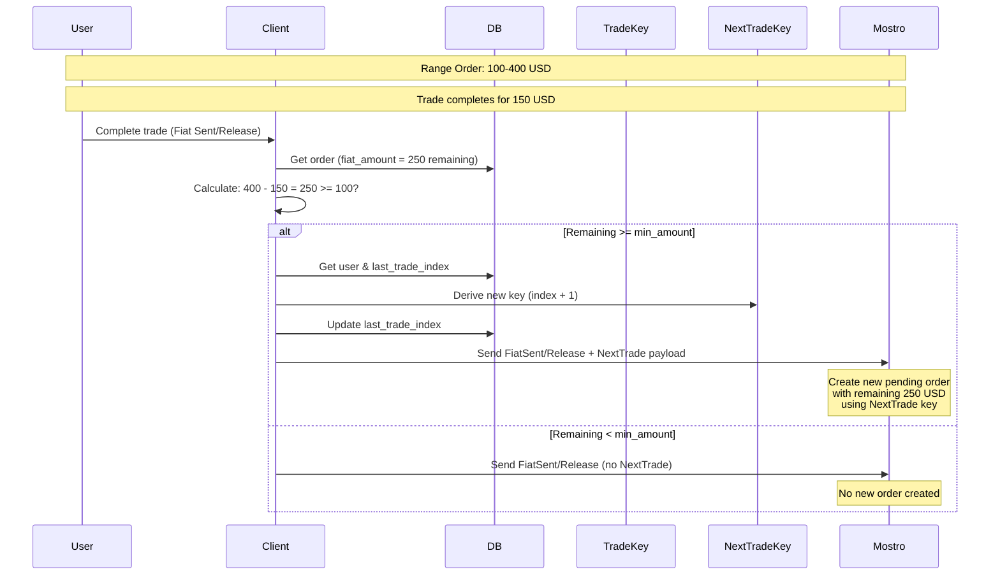

# Range Orders

Range orders allow users to create orders with variable amounts within a specified range (e.g., "Sell 100-400 USD"). This enables more flexible trading where buyers can take partial amounts from a larger order.

## How Range Orders Work

1. **Order Creation**: A range order is created with:
   - `min_amount`: Minimum trade amount (e.g., 100 USD)
   - `max_amount`: Maximum trade amount (e.g., 400 USD)
   - `fiat_amount`: Current amount available (starts at `max_amount`)

2. **Taking Range Orders**: Users can take any amount between `min_amount` and the remaining `fiat_amount`.

3. **Trade Completion**: When a trade completes (via `FiatSent` or `Release` actions), Mostrix checks if there's remaining amount to create a new pending order.

## NextTrade Payload

Before completing a range order trade, Mostrix must inform the Mostro daemon about the next trade key that will be used for the remaining amount. This is done via the `NextTrade` payload.

**Source**: `src/util/order_utils/execute_send_msg.rs:17`
```17:40:src/util/order_utils/execute_send_msg.rs
        Action::FiatSent | Action::Release => {
            // Check if this is a range order that needs NextTrade payload
            if let (Some(min_amount), Some(max_amount)) = (order.min_amount, order.max_amount) {
                if max_amount - order.fiat_amount >= min_amount {
                    // This is a range order with remaining amount, create NextTrade payload
                    let user = User::get(pool).await?;
                    let next_trade_index = user.last_trade_index.unwrap_or(0) + 1;
                    let next_trade_keys = user.derive_trade_keys(next_trade_index)?;

                    // Update last trade index
                    User::update_last_trade_index(pool, next_trade_index).await?;

                    Ok(Some(Payload::NextTrade(
                        next_trade_keys.public_key().to_string(),
                        next_trade_index as u32,
                    )))
                } else {
                    Ok(None)
                }
            } else {
                Ok(None)
            }
        }
```

## Range Order Logic

When completing a trade (`FiatSent` or `Release`):

1. **Check if range order**: Verify the order has both `min_amount` and `max_amount` set.

2. **Calculate remaining amount**: `remaining = max_amount - fiat_amount`

3. **Check if new order needed**:
   - If `remaining >= min_amount`: Create `NextTrade` payload with:
     - Derive next trade key (increment `last_trade_index`)
     - Send the new trade key's public key and index to Mostro
     - Mostro will create a new pending order with the remaining amount
   - If `remaining < min_amount`: No new order is created (send `None` payload)

4. **Mostro creates new order**: Upon receiving the `NextTrade` payload, Mostro daemon creates a new pending order with:
   - The remaining amount (`max_amount - fiat_amount`)
   - The new trade key public key
   - The new trade index

## Example Flow



## Key Points

- **Range orders** enable partial fills of larger orders
- **NextTrade payload** must be sent **before** completing the trade so Mostro knows which key to use for the new order
- If remaining amount is **less than minimum**, no new order is created
- Each new order created from a range order uses a **fresh trade key** for privacy
