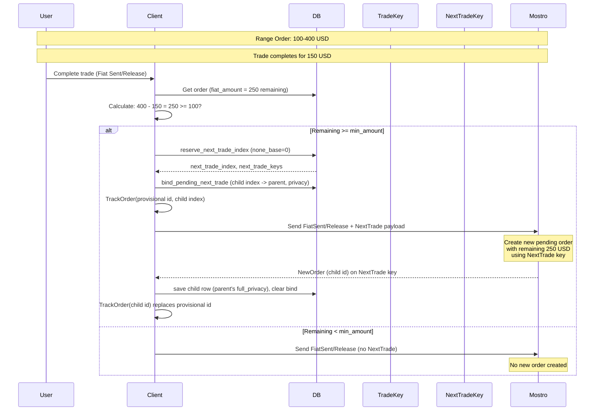

# Range Orders

Range orders allow users to create orders with variable amounts within a specified range (e.g., "Sell 100-400 USD"). This enables more flexible trading where buyers can take partial amounts from a larger order.

## How Range Orders Work

1. **Order Creation**: A range order is created with:
   - `min_amount`: Minimum trade amount (e.g., 100 USD)
   - `max_amount`: Maximum trade amount (e.g., 400 USD)
   - `fiat_amount`: Current amount available (starts at `max_amount`)

2. **Taking Range Orders**: Users can take any amount between `min_amount` and the remaining `fiat_amount`.

3. **Trade Completion**: When a trade completes (via `FiatSent` or `Release` actions), Mostrix checks if there's remaining amount to create a new pending order.

## NextTrade Payload

Before completing a range order trade, Mostrix must inform the Mostro daemon about the next trade key that will be used for the remaining amount. This is done via the `NextTrade` payload.

**Source**: `src/util/order_utils/execute_send_msg.rs` (`create_msg_payload`)
```rust
let (next_trade_index, next_trade_keys) = User::reserve_next_trade_index(pool, 0).await?;
let provisional_id = Order::bind_pending_next_trade(pool, parent_id, next_trade_index).await?;
send_track_order_cmd(provisional_id, next_trade_index);

Ok(Some(Payload::NextTrade(
    next_trade_keys.public_key().to_string(),
    next_trade_index as u32,
)))
```

### Child binding, subscription and privacy

Mostro sends the child's `NewOrder` to the freshly reserved trade pubkey, so Mostrix must listen on it **before** that message exists as an `orders` row:

1. **Bind**: `Order::bind_pending_next_trade` writes a `pending_next_trades` row keyed by the child trade index (parent order id, parent `full_privacy`, and a random `provisional_order_id`). A retry that reserves a new index never overwrites an earlier bind; binding an index already owned by another parent is rejected.
2. **Early subscribe**: `TrackOrder` is sent with the provisional id right away. On startup, `hydrate_startup_active_order_dm_state` also loads pending binds (`Order::list_pending_next_trade_tracks`) and, for a pending child, replays its `NewOrder` before any newer DM.
3. **Persist**: when the child `NewOrder` arrives, `persist_range_child_listing_from_new_order` saves the row under **Mostro's** order id with the parent's `full_privacy` (unbound or failed lookups skip persistence rather than defaulting to reputation mode). Only after a successful save is the bind cleared.
4. **Id handoff**: the listener re-tracks the key under Mostro's child id and redirects any DM still routed under the provisional id to the persisted child row.
5. **Wipes**: `Order::delete_all_in_tx` clears `pending_next_trades` together with `orders` on seed import, session wipe, and Generate New Keys.

## Range Order Logic

When completing a trade (`FiatSent` or `Release`):

1. **Check if range order**: Verify the order has both `min_amount` and `max_amount` set.

2. **Calculate remaining amount**: `remaining = max_amount - fiat_amount`

3. **Check if new order needed**:
   - If `remaining >= min_amount`: Create `NextTrade` payload with:
     - Reserve next trade key via `User::reserve_next_trade_index(pool, 0)`
     - Bind the child index to the parent in `pending_next_trades` and subscribe to the child key (see above)
     - Send the new trade key's public key and index to Mostro
     - Mostro will create a new pending order with the remaining amount
   - If `remaining < min_amount`: No new order is created (send `None` payload)

4. **Mostro creates new order**: Upon receiving the `NextTrade` payload, Mostro daemon creates a new pending order with:
   - The remaining amount (`max_amount - fiat_amount`)
   - The new trade key public key
   - The new trade index

## Example Flow


```mermaid
sequenceDiagram
    participant User
    participant Client
    participant DB
    participant TradeKey
    participant NextTradeKey
    participant Mostro

    Note over User,Mostro: Range Order: 100-400 USD
    Note over User,Mostro: Trade completes for 150 USD
    User->>Client: Complete trade (Fiat Sent/Release)
    Client->>DB: Get order (fiat_amount = 250 remaining)
    Client->>Client: Calculate: 400 - 150 = 250 >= 100?
    alt Remaining >= min_amount
        Client->>DB: reserve_next_trade_index (none_base=0)
        DB-->>Client: next_trade_index, next_trade_keys
        Client->>DB: bind_pending_next_trade (child index -> parent, privacy)
        Client->>Client: TrackOrder(provisional id, child index)
        Client->>Mostro: Send FiatSent/Release + NextTrade payload
        Note over Mostro: Create new pending order<br/>with remaining 250 USD<br/>using NextTrade key
        Mostro-->>Client: NewOrder (child id) on NextTrade key
        Client->>DB: save child row (parent's full_privacy), clear bind
        Client->>Client: TrackOrder(child id) replaces provisional id
    else Remaining < min_amount
        Client->>Mostro: Send FiatSent/Release (no NextTrade)
        Note over Mostro: No new order created
    end
```

## Key Points

- **Range orders** enable partial fills of larger orders
- **NextTrade payload** must be sent **before** completing the trade so Mostro knows which key to use for the new order
- If remaining amount is **less than minimum**, no new order is created
- Each new order created from a range order uses a **fresh trade key** for privacy
- The child inherits the parent's **full-privacy** mode via its `pending_next_trades` bind, never from an unrelated maker order
